# Idiolect

**Speech-to-text that learns your way of speaking.**

Idiolect is a local-first personalised speech-to-text input method. It runs through the operating system input method layer, captures the corrections you make to dictated text — either by editing the live preedit or in an optional review dialog that works even in apps that hide their text (Electron/VS Code) — and uses those corrections to improve a per-user speech model over time. All processing is on-device; nothing is sent to the cloud.

## Look &amp; feel

Dictate, then **review and fix** in a window Idiolect controls — so your correction is captured even in apps that hide their text (Electron/VS Code). <kbd>Ctrl</kbd>+<kbd>Enter</kbd> inserts the result at the cursor; <kbd>Esc</kbd> cancels.

<p align="center">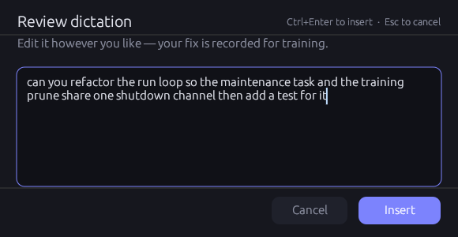</p>

A live microphone rides your **text caret** while you speak, and the tray icon shows state at a glance — idle, recording, or error:

<p align="center">
  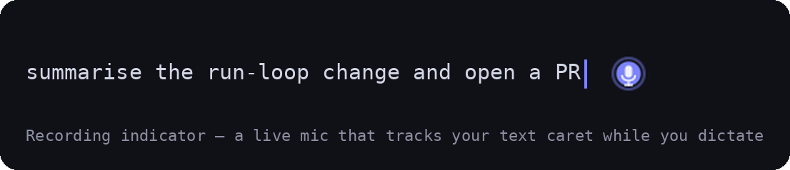
  <br><br>
  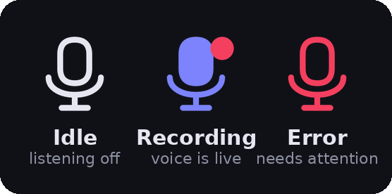
</p>

Everything else is in the **tray menu** — recent dictations (insert at the cursor / copy / delete), the review-before-insert toggle, and how long audio + transcripts are kept for training (presets or a custom value):

<p align="center">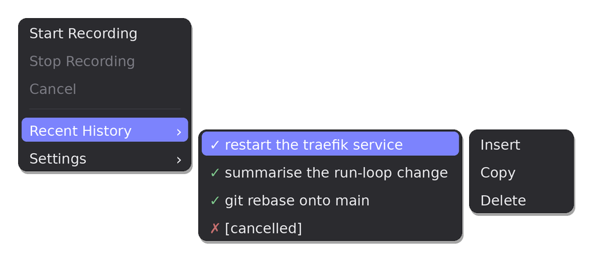</p>

<p align="center">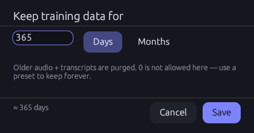</p>

---

## Installation & Usage

Idiolect has two parts: the **daemon** (`idiolectd`, Rust — captures audio and runs Whisper) and the **fcitx5 input-method addon** (`idiolect.so`, C++ — binds a global hotkey and types the transcript into the focused app). You build both, run the daemon, and press a hotkey to dictate.

> Status: builds from source. A one-command prebuilt `.deb` is **future work** — for now you compile it (below).

### Prerequisites

**Build-time (only for whoever compiles — not end users of a future package):**

| Need | Why | Install (Ubuntu/Debian) |
|------|-----|--------------------------|
| Rust toolchain (1.96+) | builds the daemon | `rustup` |
| CMake 3.16+, C++17 compiler | builds the fcitx5 addon | `sudo apt install cmake build-essential` |
| CUDA toolkit (`nvcc`) | GPU Whisper build | NVIDIA CUDA toolkit (e.g. 13.x), then build with `CMAKE_CUDA_ARCHITECTURES=native` |
| fcitx5 **-dev** packages | links the addon | `sudo apt install libfcitx5core-dev libfcitx5utils-dev libfcitx5config-dev extra-cmake-modules gettext` |

**Runtime (to actually use it):**

| Need | Why | Notes |
|------|-----|-------|
| NVIDIA driver | GPU inference | proprietary driver providing `libcuda.so`; the CUDA *runtime* libs come from the toolkit/build |
| **fcitx5 as the active input method** | so a global hotkey reaches your apps | `sudo apt install fcitx5 fcitx5-frontend-gtk3 fcitx5-frontend-qt5`; then **switch from ibus**: `im-config -n fcitx5` (or set `GTK_IM_MODULE=fcitx`, `QT_IM_MODULE=fcitx`, `XMODIFIERS=@im=fcitx`) and **log out / back in** |
| A Whisper ggml model | recognition | place a `.bin` in `~/.local/share/idiolect/models/whisper/` (e.g. `medium-en.bin`); set `asr.model` in the config to its name without `.bin` |

### Build

```bash
# Daemon (GPU/CUDA build)
CMAKE_CUDA_ARCHITECTURES=native PATH=/usr/local/cuda/bin:$PATH \
  cargo build -p idiolectd --release --features cuda
# (omit --features cuda for a CPU-only daemon)

# IBus engine (pure-Rust; add `,trace` for a live event log at /tmp/idiolect-edit.log)
cargo build -p idiolect-ibus --release --features ibus-engine
# Its out-of-process GUI helpers — built into the same target/release/ dir so the
# engine/daemon discover them by path (review dialog, caret indicator, retention):
cargo build --release \
  -p idiolect-review-dialog -p idiolect-recording-indicator -p idiolect-retention-dialog

# fcitx5 addon (requires the fcitx5 -dev packages above)
cd fcitx5/idiolect-fcitx5
cmake -S . -B build && cmake --build build
# produces build/idiolect.so when fcitx5 is found
```

The GUI helper crates aren't gated behind `ibus-engine` (they're plain binaries), but building them alongside the engine in one `--release` invocation keeps them all in `target/release/` where the engine/daemon look for them.

### Install the addon

The addon **descriptor** (`.conf`) is found under `~/.local/share/fcitx5/addon/`, but fcitx5 searches for the addon **library** (`.so`) only in its system addon dir — so the `.so` goes there (one-time `sudo`):

```bash
# descriptor: user-local is fine
mkdir -p ~/.local/share/fcitx5/addon
cp fcitx5/idiolect-fcitx5/data/idiolect-addon.conf ~/.local/share/fcitx5/addon/idiolect.conf

# library: install into fcitx5's addon dir (needs sudo)
sudo cp fcitx5/idiolect-fcitx5/build/idiolect.so /usr/lib/x86_64-linux-gnu/fcitx5/

# OR, no-sudo: point fcitx5 at a user dir (must include the system dir too).
#   mkdir -p ~/.local/lib/fcitx5 && cp fcitx5/idiolect-fcitx5/build/idiolect.so ~/.local/lib/fcitx5/
#   export FCITX_ADDON_DIRS="$HOME/.local/lib/fcitx5:/usr/lib/x86_64-linux-gnu/fcitx5"
#   (put that export in ~/.xprofile so it persists across logins)

fcitx5 -r &                          # restart fcitx5 to load the module
```

### Configure & run the daemon

Create `~/.config/idiolect/config.toml` with at least:

```toml
[audio]
input_device = "default"          # real microphone (not "fixture")
[vad]
engine = "webrtc"                 # the implemented VAD; "silero" is accepted but served by the WebRTC adapter
[asr]
engine = "whisper-rs"
model = "medium-en"               # file at ~/.local/share/idiolect/models/whisper/medium-en.bin
use_gpu = true
[storage]
data_dir = "~/.local/share/idiolect"   # expand to an absolute path
```

To see every key with its default (then trim to the overrides above):

```bash
./target/release/idiolectd config print-default --json
```

Validate the config and print the resolved paths (socket, database, model) without starting the daemon:

```bash
./target/release/idiolectd run --config ~/.config/idiolect/config.toml --check-config
```

Then run it (leave running). The model file is resolved as `<storage.data_dir>/models/whisper/<asr.model>.bin`; if it is missing the daemon falls back to a tiny bundled fixture model so it still starts:

```bash
./target/release/idiolectd run --config ~/.config/idiolect/config.toml
```

### Autostart on login (systemd user service)

The daemon ships a systemd user unit that starts it automatically when your graphical session starts and restarts it if it crashes. For a packaged install it enables with one command; for a source build you first point the unit at your binary:

```bash
# Source build: install a unit that references your compiled binary
mkdir -p ~/.config/systemd/user
sed "s|/usr/bin/idiolectd|$PWD/target/release/idiolectd|" \
    packaging/debian/usr/lib/systemd/user/idiolectd.service \
    > ~/.config/systemd/user/idiolectd.service
systemctl --user daemon-reload

# Both source and package: enable and start
systemctl --user enable --now idiolectd
```

The unit is `WantedBy=graphical-session.target`, so it only runs inside a graphical login — not over SSH or in headless/tty sessions. The IM framework (fcitx5 or IBus) is managed by the desktop session's own autostart and loads the Idiolect addon automatically once running; you do not need a separate unit for it.

### Dictate

Focus any text field and press the toggle hotkey (default **Super+T**): the tray icon flips to *Recording*, speak, press **Super+T** again — the recognized text is typed straight into the app. **Esc** while recording aborts. The hotkey is configurable in `fcitx5-configtool` (Addons → Idiolect) or `~/.config/fcitx5/conf/idiolect.conf`.

### IBus engine (alternative to fcitx5)

Idiolect ships two interchangeable input-method front-ends; both are thin clients of the same daemon, so the learning loop is identical. Use whichever your desktop runs. The **IBus engine** is the lighter path if you already run IBus (most GNOME setups): **no IM-framework switch, no relogin to a different framework, and no C/`libibus-dev`** — it's a pure-Rust engine built on `zbus`.

It's a **build-time option** (off by default so the normal build needs no IBus):

```bash
cargo build -p idiolect-ibus --release --features ibus-engine   # produces target/release/ibus-engine-idiolect
```

Install the component descriptor (with `<exec>` pointing at the built binary). **Important:** ibus only scans `/usr/share/ibus/component` by default — it does *not* scan `~/.local/share/ibus/component`. Pick one:

```bash
# Generate a descriptor with the correct exec path:
sed "s#/usr/local/bin/ibus-engine-idiolect#$PWD/target/release/ibus-engine-idiolect#" \
    crates/idiolect-adapters/desktop/ibus/data/idiolect.xml > /tmp/idiolect.xml

# Option A (simplest, one-time sudo): drop it where ibus already scans.
sudo cp /tmp/idiolect.xml /usr/share/ibus/component/idiolect.xml
ibus restart

# Option B (no sudo): keep it user-local and point ibus at the dir, then RE-LOGIN.
mkdir -p ~/.local/share/ibus/component
cp /tmp/idiolect.xml ~/.local/share/ibus/component/idiolect.xml
mkdir -p ~/.config/environment.d
echo "IBUS_COMPONENT_PATH=$HOME/.local/share/ibus/component" > ~/.config/environment.d/idiolect-ibus.conf
rm -f ~/.cache/ibus/bus/registry      # force a rescan
# log out and back in (the session must restart ibus with that env)

# Confirm it loaded, then add "Idiolect" in GNOME Settings → Keyboard → Input Sources:
ibus list-engine | grep idiolect
```

Then run the daemon as above (`input_device = "default"`, `--features cuda` for GPU), select **Idiolect** as your input source, and dictate: press the toggle (default **Super+T**), speak, press **Super+T** again to stop. A small floating microphone appears next to the text caret while recording. What happens at commit depends on the mode (toggle it in the tray — see below):

- **Direct insert (default):** the recognized text is typed straight into the focused app.
- **Review before insert:** a small editable dialog opens with the recognized text; you fix it there and press **Enter** (or **Esc** to cancel), then the final text is typed into the app. This is the robust capture path — because the edit happens in *our* window, the raw→corrected diff is captured **even in apps that don't expose their text** (notably Electron/VS Code). After the dialog closes, focus is returned to the exact window you were typing in, so you can hit Enter to send straight away.

Either way the diff between what was recognized and what you committed becomes a training example.

**Notes / tradeoffs:**
- The active IBus engine sees keys in every app, so the toggle is effectively global. While idle the engine passes all keys through untouched, so you can leave Idiolect selected as your input source and keep typing normally — it only acts when you press the toggle. (The compositor grabs Super+T before any IME, so the engine also exposes a small `org.idiolect.Trigger1` D-Bus endpoint a GNOME global shortcut can call.)
- Coverage of the *direct-insert* path depends on the app routing input through the IM framework (games, raw-input apps, password fields, some Electron apps won't receive it). **Review-before-insert sidesteps this** for capture: the correction is recorded regardless of the destination app, since you edit it in Idiolect's own dialog before it's inserted.
- fcitx5 vs IBus is purely the front-end; the daemon, GPU transcription, history, and training are shared. The IBus engine is the actively developed path (review dialog, caret indicator, history insert, retention) and the one these docs assume.

### Tray menu (manage history, retention & mode)

The tray icon (a modern line-art microphone that fills in while recording) is the control surface:

- **Start / Stop / Cancel recording** — the same as the toggle.
- **Recent History** — recent dictations; each offers **Insert** (re-type it into the focused app at the cursor, via the IME), **Copy** (to the clipboard), and **Delete**.
- **Review before insert** — toggles the review dialog described above (off by default).
- **Settings → Tray history** — how long / how many recent dictations the menu shows (*Show last* 1/7/30 days, *Max items* 10/25/50).
- **Settings → Training data kept for** — how long captured audio + transcripts are retained for learning: presets **1 month … 10 years** (default **1 year**) plus **Custom…** (a small dialog to type any number of days/months). This is deliberately separate from the tray-history list: history is a short convenience list; training data is the long-lived corpus. Past the window the daemon purges the whole session (audio + transcript + correction); everything inside the window is kept, because correct dictations are positive training signal too. Pruning runs on startup and hourly.

### Train a personal model (LoRA fine-tuning)

Every take you dictate becomes a training pair (audio + final text), and every
correction you make in the review dialog is gold signal. `idiolect-trainerctl`
turns that corpus into a personalised Whisper model — **pure Rust end to end**
(Burn for training, no Python, no sidecars). whisper.cpp cannot load adapters
at inference, so the trained LoRA is *merged* into the base weights and
written out as an ordinary `.bin` the daemon serves unchanged.

Build it (the `cuda` feature enables both GPU revalidation and GPU training):

```sh
cargo build --release -p idiolect-trainerctl --features cuda
```

**Step 1 — clean the corpus.** Re-decodes every stored take's audio whole and
repairs/rejects records whose text disagrees with it (early versions of the
streaming pipeline could drop words at pause boundaries; a poisoned pair
teaches the model to skip words). Dry-run by default; `--apply` writes:

```sh
# Stop the daemon while writing to its database, and back it up first.
cp ~/.local/share/idiolect/idiolect.sqlite ~/.local/share/idiolect/idiolect.sqlite.bak
systemctl --user stop idiolectd

target/release/idiolect-trainerctl revalidate \
  --db ~/.local/share/idiolect/idiolect.sqlite \
  --audio-root ~/.local/share/idiolect/audio \
  --model ~/.local/share/idiolect/models/whisper/medium.bin --gpu \
  --apply --json

systemctl --user start idiolectd
```

Unproofread records are re-labelled from the audio; user corrections are kept
unless the audio contains word runs the user never saw (those are rejected —
an untrustworthy label is worse than one fewer sample). Rejected records stay
in the database for audit but leave the training feed.

**Step 2 — train.** Trains LoRA adapters (decoder attention q/v, rank 8 by
default) on the cleaned feed, holds out every 10th take for validation, then
merges the adapter and writes the artifact. Reads the database, **applies
nothing** — the daemon keeps serving its configured model:

```sh
target/release/idiolect-trainerctl train \
  --db ~/.local/share/idiolect/idiolect.sqlite \
  --audio-root ~/.local/share/idiolect/audio \
  --base-model ~/.local/share/idiolect/models/whisper/medium.bin \
  --output ~/.local/share/idiolect/adapters/ggml-medium-personal-v0.bin \
  --epochs 2 --lr 1e-3 --rank 8 --gpu
```

`--gpu` uses the CUDA backend (a few minutes for `medium` on a modern card);
without it training runs on the CPU — fine for `tiny`, hours for `medium`.
A CPU-only build refuses `--gpu` rather than silently crawling. The JSON
report shows train/holdout loss before and after — **holdout loss must
drop**; it is computed on takes the adapter never saw. Takes longer than one
30 s window are skipped (windowing is future work) and listed in the report.

#### Choosing the training settings

The constraint that drives everything: this is a *small personal corpus*
(typically 100–500 takes), so the failure mode to fear is **overfitting** —
the adapter memorising your exact takes instead of learning your voice and
vocabulary. The defaults are deliberately conservative. Your meter is the
report's two loss pairs: *train falling while holdout falls* = learning;
*train falling while holdout rises* = memorising — back something off.

| Knob | Default | Raise it when… | …at the cost of |
|---|---|---|---|
| `--epochs` | 2 | holdout loss was still falling at the end of the run — there was more to learn | each extra pass over the same takes pushes toward memorisation; past the point where holdout flattens, more epochs only widen the train/holdout gap |
| `--lr` | 1e-3 | loss barely moves (typical when the corpus grows large and each step is one small sample) | too high and the loss oscillates or spikes instead of falling — LoRA with Adam tolerates a lot, but 1e-2 on a few hundred samples visibly wobbles; halve it if the per-sample losses in the progress log jump around |
| `--rank` | 8 | the adapter has more to absorb: lots of unusual jargon, a strong accent, several hundred+ corrected takes | capacity is exactly what overfits a small corpus — rank 16 on 150 takes memorises faster than it generalises; it also scales adapter parameters (and a little GPU memory/time) linearly |
| `--max-samples` | all | never for real runs — it exists to smoke-test the pipeline cheaply | training on a subset throws away signal; the holdout numbers also become noisy (the holdout is every 10th sample of what was *loaded*) |

Notes that don't fit in a table:

- **Alpha is pinned to 2×rank** on purpose. The adapter's effective strength
  is `alpha/rank × B·A`, so exposing alpha separately just gives you a second
  learning-rate dial that fights `--lr`. Keeping the ratio fixed means
  `--rank` changes *capacity* without silently changing *step size* — the
  standard LoRA practice.
- **Epochs × lr trade against each other.** 4 epochs at 5e-4 covers similar
  ground to 2 at 1e-3 with smoother steps. If you raise epochs, consider
  lowering lr; never raise both at once or you lose the ability to tell which
  change did what.
- **More data beats more knobs.** Going from 150 → 500 corrected takes will
  do more for holdout loss than any setting here. In particular, jargon and
  proper nouns are learned almost entirely from takes where you *fixed the
  word in the review dialog* — an accepted-without-edit take mostly teaches
  acoustics and style, a corrected take teaches vocabulary.
- **What the defaults gave on a real ~150-take corpus** (medium, rank 8,
  2 epochs, lr 1e-3): train 0.30 → 0.11, holdout 0.335 → 0.164. Holdout
  halved with the gap still modest — a healthy run to calibrate against. If
  your gap looks much wider (say train 0.05, holdout 0.30), that's the
  memorisation signature: drop rank or epochs.
- **Same audio, new settings = just re-run.** Training never mutates the
  corpus or the daemon; every run is a fresh artifact you can compare by its
  holdout numbers (and discard).

**Step 3 — try it (optional, reversible).** The artifact is a plain
whisper.cpp model. To serve it, place it where models live and point the
config at it:

```sh
cp ~/.local/share/idiolect/adapters/ggml-medium-personal-v0.bin \
   ~/.local/share/idiolect/models/whisper/medium-personal-v0.bin
# config.toml: [asr] model = "medium-personal-v0"
systemctl --user restart idiolectd
```

Switching back is editing the name back and restarting. An automated
WER-based promotion gate (see [Training Pipeline](#training-pipeline)) is the
planned replacement for this manual step.

Practical notes: more *corrected* takes mean more signal — jargon and proper
nouns ("E2E", "fail2ban", product names) are only learned from takes where
you actually fixed them, so use the review dialog and fix words in place.
Multilingual (`medium`) and English-only (`tiny.en`, `medium.en`) bases both
work; the trainer derives the right token prompt from the model file itself.

---

## Table of Contents

- [Look & feel](#look--feel)
- [Installation & Usage](#installation--usage)
- [Core Architecture](#core-architecture)
- [Why Idiolect Must Be an Input Method](#why-idiolect-must-be-an-input-method)
- [System Processes](#system-processes)
- [Interface Architecture: Ports and Adapters](#interface-architecture-ports-and-adapters)
  - [Boundary Rule](#boundary-rule)
  - [Dependency Direction](#dependency-direction)
- [Proposed Layering](#proposed-layering)
- [Core Domain Types](#core-domain-types-examples)
- [Required Ports (Traits)](#required-ports-traits)
- [Adapter Selection Through Configuration](#adapter-selection-through-configuration)
- [Contract Tests for Replaceability](#contract-tests-for-replaceability)
- [Anti-Coupling Checklist](#anti-coupling-checklist)
- [Architecture Refinements](#architecture-refinements)
  - [Domain Events](#domain-events)
  - [Event Log plus Materialised Tables](#event-log-plus-materialised-tables)
  - [Command and Query Separation](#command-and-query-separation)
  - [Idempotency and Exactly-Once Session Semantics](#idempotency-and-exactly-once-session-semantics)
  - [Backpressure and Worker Isolation](#backpressure-and-worker-isolation)
  - [Capability Negotiation](#capability-negotiation)
  - [Interface Stability Levels](#interface-stability-levels)
- [Fcitx5 Engine Design](#fcitx5-engine-design)
- [Text Session Model](#text-session-model)
- [Personalisation Strategy](#personalisation-strategy)
- [Training Pipeline](#training-pipeline)
- [Repository Structure](#repository-structure)
- [Binary Names](#binary-names)
- [Technology Stack](#technology-stack)
- [Testing Strategy](#testing-strategy)
  - [Testing Layers](#testing-layers)
  - [Test Suite Layout](#test-suite-layout)
  - [Unit Testing](#unit-testing)
  - [Integration Testing](#integration-testing)
  - [End-to-End Testing](#end-to-end-testing)
  - [Test Fixtures](#test-fixtures)
  - [Model and Evaluation Regression Testing](#model-and-evaluation-regression-testing)
  - [CI Gates](#ci-gates)
- [Status](#status)
  - [Baseline Verification Gates](#baseline-verification-gates)
- [CLI Surface](#cli-surface)
- [Core Truths of the Plan](#core-truths-of-the-plan)
- [Further Reading](#further-reading)

---

## Core Architecture

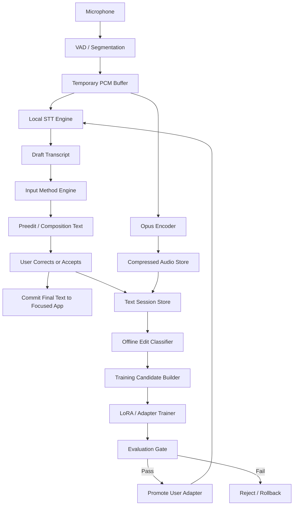

**Main design rule:** Every dictation creates an IME text session. Every IME text session links audio, raw STT, preedit changes, committed text, and training status.

---

## Why Idiolect Must Be an Input Method

The text layer is implemented through the operating system input method framework — not per-application plugins.

| Old Approach (Rejected) | New Approach |
|---|---|
| Browser plugin | One input method |
| VS Code plugin | System-wide through OS input-method layer |
| Terminal plugin | Works in any focused text field |
| Email plugin | |
| Slack plugin | |
| Notion plugin | |

**Linux Primary Backend:** Fcitx5  
**Linux Secondary Backend:** IBus (for GNOME/Ubuntu compatibility)  
**Future Platforms:** Windows TSF, macOS Input Method Kit, Android InputMethodService, iOS Custom Keyboard

---

## System Processes

The IME front-end is interchangeable: the fcitx5 C++ addon **or** the pure-Rust IBus engine, both thin clients of the same daemon over the same Unix-socket protocol.

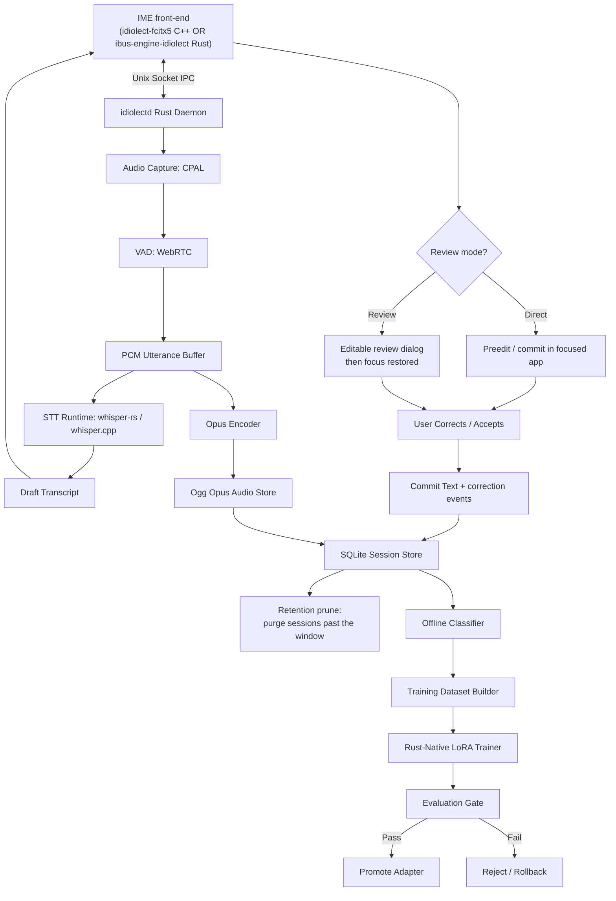

---

## Interface Architecture: Ports and Adapters

Idiolect must not be tightly coupled to any third-party component. Fcitx5, IBus, Whisper, webrtc-vad, Opus, SQLite, ksni, arboard, Burn, and any future model runtime are **replaceable adapters** behind stable Idiolect-owned interfaces.

```mermaid
flowchart TD
    A[Idiolect Core Domain] --> B[InputMethodPort]
    A --> C[AudioInputPort]
    A --> D[VadPort]
    A --> E[AsrPort]
    A --> F[AudioCodecPort]
    A --> G[MetadataStorePort]
    A --> H[TrainerPort]
    A --> I[EvaluationPort]
    A --> J[AdapterRegistryPort]

    B --> B1[Fcitx5 Adapter]
    B --> B2[IBus Adapter]
    B --> B3[Windows TSF Adapter Later]
    B --> B4[macOS Input Method Kit Adapter Later]

    C --> C1[CPAL Adapter]
    C --> C2[PipeWire Adapter Later]

    D --> D1[Silero Adapter]
    D --> D2[WebRTC VAD Adapter]
    D --> D3[ONNX VAD Adapter]

    E --> E1[whisper-rs Adapter]
    E --> E2[whisper.cpp CLI Adapter]
    E --> E3[ONNX ASR Adapter]
    E --> E4[Burn ASR Adapter]

    F --> F1[Ogg Opus Adapter]
    F --> F2[FLAC Adapter Later]

    G --> G1[SQLite Adapter]
    G --> G2[Encrypted SQLite Adapter Later]

    H --> H1[Rust Trainer Adapter]
    H --> H2[Burn Trainer Backend]

    I --> I1[jiwer Evaluation Adapter]
    I --> I2[Custom Metrics Adapter]

    J --> J1[Filesystem Adapter Registry]
```

### Boundary Rule

Each external system is isolated by an Idiolect-owned trait or interface:

```text
Fcitx5 does not own the input-method domain model.
whisper-rs does not own the ASR result model.
webrtc-vad does not own the segmentation model.
Opus does not own the utterance storage model.
SQLite does not own the repository API.
No third-party framework owns the training-run model.
```

**Every adapter converts between third-party types and Idiolect domain types.**  
Never allow: `idiolect-core depends on whisper-rs`, `idiolect-core depends on rusqlite`, `idiolect-core depends on Fcitx5`.

### Dependency Direction

```text
idiolect-core      -> no third-party backend dependencies
adapters           -> depend on idiolect-core + third-party libraries
idiolectd          -> wires core services to selected adapters (composition root)
fcitx5 shim        -> speaks protocol only; no learning/storage/model logic
Rust trainer       -> external process behind TrainerPort contract
```

---

## Proposed Layering

```text
idiolect-core
  pure domain logic
  no Fcitx5, no whisper-rs, no CPAL, no SQLite, no ONNX, no Python, no filesystem assumptions

idiolect-application
  use cases and orchestration
  session lifecycle, dictation workflow, candidate workflow, training workflow, promotion workflow
  depends on core + port traits

idiolect-ports
  traits/interfaces only (actual trait names)
  InputMethodPort, AudioInputPort, VadPort, AsrPort, AudioCodecPort,
  AudioStorePort, MetadataStorePort, TrayPort,
  TrainerPort, EvaluationPort, AdapterRegistryPort
  (ClipboardPort is defined in idiolect-application; EncryptionPort in the crypto adapter)

idiolect-adapters
  concrete implementations
  fcitx5, IBus, CPAL, webrtc-vad, whisper-rs, Opus, SQLite, ksni tray,
  arboard clipboard, ChaCha20-Poly1305 crypto, Burn trainer, fixtures

idiolectd
  composition root
  reads config, chooses adapter implementations, constructs ports, wires use cases,
  starts background workers, owns process lifecycle, exposes health/doctor state
```

---

## Core Domain Types (Examples)

```rust
pub struct AudioSegment {
    pub id: UtteranceId,
    pub sample_rate_hz: u32,
    pub channels: u16,
    pub samples_f32_mono: Vec<f32>,
    pub duration_ms: u32,
}

pub struct TranscriptDraft {
    pub utterance_id: UtteranceId,
    pub text: String,
    pub language: Option<String>,
    pub segments: Vec<TranscriptSegment>,
    pub engine_metadata: AsrMetadata,
}

pub struct CorrectionEvent {
    pub session_id: ImeSessionId,
    pub event_index: u32,
    pub event_type: CorrectionEventType,
    pub from_text: Option<String>,
    pub to_text: Option<String>,
    pub cursor_position: Option<u32>,
}
```

Third-party-specific values go into opaque metadata maps only when necessary.

---

## Required Ports (Traits)

```rust
pub trait InputMethodPort {
    fn show_preedit(&mut self, session_id: ImeSessionId, text: &str) -> Result<()>;
    fn update_preedit(&mut self, session_id: ImeSessionId, text: &str) -> Result<()>;
    fn commit_text(&mut self, session_id: ImeSessionId, text: &str) -> Result<()>;
    fn cancel_preedit(&mut self, session_id: ImeSessionId) -> Result<()>;
}

pub trait AudioInputPort {
    fn start_capture(&mut self, session_id: ImeSessionId) -> Result<()>;
    fn stop_capture(&mut self, session_id: ImeSessionId) -> Result<AudioSegment>;
}

pub trait VadPort {
    fn segment(&mut self, audio: AudioStreamFrame) -> Result<Vec<AudioSegment>>;
}

pub trait AsrPort {
    fn transcribe(&self, audio: &AudioSegment, profile: AsrProfile) -> Result<TranscriptDraft>;
}

pub trait AudioCodecPort {
    fn encode(&self, audio: &AudioSegment, target: AudioEncoding) -> Result<EncodedAudio>;
    fn decode(&self, encoded: &EncodedAudio) -> Result<AudioSegment>;
}

pub trait MetadataStorePort {
    fn create_session(&self, session: NewImeSession) -> Result<ImeSessionId>;
    fn append_edit_event(&self, event: CorrectionEvent) -> Result<()>;
    fn commit_session(&self, commit: SessionCommit) -> Result<()>;
    fn create_training_candidate(&self, candidate: NewTrainingCandidate) -> Result<TrainingCandidateId>;
}

pub trait TrainerPort {
    fn train(&self, manifest: TrainingManifest, config: TrainingConfig) -> Result<TrainingArtifact>;
}

pub trait EvaluationPort {
    fn evaluate(&self, artifact: TrainingArtifact, suites: EvaluationSuites) -> Result<EvaluationReport>;
}

pub trait AdapterRegistryPort {
    fn register_candidate(&self, artifact: TrainingArtifact, report: EvaluationReport) -> Result<AdapterId>;
    fn promote(&self, adapter_id: AdapterId) -> Result<()>;
    fn rollback(&self, user_id: UserId) -> Result<()>;
}
```

---

## Adapter Selection Through Configuration

Runtime configuration selects adapters by logical capability, not hard-coded library names. The schema below is what `idiolectd` actually reads (`idiolect-common/src/config.rs`); every section is optional and falls back to the defaults shown. Run `idiolectd config print-default --json` for the full default set.

```toml
[user]
default_user_id = "default"

[daemon]
socket_path = "…"          # default: $XDG_RUNTIME_DIR/idiolect.sock
log_level   = "info"

[audio]
input_device           = "default"
capture_sample_rate    = 48000     # 8000–192000
processing_sample_rate = 16000
channels               = 1

[vad]
engine          = "webrtc"   # "silero" is accepted, served by the WebRTC adapter
threshold       = 0.5
min_speech_ms   = 250
pre_roll_ms     = 300
post_roll_ms    = 700        # a pause this long completes a snippet mid-take
max_utterance_ms = 30000
# OPT-IN: silence this long (after the take's first speech) ends the take by
# itself, exactly like the toggle. 0 (the default) disables it — listening
# never times out; only Super+T stops a take. Must be >= post_roll_ms when set.
auto_stop_silence_ms = 0

[asr]
engine   = "whisper-rs"
model    = "whisper-medium-en"   # -> <data_dir>/models/whisper/whisper-medium-en.bin
language = "en"
use_gpu  = true
threads  = 8

[storage]
data_dir          = "…"      # default: $XDG_DATA_HOME/idiolect
database_path     = "…"      # default: <data_dir>/db/idiolect.sqlite
audio_codec       = "opus"
audio_container   = "ogg"
opus_bitrate_bps  = 24000
high_value_opus_bitrate_bps = 32000

[training]
min_approved_examples = 50
trainer    = "rust-native-lora"
auto_train = false

[privacy]
retain_audio = false

[history]
retention_days          = 1     # one of 1, 7, 30
max_entries             = 10    # one of 10, 25, 50
clipboard_auto_clear_secs = 30  # 0 disables
encrypt_at_rest         = false

[translation]
# Pause-triggered live translation: when enabled, each VAD-detected pause emits
# the snippet spoken since the previous pause, transcribed and translated
# immediately (instead of one transcript when recording stops). The tray's
# "Translation" menu toggles this and picks the language pair at runtime
# (persisted overrides; this section provides the defaults).
enabled         = false
input_language  = "auto"   # any Whisper language code, or "auto" to detect
output_language = "en"     # any Whisper language code (never "auto")
# External translator for non-English targets, invoked as:
#   <command> <input_language> <output_language>
# with the source text on stdin and the translation expected on stdout (exit 0).
# Empty (the default) means only "en" works as the target, served by Whisper's
# built-in translate task (requires a multilingual model, e.g. "whisper-medium",
# not an "-en" English-only one).
command = ""

[observability]
# all private-text logging flags must stay false (validation rejects true)
log_raw_transcripts       = false
log_corrected_transcripts = false
log_surrounding_app_text  = false
log_private_text          = false
```

Adapter choice is currently compile-time (Cargo features such as `cuda` / `ibus-engine`); the config selects model, devices, and behaviour while the core talks only to the port interfaces.

---

## Contract Tests for Replaceability

Every port must have a shared contract test suite. Any adapter implementing that port must pass the same tests.

| Port | Primary Adapter | Replacement/Test Adapter |
|---|---|---|
| `InputMethodPort` | fcitx5 / IBus | headless fake input method |
| `AsrPort` | whisper-rs | deterministic fixture recogniser |
| `VadPort` | webrtc-vad | fixture segmenter |
| `AudioCodecPort` | Opus | no-op PCM fixture codec |
| `MetadataStorePort` | SQLite | in-memory store |
| `TrainerPort` | Burn trainer | fake trainer returning fixed metrics |
| `EvaluationPort` | Rust metric engine | fixture evaluator |
| `AdapterRegistryPort` | filesystem registry | temp-dir registry |

**Rule:** No port is architecturally proven until both the real adapter and replacement adapter pass the same contract test suite.

---

## Anti-Coupling Checklist

Before accepting a new dependency, answer:

- Can this component be replaced without changing `idiolect-core`?
- Are its types hidden behind an Idiolect-owned interface?
- Can it be mocked in tests?
- Can its version be upgraded without changing the database schema?
- Can its output be represented in stable Idiolect domain types?
- Can failures be mapped into Idiolect error types?
- Does it require private data to leave the machine?

If the answer is no, the dependency must be wrapped or rejected.

---

## Architecture Refinements

### Domain Events

Use typed domain events inside Idiolect for clear audit trail, simpler testing, idempotent recovery, and cleaner integration:

```rust
pub enum DomainEvent {
    DictationStarted(DictationStarted),
    AudioSegmentCaptured(AudioSegmentCaptured),
    TranscriptProduced(TranscriptProduced),
    PreeditChanged(PreeditChanged),
    TextCommitted(TextCommitted),
    SessionCancelled(SessionCancelled),
    TrainingCandidateCreated(TrainingCandidateCreated),
    CandidateClassified(CandidateClassified),
    AdapterEvaluated(AdapterEvaluated),
    AdapterPromoted(AdapterPromoted),
    AdapterRejected(AdapterRejected),
}
```

### Event Log plus Materialised Tables

Use an append-only event log as the source of truth for correction/session history, then maintain relational tables for query speed:

```sql
CREATE TABLE event_log (
  id TEXT PRIMARY KEY,
  aggregate_type TEXT NOT NULL,
  aggregate_id TEXT NOT NULL,
  event_type TEXT NOT NULL,
  event_version INTEGER NOT NULL,
  event_json TEXT NOT NULL,
  idempotency_key TEXT,
  created_at TEXT NOT NULL
);
```

### Command and Query Separation

**Commands** change state: `StartDictation`, `StopDictation`, `RecordPreeditChange`, `CommitSession`, `CancelSession`, `ClassifyCandidate`, `PromoteAdapter`, `RollbackAdapter`, `DeleteUtterance`

**Queries** read state: `GetCurrentSession`, `ListCandidates`, `ListAdapters`, `GetTrainingRun`, `GetPrivacyReport`, `GetDoctorReport`

### Idempotency and Exactly-Once Session Semantics

Every mutating command has: `command_id`, `session_id`, monotonic `event_index`, `idempotency_key`, `created_at`. Duplicate commits must not create duplicate candidates; cancel after commit must be ignored; preedit edit events must preserve order.

### Backpressure and Worker Isolation

Separate execution lanes with bounded queues:

```text
input-method lane: fast, non-blocking
audio lane: real-time-ish
speech-to-text lane: bounded worker queue
storage lane: short transactions
training lane: background, cancellable
evaluation lane: background, resource-limited
```

### Capability Negotiation

Each adapter reports capabilities at startup. Core logic branches on capabilities, not third-party library names:

```rust
pub struct AdapterCapabilities {
    pub name: String,
    pub version: String,
    pub supports_streaming: bool,
    pub supports_word_timestamps: bool,
    pub supports_confidence: bool,
    pub supports_gpu: bool,
    pub supports_incremental_updates: bool,
}
```

### Interface Stability Levels

| Level | Meaning | Examples |
|---|---|---|
| internal | can change freely before v1 | low-level helper traits |
| product-stable | stable across v1.x | session lifecycle, training candidate rules |
| adapter-stable | third-party adapters depend on it | port traits, adapter manifests |
| storage-stable | migration required for change | database schema, event log |
| protocol-stable | compatibility negotiation required | IPC messages |

---

## Fcitx5 Engine Design

The Fcitx5 engine is a **thin C++ shim**:

- Registers Idiolect as an input method
- Handles activation/hotkey
- Sends `StartDictation`/`StopDictation` to `idiolectd`
- Receives transcript results
- Displays transcript as preedit text
- Captures edits made before commit
- Commits final text to focused application
- Sends session events back to `idiolectd`

**It does NOT:** run Whisper, capture microphone audio, encode audio, write SQLite, train models, own learning logic.

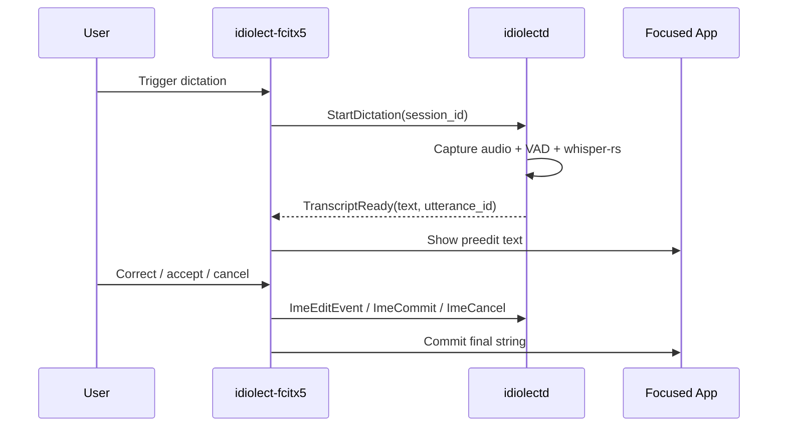

---

## Text Session Model

### Session States

```text
created -> recording -> transcribing -> preedit_active -> user_correcting -> committed
                                                              -> cancelled
                                                              -> abandoned
                                                              -> post_commit_observed
                                                              -> post_commit_unknown
```

### Correction Capture Quality

| Quality | Source | Example |
|---|---|---|
| **High** | Review dialog | "restart Traefik" → STT "restart traffic" → user fixes it in Idiolect's own editable window, then it's inserted. Works in any app (incl. Electron) because the edit happens before the text reaches the app. |
| **High** | IME preedit correction | User edits the live preedit (printable keys / backspace / arrows) before committing — captured directly in the engine's editable buffer. |
| **Medium** | Post-commit amend | Committed "restart traffic", later corrected in place; the engine reports the corrected form (`ReportCorrection`) and the candidate is amended. |
| **Low** | No correction captured | Store audio + raw STT + committed text only (still a valid positive training example). |

Every committed dictation produces a training candidate — labelled `accepted_without_edit` when the recognition was kept verbatim, or `accepted_with_edit` when the diff (raw → corrected) is the learning signal. Audio is retained for all of them within the training-data retention window (see the tray's *Training data kept for*), since correct dictations are positive supervision too.

---

## Personalisation Strategy

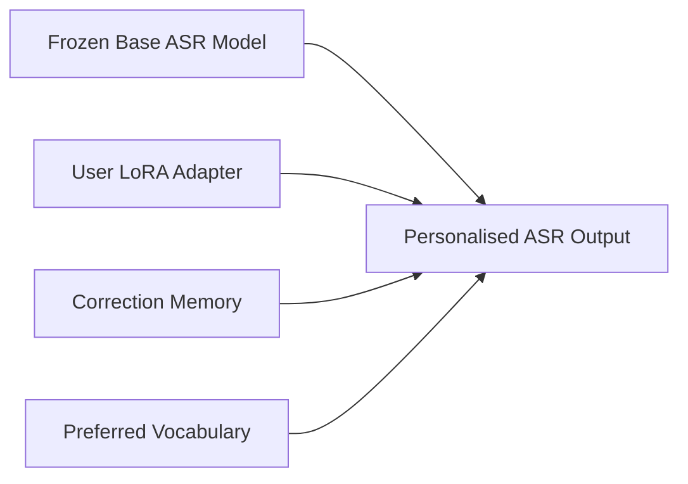

### Path A: v1 Runtime Learning (Immediate)
- Personal correction memory
- Preferred vocabulary
- Context-aware substitution
- Candidate reranking
- Proper noun preference

### Path B: Model Adaptation (BUILT — Burn-native)
- LoRA adapters trained in **Burn** (chosen over Candle), pure Rust, CPU or CUDA
- The whole Whisper forward pass runs in Burn, loaded straight from the same
  ggml `.bin` the daemon serves — decode parity against whisper-rs is a test gate
- Trained adapters are **merged** into the base weights and emitted as a plain
  whisper.cpp model: inference never needs adapter support or a Python runtime
- See [Train a personal model](#train-a-personal-model-lora-fine-tuning) for usage

### Path C: Long-Term
- Adapter-aware inference in Rust (serve adapters without merging)
- Automated retraining on a schedule once the promotion gate is wired

---

## Training Pipeline

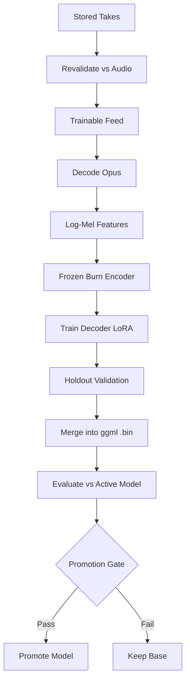

Implemented today (`idiolect-trainerctl`, crate `idiolect-trainer-burn`):
revalidation, opus → log-mel (an exact port of whisper.cpp's spectrogram),
the full Whisper forward pass in Burn loaded from the ggml file, LoRA on the
decoder attention q/v projections, hand-rolled Adam, train/holdout split and
before/after holdout loss, and the merge back into a plain whisper.cpp `.bin`.
Correctness is gated by tests, in dependency order: ggml read→write is
byte-identical; Burn's greedy decode matches whisper-rs on the same model
file; a zero-initialised adapter changes nothing; an overfitted adapter,
merged, is served by the unmodified engine. Still to wire: the WER-based
promotion gate below (rules exist in `trainerctl`'s promotion module),
adapter registry bookkeeping, and >30 s take windowing.

**LoRA settings:** rank 8 (`--rank`, alpha = 2×rank), decoder attention q/v,
conservative LR (`--lr`, default 1e-3), few epochs (`--epochs`, default 2).

### Promotion Criteria

Promote only if:
- Personal holdout WER improves
- Proper noun accuracy improves or does not regress
- Command accuracy does not regress
- General mini-set does not materially regress
- Hallucination/deletion rates do not increase
- Latency remains acceptable

### Rollback Rules

Always retain: current active adapter, previous active adapter, best historical adapter, base model fallback.

---

## Repository Structure

This is the actual Cargo workspace layout (see `Cargo.toml` for the authoritative member list). The ports/adapters split from the architecture above is realised as one crate per port-trait group and one crate per adapter.

```text
idiolect/
  Cargo.toml            # workspace: warnings = deny, unsafe_code = forbid
  README.md
  LICENSE               # AGPL-3.0-only

  crates/
    # --- domain / application / interfaces ---
    idiolect-core/         # pure domain: ImeSession state machine, TrainingCandidate, rules
    idiolect-ports/        # port traits only (see "Required Ports" below)
    idiolect-application/  # use cases: Dictation, History, Menu, Maintenance
    idiolect-common/       # ids, config (TOML + XDG path resolution), error, time
    idiolect-ipc/          # Unix-socket JSON-Lines protocol: messages, framing, handshake

    # --- real adapters ---
    idiolect-adapter-cpal/        # AudioInputPort  (cpal)
    idiolect-adapter-vad/         # VadPort         (webrtc-vad)
    idiolect-adapter-whisper/     # AsrPort         (whisper-rs; optional `cuda` feature)
    idiolect-adapter-opus/        # AudioCodecPort  (opus)
    idiolect-adapter-sqlite/      # MetadataStorePort + AudioStorePort (rusqlite, optional crypto)

    # --- fixture / in-memory adapters (tests & CI) ---
    idiolect-adapter-memory/        # in-memory store stub
    idiolect-adapter-fixture-audio/ # deterministic sine-wave AudioInputPort
    idiolect-adapter-fixture-asr/   # deterministic AsrPort
    idiolect-adapter-fixture-codec/ # no-op AudioCodecPort

    # --- desktop integration ---
    idiolect-adapters/desktop/ksni/       # TrayPort (ksni); line-art mic icons rendered with tiny-skia
    idiolect-adapters/desktop/clipboard/  # ClipboardPort  (arboard)
    idiolect-adapters/desktop/ibus/       # IBus engine (ibus-engine-idiolect, feature `ibus-engine`).
                                          #   session (pure state machine), ipc, ibus (zbus glue),
                                          #   review (review-dialog trait), indicator (caret overlay
                                          #   trait), focus (X11 focus capture/restore via x11rb)
    idiolect-adapters/crypto/             # EncryptionPort (ChaCha20-Poly1305 at-rest)

    # --- out-of-process GUI helpers (pure-Rust egui/eframe, behind traits) ---
    idiolect-review-dialog/        # editable review window (idiolect-review-dialog)
    idiolect-recording-indicator/  # floating "mic is live" overlay tracking the caret
    idiolect-retention-dialog/     # custom training-retention input (idiolect-retention-dialog)

    # --- training (early-stage) ---
    idiolect-ml-core/        # manifest / artifact / evaluation value types
    idiolect-trainer-burn/   # TrainerPort over Burn (stub)
    idiolect-trainerctl/     # revalidate/train CLI + classifier, manifest, metrics, promotion

    # --- composition root + CLI + tests ---
    idiolectd/                   # daemon: wires adapters, runs the IPC/run loop
    idiolect-cli/                # operator CLI (binary: idiolect-cli, aliased idiolect)
    idiolect-test-support/       # shared fakes & audio fixtures
    idiolect-integration-tests/  # cross-crate integration tests

  fcitx5/
    idiolect-fcitx5/      # C++ fcitx5 addon -> idiolect.so
      CMakeLists.txt
      src/                # engine, idiolect_module, ipc_client, preedit_session
      data/               # idiolect-addon.conf, idiolect.conf, metainfo.xml
      tests/              # preedit_session, toggle_session, disconnect_recovery, e2e_ipc_bridge

  ci/scripts/            # test-all.sh and the per-area gates it runs
  packaging/             # Debian package layout + systemd user service
  scripts/               # dictate helpers
  docs/                  # master plan, decisions/ (ADRs), implementation/, future/
  models/whisper/        # drop Whisper .bin model files here
```

---

## Binary Names

```text
idiolectd                     # local daemon (composition root)
idiolect-cli                  # operator CLI (installed also as `idiolect`)
idiolect.so                   # fcitx5 input-method addon (built from fcitx5/idiolect-fcitx5)
ibus-engine-idiolect          # IBus engine (built with `--features ibus-engine`)
idiolect-review-dialog        # review-before-insert window (spawned by the engine)
idiolect-recording-indicator  # floating caret mic overlay (spawned by the engine)
idiolect-retention-dialog     # custom training-retention input (spawned by the daemon)
idiolect-trainerctl           # training CLI: revalidate (corpus cleaning) + train (LoRA -> merged .bin)
```

The three GUI helpers run **out-of-process** behind traits (`ReviewDialog`, `RecordingIndicator`, `RetentionDialog`), so the egui/winit stack never runs inside the async IME and the toolkit stays swappable. The engine/daemon discovers each binary next to its own executable, so keep them in the same directory (e.g. `target/release/`).

---

## Technology Stack

| Component | First Implementation | Replaceability Rule |
|---|---|---|
| Input method | Fcitx5 C++ engine | behind `InputMethodPort` |
| Local daemon | Rust | composition root only |
| IPC | Unix domain socket + JSON Lines | behind `IpcTransportPort` |
| Audio capture | CPAL | behind `AudioInputPort` |
| Resampling | rubato | behind `AudioResamplerPort` |
| VAD | webrtc-vad (16 kHz, 30 ms frames) | behind `VadPort` |
| STT inference | whisper-rs over whisper.cpp (optional CUDA) | behind `AsrPort` |
| First model | Whisper `medium.en` GGML/GGUF | model artifact, not domain dependency |
| Audio storage | Opus, mono, 24 kbps | behind `AudioCodecPort` |
| Metadata storage | SQLite via rusqlite (optional ChaCha20-Poly1305 at-rest) | behind `MetadataStorePort` / `AudioStorePort` |
| Tray + clipboard | ksni tray, arboard clipboard | behind `TrayPort` / `ClipboardPort` |
| Tray icons | tiny-skia (line-art mic rendered to ARGB pixmaps) | rendering detail of the ksni adapter |
| Review / indicator / retention GUI | egui/eframe (pure-Rust, out-of-process) | behind `ReviewDialog` / `RecordingIndicator` / `RetentionDialog` |
| Focus restore (review dialog) | x11rb (`_NET_ACTIVE_WINDOW`), engine feature only | behind `WindowFocus` (no-op fallback) |
| IBus engine | zbus (pure-Rust D-Bus, no `libibus-dev`) | behind `InputMethodPort` (alt front-end to fcitx5) |
| Training orchestration | Rust (early-stage) | application service |
| Training backend | Burn (stub, behind `TrainerPort`) | behind `TrainerPort` |
| Evaluation | Rust metric engine (early-stage) | behind `EvaluationPort` |
| Python reference tools | optional research only | never required by v1 product |

**Language Policy:** Rust is the default for product code. Allowed non-Rust: Fcitx5 C++ shim (thin boundary adapter), third-party C/C++ libraries behind Rust adapter crates, Python scripts (research/reference only, not required for v1 operation).

---

## Testing Strategy

Testing is a core product requirement, not an afterthought. Idiolect sits between microphone input, speech recognition, operating-system text composition, local storage, and model adaptation. Bugs can silently corrupt training data, commit wrong text into user applications, or promote a worse personalised model. The test strategy must cover correctness, privacy, data integrity, latency, and regression safety.

**Test-Driven Development is mandatory** — see [CONTRIBUTING.md](CONTRIBUTING.md) and the repo-root [CLAUDE.md](CLAUDE.md). No production code changes without a failing test first: a bug fix starts with a test that fails on the current code, then is made to pass (red → green → refactor). Every behaviour is covered at **unit, integration, and end-to-end** levels; a level is skipped only with a written reason in the test file (e.g. a GUI/desktop boundary with no headless seam, such as a StatusNotifier tray click or the egui binaries themselves). End-to-end tests prefer self-provisioned infra so they run in CI rather than being `#[ignore]`d-and-forgotten — e.g. the IBus engine e2e spawns its own private `dbus-daemon` (see `ci/scripts/test-ibus-e2e.sh`). Both gates stay green before and after every change: `cargo test --workspace` and `cargo clippy --workspace --all-targets` (warnings are denied).

### Testing Layers

```text
unit tests
  -> integration tests
  -> component contract tests
  -> end-to-end tests
  -> model/evaluation regression tests
  -> manual exploratory tests
```

**Testing Principle:** No captured correction should be used for training unless the audio, raw transcript, edit events, committed text, classifier decision, and manifest entry are all internally consistent.

### Test Suite Layout

```text
tests/
  fixtures/
    audio/           # short spoken phrases, silence, noise, clipped speech, long utterance
    transcripts/     # raw STT, corrected text, semantic rewrite examples
    ipc/             # valid sessions, malformed messages, reconnect sequences
    sqlite/          # migrated empty DB, sample populated DB, corrupted DB copy
    manifests/       # valid train/validation/holdout files, invalid duplicate split files
    adapters/        # passing, failing, latency-regressing, hallucination-regressing examples
  integration/
  e2e/
  performance/
  privacy/
  regression/

crates/
  idiolect-common/tests/
  idiolect-ipc/tests/
  idiolect-audio/tests/
  idiolect-vad/tests/
  idiolect-asr/tests/
  idiolect-codec/tests/
  idiolect-storage/tests/
  idiolect-trainerctl/tests/
  idiolectd/tests/

fcitx5/idiolect-fcitx5/tests/
  unit/
  contract/
  headless/
```

### Unit Testing

Unit tests isolate a single function, struct, state machine, or algorithm. They must not require a microphone, GPU, real Fcitx5 session, real Whisper model, or user desktop.

| Area | What to test |
|---|---|
| `idiolect-common` | ID parsing, timestamp handling, config defaults, enum serialisation, error mapping |
| `idiolect-ipc` | JSON Lines framing, malformed messages, request/response correlation, streaming events, reconnect behaviour |
| `idiolect-audio` | sample conversion, channel downmixing, buffer boundaries, resampling metadata, clipping handling |
| `idiolect-vad` | speech boundary state machine, pre-roll/post-roll logic, max utterance cut-off, silence handling |
| `idiolect-asr` | runtime wrapper behaviour with mocked recogniser, transcript normalisation, error propagation |
| `idiolect-codec` | Opus path generation, hash calculation, decode metadata, debug WAV guardrails |
| `idiolect-storage` | migrations, insert/update invariants, foreign-key behaviour, deletion cascades, transaction rollback |
| `idiolect-trainerctl` | candidate filtering, split generation, manifest writing, metric import, promotion decision logic |
| `idiolectd` | daemon state transitions, command handling, service wiring with mocks |
| Fcitx5 shim | preedit state, edit event ordering, commit/cancel logic, IPC client failure handling |
| Rust trainer | classifier rules, dataset split, metric calculation, adapter metadata, early-stopping decisions |

**Minimum unit test rules:**
- All state machines must test every valid transition and every invalid transition
- All database writes must test success and rollback failure paths
- All IPC message types must round-trip through serialisation and deserialisation
- All text edit classification labels must have positive and negative examples

**Example Rust unit tests:**
```rust
#[test]
fn vad_adds_pre_roll_without_negative_start() {
    // Given a speech boundary near the start of the rolling buffer,
    // pre-roll should clamp to zero rather than underflow.
}

#[test]
fn ime_commit_creates_high_quality_candidate_after_preedit_correction() {
    // Raw: "restart traffic"
    // Edited: "restart Traefik"
    // Commit should create an ime_preedit_correction candidate with trust 1.0.
}
```

**Example classifier unit tests:**
```rust
#[test]
fn semantic_rewrite_is_rejected() {
    let raw = "restart traffic";
    let final_text = "actually open the deployment notes";
    let label = classify_edit(raw, final_text);
    assert_eq!(label, EditClassification::SemanticRewrite);
}
```

### Integration Testing

Integration tests verify that two or more real components work together while avoiding a full desktop session where possible.

| Suite | Components under test | Purpose |
|---|---|---|
| IPC contract | Fcitx5 IPC client + Rust IPC server | Ensure both sides agree on message schemas and streaming behaviour |
| daemon-storage | `idiolectd` + SQLite + audio store pathing | Ensure session lifecycle writes consistent rows and files |
| audio-vad | CPAL abstraction or fixture PCM + VAD | Ensure utterance segmentation is stable on known clips |
| asr-fixture | ASR wrapper + small fixed model or mocked recogniser | Ensure transcript output is passed into IME session correctly |
| codec-storage | Opus encode/decode + utterance rows | Ensure stored clips can be recovered for training |
| classifier-storage | captured sessions + classifier + candidate table | Ensure trust scores and labels persist correctly |
| manifest-builder | approved candidates + audio files + manifests | Ensure train/validation/holdout manifests are valid |
| trainer-evaluator | small fixture dataset + Rust trainer/evaluator | Ensure metrics are produced and imported |
| adapter-promotion | evaluation metrics + adapter registry | Ensure pass/fail/rollback rules are enforced |

**Important integration invariants:**
- An utterance row must not exist without an audio file unless the transaction is explicitly marked failed
- An IME committed session must link to exactly one utterance
- A high-quality correction candidate must link to both `utterance_id` and `text_session_id`
- A rejected classifier label must never appear in a training manifest
- A holdout item must never appear in a training split
- Adapter promotion must be atomic
- Rollback must restore the previous active adapter

**SQLite integration tests** run against temporary databases with migrations applied from scratch.

**IPC integration tests** use temporary Unix domain sockets with a test `idiolectd` server.

### End-to-End Testing

E2E tests validate the complete user-visible workflow:

```text
trigger dictation
capture or inject audio
transcribe
show preedit text
simulate correction
commit text into focused app
persist session
classify candidate
export manifest
run evaluation/promotion gate where applicable
```

| Tier | Environment | Purpose |
|---|---|---|
| E2E-lite | no desktop, mocked Fcitx5, mocked ASR | Fast lifecycle test in continuous integration |
| E2E-headless | nested X11/Wayland session + Fcitx5 + test app | Verify input-method behaviour without a real user desktop |
| E2E-real-desktop | manual or nightly Linux desktop VM | Verify browser, terminal, GTK, Qt, and Electron apps |
| E2E-model | real Whisper model + fixture audio | Verify transcription and latency regressions |
| E2E-training | fixture corrections + trainer + evaluation gate | Verify learning loop without user data |

**Minimum E2E scenarios (20):**
1. Accept transcript unchanged
2. Correct one word in preedit and commit
3. Cancel dictation before commit
4. Abandon session after transcript appears
5. Dictate two utterances in the same target app
6. Dictate into browser text field
7. Dictate into terminal
8. Dictate into GTK editor
9. Dictate into Qt editor
10. Dictate into Electron app
11. Daemon crashes after audio capture but before commit
12. Fcitx5 engine loses IPC connection during preedit
13. Storage disk becomes unavailable
14. ASR returns empty transcript
15. ASR returns low-confidence transcript
16. Classifier rejects semantic rewrite
17. Approved correction appears in manifest
18. Holdout example is excluded from training
19. Bad adapter is rejected
20. Previous adapter is restored after rollback

**Target applications for Linux E2E:**
| App class | Example target |
|---|---|
| Browser | Firefox, Chromium |
| Terminal | GNOME Terminal, Konsole, Alacritty |
| GTK text editor | gedit or GNOME Text Editor |
| Qt text editor | Kate or simple Qt test app |
| Electron | VS Code or simple Electron fixture app |
| Web text area | local test page with input and textarea fields |

The E2E test harness includes a tiny local test application that records exactly what text was committed.

### Test Fixtures

Fixtures are synthetic, redistributable, and small enough for continuous integration.

| Fixture | Contents |
|---|---|
| audio clips | short spoken phrases, silence, noise, clipped speech, long utterance |
| transcripts | raw STT, corrected text, semantic rewrite examples |
| IPC logs | valid sessions, malformed messages, reconnect sequences |
| SQLite snapshots | migrated empty DB, sample populated DB, corrupted DB copy |
| manifests | valid train/validation/holdout files, invalid duplicate split files |
| adapter metrics | passing, failing, latency-regressing, hallucination-regressing examples |

**Required phrase fixtures:**
```text
restart Traefik
open Vaultwarden
deploy the container
roll back the adapter
use the Fcitx5 input method
```

**Correction fixtures:**
| Raw STT | Final text | Expected label | Trust |
|---|---|---|---:|
| restart traffic | restart Traefik | proper_noun_correction | 0.90 |
| open vault warden | open Vaultwarden | proper_noun_correction | 0.90 |
| deploy the container | deploy the container | accepted_without_edit | 0.60 |
| roll back adapter | roll back the adapter | asr_correction | 1.00 |
| restart traffic | actually open the notes | semantic_rewrite | 0.00 |

**Audio fixture rules:**
- Do not use private user recordings in the repository
- Use synthetic or explicitly consented sample audio only
- Keep large model files out of git
- Download models through explicit developer command or CI cache

### Model and Evaluation Regression Testing

Model tests detect accuracy, latency, hallucination, deletion, and promotion regressions.

**Regression sets:**
| Set | Purpose |
|---|---|
| personal fixture set | proper nouns and repeated user-style corrections |
| command set | short operational commands |
| general speech mini-set | ordinary dictation to prevent overfitting |
| silence/noise set | hallucination detection |
| long utterance set | segmentation and timeout behaviour |

**Metrics to track in CI or nightly jobs:**
```text
word error rate
character error rate
proper noun accuracy
command exact-match accuracy
hallucination rate on silence/noise
deletion rate
median latency
p95 latency
real-time factor
memory usage
model load time
```

**Promotion-gate tests** use fixed metric inputs and real evaluation outputs.

**Promotion must fail if:**
- Personal holdout WER does not improve enough
- General regression set materially worsens
- Proper noun accuracy regresses
- Command accuracy regresses
- Hallucination rate increases
- p95 latency exceeds target
- Adapter artifact is missing or corrupt
- Adapter metadata does not match the base model

### CI Gates

All warnings are errors, and any failing command blocks the current baseline. Run the full baseline gate:

```bash
bash ci/scripts/test-all.sh
```

Gates run by `test-all.sh`, in order:

```bash
bash ci/scripts/test-rust.sh
bash ci/scripts/test-fcitx5.sh
bash ci/scripts/test-integration.sh
bash ci/scripts/test-e2e.sh
bash ci/scripts/test-e2e-failure-recovery.sh
bash ci/scripts/test-model-regression.sh
bash ci/scripts/test-performance.sh
bash ci/scripts/test-real-adapter-deps.sh
bash ci/scripts/test-interface-no-backend-leakage.sh
bash ci/scripts/test-packaging.sh
bash ci/scripts/test-package-smoke.sh
bash ci/scripts/test-package-lifecycle.sh
bash ci/scripts/test-coverage-map.sh
bash ci/scripts/test-coverage.sh
```

Other scripts in `ci/scripts/` (not part of the default run): `test-e2e-headless.sh`, `test-fcitx5-integration.sh`, and `fetch-whisper-fixture.sh` (downloads the Whisper test fixture).

---

## Status

This repository builds and runs the core dictation loop, but is not yet Idiolect v1 complete.

**Working today:**
- Dictation loop end to end: CPAL capture → WebRTC VAD → whisper-rs (CPU or CUDA) → preedit → commit, over the Unix-socket JSON-Lines IPC.
- Two interchangeable front-ends: fcitx5 addon (`idiolect.so`) and the IBus engine (`ibus-engine-idiolect`).
- SQLite metadata + on-disk audio store (with optional ChaCha20-Poly1305 at-rest encryption), history, ksni tray menu, and clipboard reinsert/copy.
- Operator CLI: `doctor`, `history`, `tray`, `privacy`, `logs` (see [CLI Surface](#cli-surface)).
- LoRA training end to end: `idiolect-trainerctl revalidate` (corpus cleaning) and `train` (Burn, CPU or CUDA) emitting a merged whisper.cpp `.bin` — see [Train a personal model](#train-a-personal-model-lora-fine-tuning).

**Early-stage / not wired end to end:**
- Automated evaluation and adapter promotion/rollback (the promotion rules and registry exist in `idiolect-trainerctl`, but applying a trained model is still the manual config switch; the `idiolect-cli` `train`/`adapters`/`candidates`/`sessions`/`models` groups return `not-implemented`).
- Takes longer than one 30 s Whisper window are skipped by training (no windowing yet).
- A one-command prebuilt `.deb` (packaging exists under `packaging/` and is exercised in CI, but you currently build from source).

### Baseline Verification Gates

All warnings are errors, and any failing command blocks the current baseline. Run the full baseline gate:

```bash
bash ci/scripts/test-all.sh
```

See [CI Gates](#ci-gates) for the full list of gates `test-all.sh` runs.

---

## CLI Surface

Product command groups are wired through `idiolect-cli` (installed as both `idiolect-cli` and `idiolect`). Backed commands execute normally; commands whose backing services are not yet built return nonzero JSON with `code: "not-implemented"`.

**Implemented today:**

```bash
# diagnostics — resolves paths and checks DB migrations, socket, model, fcitx5 metadata
idiolect-cli doctor --json

# history (reads SQLite; reinsert/copy talk to the running daemon over the socket)
idiolect-cli history list   --db path/to/idiolect.sqlite [--limit 10] [--json]
idiolect-cli history show   --id <ID> --db path/to/idiolect.sqlite [--json]
idiolect-cli history delete --id <ID> --db path/to/idiolect.sqlite --confirm-delete
idiolect-cli history prune  --days <N> --db path/to/idiolect.sqlite --confirm-delete
idiolect-cli history reinsert --id <ID> [--socket PATH] [--json]
idiolect-cli history copy     --id <ID> [--socket PATH] [--json]

# tray / history settings (tray-history retention-days ∈ {1,7,30}, max-entries ∈ {10,25,50})
idiolect-cli tray status --db path/to/idiolect.sqlite [--json]
idiolect-cli tray config --db path/to/idiolect.sqlite [--retention-days 7] [--max-entries 25]
idiolect-cli tray menu   --db path/to/idiolect.sqlite [--json]
# NOTE: training-data retention (default 365 days) is managed from the tray
#   ("Settings → Training data kept for", presets + Custom…), persisted in
#   tray_settings as `training_retention_days`; it is separate from the
#   tray-history `retention_days` above and from `history prune`.

# privacy
idiolect-cli privacy export --user default --db path/to/idiolect.sqlite
idiolect-cli privacy delete --user default --db path/to/idiolect.sqlite --confirm-delete

# logs (redacts transcript/clipboard fields unless --include-private)
idiolect-cli logs show --log-file path/to/log [--include-private]
```

**Not yet implemented** (return `code: "not-implemented"`): `service status|restart`, `models list|install`, `sessions list|show|delete`, `candidates list`, `memory list|delete`, `train export-manifest|classify|run`, `adapters list|promote|rollback`, `privacy delete-all`.

---

## Core Truths of the Plan

1. **Input method first** — not plugins, not clipboard hacks, not keylogging
2. **Local-first** — no cloud dependency for core loop
3. **Ports and adapters** — every third-party component is replaceable
4. **Rust-first ML** — training, evaluation, promotion, rollback owned by Rust application services
5. **Event-sourced session model** — append-only event log + materialised tables
6. **Idempotent, exactly-once semantics** — survive IPC loss, duplicate events, crashes
7. **Capability negotiation over library detection** — branch on capabilities, not names
8. **Contract-tested replaceability** — two implementations per port minimum
9. **Privacy by architecture** — private data never leaves the machine
10. **v1 must be end-to-end complete** — dictation → correction → training → promotion → rollback

---

## Further Reading

- [Master Plan](docs/idiolect_master_plan_rust_first.md) — Complete architectural specification
- [Decisions](docs/decisions/) — Architecture Decision Records
- [Implementation Plans](docs/implementation/) — Detailed workstream plans
