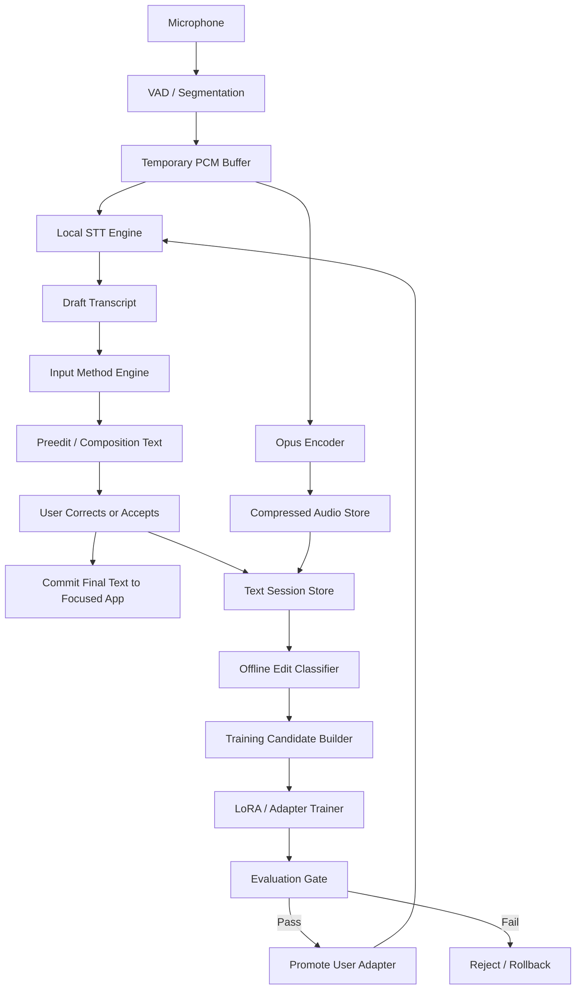
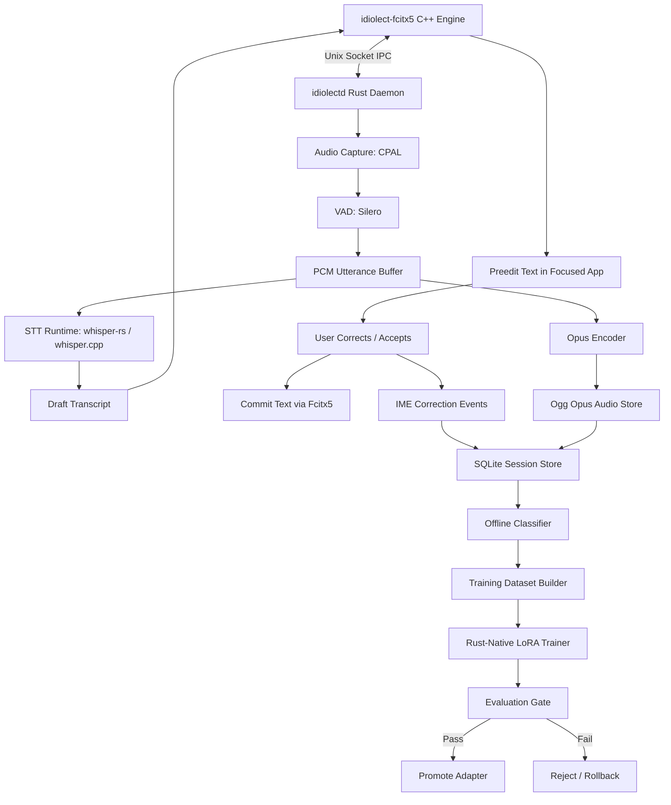
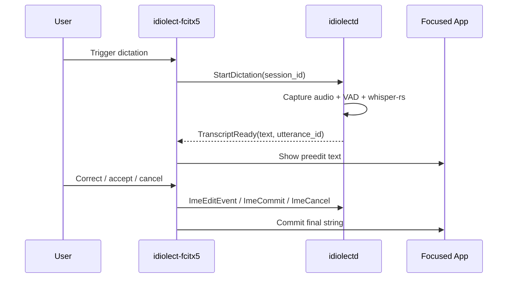
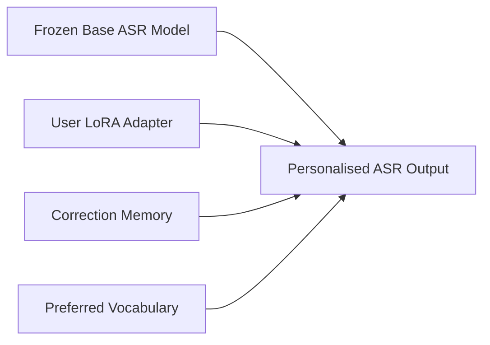
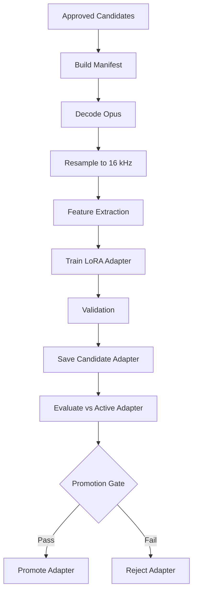

# Idiolect

**Speech-to-text that learns your way of speaking.**

Idiolect is a local-first personalised speech-to-text input method. It runs through the operating system input method layer, captures corrections made before text is committed, and uses those corrections to improve a per-user speech model over time.

---

## Table of Contents

- [Core Architecture](#core-architecture)
- [Why Idiolect Must Be an Input Method](#why-idiolect-must-be-an-input-method)
- [System Processes](#system-processes)
- [Interface Architecture: Ports and Adapters](#interface-architecture-ports-and-adapters)
  - [Boundary Rule](#boundary-rule)
  - [Dependency Direction](#dependency-direction)
- [Proposed Layering](#proposed-layering)
- [Core Domain Types](#core-domain-types-examples)
- [Required Ports (Traits)](#required-ports-traits)
- [Adapter Selection Through Configuration](#adapter-selection-through-configuration)
- [Contract Tests for Replaceability](#contract-tests-for-replaceability)
- [Anti-Coupling Checklist](#anti-coupling-checklist)
- [Architecture Refinements](#architecture-refinements)
  - [Domain Events](#domain-events)
  - [Event Log plus Materialised Tables](#event-log-plus-materialised-tables)
  - [Command and Query Separation](#command-and-query-separation)
  - [Idempotency and Exactly-Once Session Semantics](#idempotency-and-exactly-once-session-semantics)
  - [Backpressure and Worker Isolation](#backpressure-and-worker-isolation)
  - [Capability Negotiation](#capability-negotiation)
  - [Interface Stability Levels](#interface-stability-levels)
- [Fcitx5 Engine Design](#fcitx5-engine-design)
- [Text Session Model](#text-session-model)
- [Personalisation Strategy](#personalisation-strategy)
- [Training Pipeline](#training-pipeline)
- [Repository Structure](#repository-structure)
- [Binary Names](#binary-names)
- [Technology Stack](#technology-stack)
- [Testing Strategy](#testing-strategy)
  - [Testing Layers](#testing-layers)
  - [Test Suite Layout](#test-suite-layout)
  - [Unit Testing](#unit-testing)
  - [Integration Testing](#integration-testing)
  - [End-to-End Testing](#end-to-end-testing)
  - [Test Fixtures](#test-fixtures)
  - [Model and Evaluation Regression Testing](#model-and-evaluation-regression-testing)
  - [CI Gates](#ci-gates)
- [Status](#status)
  - [Baseline Verification Gates](#baseline-verification-gates)
- [CLI Surface](#cli-surface)
- [Core Truths of the Plan](#core-truths-of-the-plan)
- [Further Reading](#further-reading)

---

## Core Architecture



**Main design rule:** Every dictation creates an IME text session. Every IME text session links audio, raw STT, preedit changes, committed text, and training status.

---

## Why Idiolect Must Be an Input Method

The text layer is implemented through the operating system input method framework — not per-application plugins.

| Old Approach (Rejected) | New Approach |
|---|---|
| Browser plugin | One input method |
| VS Code plugin | System-wide through OS input-method layer |
| Terminal plugin | Works in any focused text field |
| Email plugin | |
| Slack plugin | |
| Notion plugin | |

**Linux Primary Backend:** Fcitx5  
**Linux Secondary Backend:** IBus (for GNOME/Ubuntu compatibility)  
**Future Platforms:** Windows TSF, macOS Input Method Kit, Android InputMethodService, iOS Custom Keyboard

---

## System Processes



---

## Interface Architecture: Ports and Adapters

Idiolect must not be tightly coupled to any third-party component. Fcitx5, IBus, Whisper, Silero VAD, Opus, SQLite, ONNX Runtime, Burn, and any future model runtime are **replaceable adapters** behind stable Idiolect-owned interfaces.

```mermaid
flowchart TD
    A[Idiolect Core Domain] --> B[InputMethodPort]
    A --> C[AudioInputPort]
    A --> D[VadPort]
    A --> E[AsrPort]
    A --> F[AudioCodecPort]
    A --> G[MetadataStorePort]
    A --> H[TrainerPort]
    A --> I[EvaluationPort]
    A --> J[AdapterRegistryPort]

    B --> B1[Fcitx5 Adapter]
    B --> B2[IBus Adapter]
    B --> B3[Windows TSF Adapter Later]
    B --> B4[macOS Input Method Kit Adapter Later]

    C --> C1[CPAL Adapter]
    C --> C2[PipeWire Adapter Later]

    D --> D1[Silero Adapter]
    D --> D2[WebRTC VAD Adapter]
    D --> D3[ONNX VAD Adapter]

    E --> E1[whisper-rs Adapter]
    E --> E2[whisper.cpp CLI Adapter]
    E --> E3[ONNX ASR Adapter]
    E --> E4[Burn ASR Adapter]

    F --> F1[Ogg Opus Adapter]
    F --> F2[FLAC Adapter Later]

    G --> G1[SQLite Adapter]
    G --> G2[Encrypted SQLite Adapter Later]

    H --> H1[Rust Trainer Adapter]
    H --> H2[Burn Trainer Backend]

    I --> I1[jiwer Evaluation Adapter]
    I --> I2[Custom Metrics Adapter]

    J --> J1[Filesystem Adapter Registry]
```



### Boundary Rule

Each external system is isolated by an Idiolect-owned trait or interface:

```text
Fcitx5 does not own the input-method domain model.
whisper-rs does not own the ASR result model.
Silero does not own the segmentation model.
Opus does not own the utterance storage model.
SQLite does not own the repository API.
No third-party framework owns the training-run model.
```

**Every adapter converts between third-party types and Idiolect domain types.**  
Never allow: `idiolect-core depends on whisper-rs`, `idiolect-core depends on rusqlite`, `idiolect-core depends on Fcitx5`.

### Dependency Direction

```text
idiolect-core      -> no third-party backend dependencies
adapters           -> depend on idiolect-core + third-party libraries
idiolectd          -> wires core services to selected adapters (composition root)
fcitx5 shim        -> speaks protocol only; no learning/storage/model logic
Rust trainer       -> external process behind TrainerPort contract
```

---

## Proposed Layering

```text
idiolect-core
  pure domain logic
  no Fcitx5, no whisper-rs, no CPAL, no SQLite, no ONNX, no Python, no filesystem assumptions

idiolect-application
  use cases and orchestration
  session lifecycle, dictation workflow, candidate workflow, training workflow, promotion workflow
  depends on core + port traits

idiolect-ports
  traits/interfaces only
  InputMethodPort, AudioCapturePort, VoiceActivityPort, SpeechToTextPort,
  AudioCodecPort, SessionRepositoryPort, CandidateRepositoryPort,
  TrainerPort, EvaluatorPort, AdapterRegistryPort, ClockPort, EventSinkPort

idiolect-adapters
  concrete implementations
  Fcitx5, CPAL, Silero, whisper-rs, Opus, SQLite, Rust trainer, filesystem

idiolectd
  composition root
  reads config, chooses adapter implementations, constructs ports, wires use cases,
  starts background workers, owns process lifecycle, exposes health/doctor state
```

---

## Core Domain Types (Examples)

```rust
pub struct AudioSegment {
    pub id: UtteranceId,
    pub sample_rate_hz: u32,
    pub channels: u16,
    pub samples_f32_mono: Vec<f32>,
    pub duration_ms: u32,
}

pub struct TranscriptDraft {
    pub utterance_id: UtteranceId,
    pub text: String,
    pub language: Option<String>,
    pub segments: Vec<TranscriptSegment>,
    pub engine_metadata: AsrMetadata,
}

pub struct CorrectionEvent {
    pub session_id: ImeSessionId,
    pub event_index: u32,
    pub event_type: CorrectionEventType,
    pub from_text: Option<String>,
    pub to_text: Option<String>,
    pub cursor_position: Option<u32>,
}
```

Third-party-specific values go into opaque metadata maps only when necessary.

---

## Required Ports (Traits)

```rust
pub trait InputMethodPort {
    fn show_preedit(&mut self, session_id: ImeSessionId, text: &str) -> Result<()>;
    fn update_preedit(&mut self, session_id: ImeSessionId, text: &str) -> Result<()>;
    fn commit_text(&mut self, session_id: ImeSessionId, text: &str) -> Result<()>;
    fn cancel_preedit(&mut self, session_id: ImeSessionId) -> Result<()>;
}

pub trait AudioInputPort {
    fn start_capture(&mut self, session_id: ImeSessionId) -> Result<()>;
    fn stop_capture(&mut self, session_id: ImeSessionId) -> Result<AudioSegment>;
}

pub trait VadPort {
    fn segment(&mut self, audio: AudioStreamFrame) -> Result<Vec<AudioSegment>>;
}

pub trait AsrPort {
    fn transcribe(&self, audio: &AudioSegment, profile: AsrProfile) -> Result<TranscriptDraft>;
}

pub trait AudioCodecPort {
    fn encode(&self, audio: &AudioSegment, target: AudioEncoding) -> Result<EncodedAudio>;
    fn decode(&self, encoded: &EncodedAudio) -> Result<AudioSegment>;
}

pub trait MetadataStorePort {
    fn create_session(&self, session: NewImeSession) -> Result<ImeSessionId>;
    fn append_edit_event(&self, event: CorrectionEvent) -> Result<()>;
    fn commit_session(&self, commit: SessionCommit) -> Result<()>;
    fn create_training_candidate(&self, candidate: NewTrainingCandidate) -> Result<TrainingCandidateId>;
}

pub trait TrainerPort {
    fn train(&self, manifest: TrainingManifest, config: TrainingConfig) -> Result<TrainingArtifact>;
}

pub trait EvaluationPort {
    fn evaluate(&self, artifact: TrainingArtifact, suites: EvaluationSuites) -> Result<EvaluationReport>;
}

pub trait AdapterRegistryPort {
    fn register_candidate(&self, artifact: TrainingArtifact, report: EvaluationReport) -> Result<AdapterId>;
    fn promote(&self, adapter_id: AdapterId) -> Result<()>;
    fn rollback(&self, user_id: UserId) -> Result<()>;
}
```

---

## Adapter Selection Through Configuration

Runtime configuration selects adapters by logical capability, not hard-coded library names:

```toml
[input_method]
backend = "fcitx5"

[audio]
backend = "cpal"

[vad]
backend = "silero"

[asr]
backend = "whisper-rs"
model = "whisper-medium-en"

[codec]
backend = "ogg-opus"

[metadata_store]
backend = "sqlite"

[trainer]
backend = "rust-native-lora"
auto_train = false

[evaluator]
backend = "jiwer"
```

Compile-time feature selection is acceptable for v1, provided the core talks only to interfaces.

---

## Contract Tests for Replaceability

Every port must have a shared contract test suite. Any adapter implementing that port must pass the same tests.

| Port | Primary Adapter | Replacement/Test Adapter |
|---|---|---|
| `InputMethodPort` | Fcitx5 | headless fake input method |
| `SpeechToTextPort` | whisper-rs | deterministic fixture recogniser |
| `VoiceActivityPort` | Silero | fixture segmenter |
| `AudioCodecPort` | Opus | no-op PCM fixture codec |
| `SessionRepositoryPort` | SQLite | in-memory repository |
| `TrainerPort` | Rust-native trainer | fake trainer returning fixed metrics |
| `EvaluatorPort` | jiwer evaluator | fixture evaluator |
| `AdapterRegistryPort` | filesystem registry | temp-dir registry |

**Rule:** No port is architecturally proven until both the real adapter and replacement adapter pass the same contract test suite.

---

## Anti-Coupling Checklist

Before accepting a new dependency, answer:

- Can this component be replaced without changing `idiolect-core`?
- Are its types hidden behind an Idiolect-owned interface?
- Can it be mocked in tests?
- Can its version be upgraded without changing the database schema?
- Can its output be represented in stable Idiolect domain types?
- Can failures be mapped into Idiolect error types?
- Does it require private data to leave the machine?

If the answer is no, the dependency must be wrapped or rejected.

---

## Architecture Refinements

### Domain Events

Use typed domain events inside Idiolect for clear audit trail, simpler testing, idempotent recovery, and cleaner integration:

```rust
pub enum DomainEvent {
    DictationStarted(DictationStarted),
    AudioSegmentCaptured(AudioSegmentCaptured),
    TranscriptProduced(TranscriptProduced),
    PreeditChanged(PreeditChanged),
    TextCommitted(TextCommitted),
    SessionCancelled(SessionCancelled),
    TrainingCandidateCreated(TrainingCandidateCreated),
    CandidateClassified(CandidateClassified),
    AdapterEvaluated(AdapterEvaluated),
    AdapterPromoted(AdapterPromoted),
    AdapterRejected(AdapterRejected),
}
```

### Event Log plus Materialised Tables

Use an append-only event log as the source of truth for correction/session history, then maintain relational tables for query speed:

```sql
CREATE TABLE event_log (
  id TEXT PRIMARY KEY,
  aggregate_type TEXT NOT NULL,
  aggregate_id TEXT NOT NULL,
  event_type TEXT NOT NULL,
  event_version INTEGER NOT NULL,
  event_json TEXT NOT NULL,
  idempotency_key TEXT,
  created_at TEXT NOT NULL
);
```

### Command and Query Separation

**Commands** change state: `StartDictation`, `StopDictation`, `RecordPreeditChange`, `CommitSession`, `CancelSession`, `ClassifyCandidate`, `PromoteAdapter`, `RollbackAdapter`, `DeleteUtterance`

**Queries** read state: `GetCurrentSession`, `ListCandidates`, `ListAdapters`, `GetTrainingRun`, `GetPrivacyReport`, `GetDoctorReport`

### Idempotency and Exactly-Once Session Semantics

Every mutating command has: `command_id`, `session_id`, monotonic `event_index`, `idempotency_key`, `created_at`. Duplicate commits must not create duplicate candidates; cancel after commit must be ignored; preedit edit events must preserve order.

### Backpressure and Worker Isolation

Separate execution lanes with bounded queues:

```text
input-method lane: fast, non-blocking
audio lane: real-time-ish
speech-to-text lane: bounded worker queue
storage lane: short transactions
training lane: background, cancellable
evaluation lane: background, resource-limited
```

### Capability Negotiation

Each adapter reports capabilities at startup. Core logic branches on capabilities, not third-party library names:

```rust
pub struct AdapterCapabilities {
    pub name: String,
    pub version: String,
    pub supports_streaming: bool,
    pub supports_word_timestamps: bool,
    pub supports_confidence: bool,
    pub supports_gpu: bool,
    pub supports_incremental_updates: bool,
}
```

### Interface Stability Levels

| Level | Meaning | Examples |
|---|---|---|
| internal | can change freely before v1 | low-level helper traits |
| product-stable | stable across v1.x | session lifecycle, training candidate rules |
| adapter-stable | third-party adapters depend on it | port traits, adapter manifests |
| storage-stable | migration required for change | database schema, event log |
| protocol-stable | compatibility negotiation required | IPC messages |

---

## Fcitx5 Engine Design

The Fcitx5 engine is a **thin C++ shim**:

- Registers Idiolect as an input method
- Handles activation/hotkey
- Sends `StartDictation`/`StopDictation` to `idiolectd`
- Receives transcript results
- Displays transcript as preedit text
- Captures edits made before commit
- Commits final text to focused application
- Sends session events back to `idiolectd`

**It does NOT:** run Whisper, capture microphone audio, encode audio, write SQLite, train models, own learning logic.



---

## Text Session Model

### Session States

```text
created -> recording -> transcribing -> preedit_active -> user_correcting -> committed
                                                              -> cancelled
                                                              -> abandoned
                                                              -> post_commit_observed
                                                              -> post_commit_unknown
```

### Correction Capture Quality

| Quality | Source | Example |
|---|---|---|
| **High** | IME preedit correction | Spoken: "restart Traefik" → STT: "restart traffic" → User fixes to "restart Traefik" |
| **Medium** | Post-commit surrounding text | Committed "restart traffic", later observed "restart Traefik" in context |
| **Low** | No correction captured | Store audio + raw STT + committed text only |

---

## Personalisation Strategy



### Path A: v1 Runtime Learning (Immediate)
- Personal correction memory
- Preferred vocabulary
- Context-aware substitution
- Candidate reranking
- Proper noun preference

### Path B: Research/Mid-Term (Deferred Model Adaptation)
- Train LoRA/DoRA adapters through Rust-owned `TrainerPort`
- Evaluate Burn and Candle as Rust-native training backends
- Produce versioned export/merge artifacts validated through `AsrPort` contract tests

### Path C: Long-Term
- Build adapter-aware inference/training in Rust
- Burn or Candle as candidate backends
- Personalised adapters load without Python runtime

---

## Training Pipeline



**Initial LoRA Settings:** rank 8-16, alpha 16-32, dropout 0.05, target attention q/v layers, conservative LR, few epochs, early stopping.

### Promotion Criteria

Promote only if:
- Personal holdout WER improves
- Proper noun accuracy improves or does not regress
- Command accuracy does not regress
- General mini-set does not materially regress
- Hallucination/deletion rates do not increase
- Latency remains acceptable

### Rollback Rules

Always retain: current active adapter, previous active adapter, best historical adapter, base model fallback.

---

## Repository Structure

```text
idiolect/
  Cargo.toml
  README.md
  LICENSE

  crates/
    idiolect-core/
      src/
        domain/
        services/
        ports/

    idiolect-adapters/
      fcitx5-input-method/
      ibus-input-method/
      cpal-audio-input/
      silero-vad/
      whisper-rs-asr/
      ogg-opus-codec/
      sqlite-store/
      rust-native-lora-trainer/
      jiwer-evaluator/

    idiolect-common/
      src/
        ids.rs
        protocol.rs
        config.rs
        error.rs
        time.rs

    idiolect-ipc/
      src/
        server.rs
        client.rs
        messages.rs
        framing.rs

    idiolect-audio/
      src/
        capture.rs
        devices.rs
        buffer.rs
        resample.rs

    idiolect-vad/
      src/
        silero.rs
        segmenter.rs
        config.rs

    idiolect-asr/
      src/
        whisper_rs.rs
        runtime.rs
        models.rs
        transcript.rs

    idiolect-codec/
      src/
        opus.rs
        decode.rs
        encode.rs
        wav_debug.rs

    idiolect-storage/
      src/
        db.rs
        migrations.rs
        utterances.rs
        sessions.rs
        candidates.rs
        adapters.rs
        audio_store.rs

    idiolect-trainerctl/
      src/
        manifest.rs
        classify.rs
        train.rs
        evaluate.rs
        promote.rs

    idiolectd/
      src/
        main.rs
        daemon.rs
        services.rs
        commands.rs

  fcitx5/
    idiolect-fcitx5/
      CMakeLists.txt
      src/
        engine.cpp
        engine.h
        ipc_client.cpp
        ipc_client.h
        preedit_session.cpp
        preedit_session.h
      data/
        idiolect-addon.conf
        idiolect.conf

  research/
    python-trainer-reference/
      README.md
      pyproject.toml
      train_lora.py
      evaluate_adapter.py
      build_manifest.py
      classify_edits.py
      merge_adapter.py
      export_model.py

  models/
    README.md
    whisper/
      .gitkeep

  docs/
    00-master-plan.md
    01-interface-architecture.md
    02-input-method-architecture.md
    03-fcitx5-engine.md
    04-rust-daemon.md
    05-audio-pipeline.md
    06-storage-schema.md
    07-correction-sessions.md
    08-training-pipeline.md
    09-models.md
    10-burn-roadmap.md
    11-security-privacy.md
    12-testing-strategy.md
    13-v1-delivery-target.md
```

---

## Binary Names

```text
idiolectd          # local daemon
idiolect           # CLI
idiolect-fcitx5    # Fcitx5 input method engine/addon
idiolect-train     # trainer orchestration CLI (optional)
```

---

## Technology Stack

| Component | First Implementation | Replaceability Rule |
|---|---|---|
| Input method | Fcitx5 C++ engine | behind `InputMethodPort` |
| Local daemon | Rust | composition root only |
| IPC | Unix domain socket + JSON Lines | behind `IpcTransportPort` |
| Audio capture | CPAL | behind `AudioInputPort` |
| Resampling | rubato | behind `AudioResamplerPort` |
| VAD | Silero VAD Rust crate / ONNX Runtime | behind `VadPort` |
| STT inference | whisper-rs over whisper.cpp | behind `AsrPort` |
| First model | Whisper `medium.en` GGML/GGUF | model artifact, not domain dependency |
| Audio storage | Ogg Opus, mono, 24 kbps VBR | behind `AudioCodecPort` |
| Metadata storage | SQLite via rusqlite | behind `MetadataStorePort` |
| Training orchestration | Rust | application service |
| Training backend | Rust-native (Burn/Candle evaluated) | behind `TrainerPort` |
| Evaluation | Rust metric engine first | behind `EvaluationPort` |
| Python reference tools | optional research only | never required by v1 product |

**Language Policy:** Rust is the default for product code. Allowed non-Rust: Fcitx5 C++ shim (thin boundary adapter), third-party C/C++ libraries behind Rust adapter crates, Python scripts (research/reference only, not required for v1 operation).

---

## Testing Strategy

Testing is a core product requirement, not an afterthought. Idiolect sits between microphone input, speech recognition, operating-system text composition, local storage, and model adaptation. Bugs can silently corrupt training data, commit wrong text into user applications, or promote a worse personalised model. The test strategy must cover correctness, privacy, data integrity, latency, and regression safety.

### Testing Layers

```text
unit tests
  -> integration tests
  -> component contract tests
  -> end-to-end tests
  -> model/evaluation regression tests
  -> manual exploratory tests
```

**Testing Principle:** No captured correction should be used for training unless the audio, raw transcript, edit events, committed text, classifier decision, and manifest entry are all internally consistent.

### Test Suite Layout

```text
tests/
  fixtures/
    audio/           # short spoken phrases, silence, noise, clipped speech, long utterance
    transcripts/     # raw STT, corrected text, semantic rewrite examples
    ipc/             # valid sessions, malformed messages, reconnect sequences
    sqlite/          # migrated empty DB, sample populated DB, corrupted DB copy
    manifests/       # valid train/validation/holdout files, invalid duplicate split files
    adapters/        # passing, failing, latency-regressing, hallucination-regressing examples
  integration/
  e2e/
  performance/
  privacy/
  regression/

crates/
  idiolect-common/tests/
  idiolect-ipc/tests/
  idiolect-audio/tests/
  idiolect-vad/tests/
  idiolect-asr/tests/
  idiolect-codec/tests/
  idiolect-storage/tests/
  idiolect-trainerctl/tests/
  idiolectd/tests/

fcitx5/idiolect-fcitx5/tests/
  unit/
  contract/
  headless/
```

### Unit Testing

Unit tests isolate a single function, struct, state machine, or algorithm. They must not require a microphone, GPU, real Fcitx5 session, real Whisper model, or user desktop.

| Area | What to test |
|---|---|
| `idiolect-common` | ID parsing, timestamp handling, config defaults, enum serialisation, error mapping |
| `idiolect-ipc` | JSON Lines framing, malformed messages, request/response correlation, streaming events, reconnect behaviour |
| `idiolect-audio` | sample conversion, channel downmixing, buffer boundaries, resampling metadata, clipping handling |
| `idiolect-vad` | speech boundary state machine, pre-roll/post-roll logic, max utterance cut-off, silence handling |
| `idiolect-asr` | runtime wrapper behaviour with mocked recogniser, transcript normalisation, error propagation |
| `idiolect-codec` | Opus path generation, hash calculation, decode metadata, debug WAV guardrails |
| `idiolect-storage` | migrations, insert/update invariants, foreign-key behaviour, deletion cascades, transaction rollback |
| `idiolect-trainerctl` | candidate filtering, split generation, manifest writing, metric import, promotion decision logic |
| `idiolectd` | daemon state transitions, command handling, service wiring with mocks |
| Fcitx5 shim | preedit state, edit event ordering, commit/cancel logic, IPC client failure handling |
| Rust trainer | classifier rules, dataset split, metric calculation, adapter metadata, early-stopping decisions |

**Minimum unit test rules:**
- All state machines must test every valid transition and every invalid transition
- All database writes must test success and rollback failure paths
- All IPC message types must round-trip through serialisation and deserialisation
- All text edit classification labels must have positive and negative examples

**Example Rust unit tests:**
```rust
#[test]
fn vad_adds_pre_roll_without_negative_start() {
    // Given a speech boundary near the start of the rolling buffer,
    // pre-roll should clamp to zero rather than underflow.
}

#[test]
fn ime_commit_creates_high_quality_candidate_after_preedit_correction() {
    // Raw: "restart traffic"
    // Edited: "restart Traefik"
    // Commit should create an ime_preedit_correction candidate with trust 1.0.
}
```

**Example classifier unit tests:**
```rust
#[test]
fn semantic_rewrite_is_rejected() {
    let raw = "restart traffic";
    let final_text = "actually open the deployment notes";
    let label = classify_edit(raw, final_text);
    assert_eq!(label, EditClassification::SemanticRewrite);
}
```

### Integration Testing

Integration tests verify that two or more real components work together while avoiding a full desktop session where possible.

| Suite | Components under test | Purpose |
|---|---|---|
| IPC contract | Fcitx5 IPC client + Rust IPC server | Ensure both sides agree on message schemas and streaming behaviour |
| daemon-storage | `idiolectd` + SQLite + audio store pathing | Ensure session lifecycle writes consistent rows and files |
| audio-vad | CPAL abstraction or fixture PCM + VAD | Ensure utterance segmentation is stable on known clips |
| asr-fixture | ASR wrapper + small fixed model or mocked recogniser | Ensure transcript output is passed into IME session correctly |
| codec-storage | Opus encode/decode + utterance rows | Ensure stored clips can be recovered for training |
| classifier-storage | captured sessions + classifier + candidate table | Ensure trust scores and labels persist correctly |
| manifest-builder | approved candidates + audio files + manifests | Ensure train/validation/holdout manifests are valid |
| trainer-evaluator | small fixture dataset + Rust trainer/evaluator | Ensure metrics are produced and imported |
| adapter-promotion | evaluation metrics + adapter registry | Ensure pass/fail/rollback rules are enforced |

**Important integration invariants:**
- An utterance row must not exist without an audio file unless the transaction is explicitly marked failed
- An IME committed session must link to exactly one utterance
- A high-quality correction candidate must link to both `utterance_id` and `text_session_id`
- A rejected classifier label must never appear in a training manifest
- A holdout item must never appear in a training split
- Adapter promotion must be atomic
- Rollback must restore the previous active adapter

**SQLite integration tests** run against temporary databases with migrations applied from scratch.

**IPC integration tests** use temporary Unix domain sockets with a test `idiolectd` server.

### End-to-End Testing

E2E tests validate the complete user-visible workflow:

```text
trigger dictation
capture or inject audio
transcribe
show preedit text
simulate correction
commit text into focused app
persist session
classify candidate
export manifest
run evaluation/promotion gate where applicable
```

| Tier | Environment | Purpose |
|---|---|---|
| E2E-lite | no desktop, mocked Fcitx5, mocked ASR | Fast lifecycle test in continuous integration |
| E2E-headless | nested X11/Wayland session + Fcitx5 + test app | Verify input-method behaviour without a real user desktop |
| E2E-real-desktop | manual or nightly Linux desktop VM | Verify browser, terminal, GTK, Qt, and Electron apps |
| E2E-model | real Whisper model + fixture audio | Verify transcription and latency regressions |
| E2E-training | fixture corrections + trainer + evaluation gate | Verify learning loop without user data |

**Minimum E2E scenarios (20):**
1. Accept transcript unchanged
2. Correct one word in preedit and commit
3. Cancel dictation before commit
4. Abandon session after transcript appears
5. Dictate two utterances in the same target app
6. Dictate into browser text field
7. Dictate into terminal
8. Dictate into GTK editor
9. Dictate into Qt editor
10. Dictate into Electron app
11. Daemon crashes after audio capture but before commit
12. Fcitx5 engine loses IPC connection during preedit
13. Storage disk becomes unavailable
14. ASR returns empty transcript
15. ASR returns low-confidence transcript
16. Classifier rejects semantic rewrite
17. Approved correction appears in manifest
18. Holdout example is excluded from training
19. Bad adapter is rejected
20. Previous adapter is restored after rollback

**Target applications for Linux E2E:**
| App class | Example target |
|---|---|
| Browser | Firefox, Chromium |
| Terminal | GNOME Terminal, Konsole, Alacritty |
| GTK text editor | gedit or GNOME Text Editor |
| Qt text editor | Kate or simple Qt test app |
| Electron | VS Code or simple Electron fixture app |
| Web text area | local test page with input and textarea fields |

The E2E test harness includes a tiny local test application that records exactly what text was committed.

### Test Fixtures

Fixtures are synthetic, redistributable, and small enough for continuous integration.

| Fixture | Contents |
|---|---|
| audio clips | short spoken phrases, silence, noise, clipped speech, long utterance |
| transcripts | raw STT, corrected text, semantic rewrite examples |
| IPC logs | valid sessions, malformed messages, reconnect sequences |
| SQLite snapshots | migrated empty DB, sample populated DB, corrupted DB copy |
| manifests | valid train/validation/holdout files, invalid duplicate split files |
| adapter metrics | passing, failing, latency-regressing, hallucination-regressing examples |

**Required phrase fixtures:**
```text
restart Traefik
open Vaultwarden
deploy the container
roll back the adapter
use the Fcitx5 input method
```

**Correction fixtures:**
| Raw STT | Final text | Expected label | Trust |
|---|---|---|---:|
| restart traffic | restart Traefik | proper_noun_correction | 0.90 |
| open vault warden | open Vaultwarden | proper_noun_correction | 0.90 |
| deploy the container | deploy the container | accepted_without_edit | 0.60 |
| roll back adapter | roll back the adapter | asr_correction | 1.00 |
| restart traffic | actually open the notes | semantic_rewrite | 0.00 |

**Audio fixture rules:**
- Do not use private user recordings in the repository
- Use synthetic or explicitly consented sample audio only
- Keep large model files out of git
- Download models through explicit developer command or CI cache

### Model and Evaluation Regression Testing

Model tests detect accuracy, latency, hallucination, deletion, and promotion regressions.

**Regression sets:**
| Set | Purpose |
|---|---|
| personal fixture set | proper nouns and repeated user-style corrections |
| command set | short operational commands |
| general speech mini-set | ordinary dictation to prevent overfitting |
| silence/noise set | hallucination detection |
| long utterance set | segmentation and timeout behaviour |

**Metrics to track in CI or nightly jobs:**
```text
word error rate
character error rate
proper noun accuracy
command exact-match accuracy
hallucination rate on silence/noise
deletion rate
median latency
p95 latency
real-time factor
memory usage
model load time
```

**Promotion-gate tests** use fixed metric inputs and real evaluation outputs.

**Promotion must fail if:**
- Personal holdout WER does not improve enough
- General regression set materially worsens
- Proper noun accuracy regresses
- Command accuracy regresses
- Hallucination rate increases
- p95 latency exceeds target
- Adapter artifact is missing or corrupt
- Adapter metadata does not match the base model

### CI Gates

All warnings are errors, and any failing command blocks the current baseline. Run the full baseline gate:

```bash
bash ci/scripts/test-all.sh
```

Direct gates run by `test-all.sh`:

```bash
bash ci/scripts/test-rust.sh
bash ci/scripts/test-fcitx5.sh
bash ci/scripts/test-integration.sh
bash ci/scripts/test-e2e.sh
bash ci/scripts/test-real-adapter-deps.sh
bash ci/scripts/test-interface-no-backend-leakage.sh
bash ci/scripts/test-packaging.sh
bash ci/scripts/test-package-smoke.sh
bash ci/scripts/test-coverage-map.sh
bash ci/scripts/test-coverage.sh
```

Additional CI scripts (from master plan):
```bash
bash ci/scripts/test-cpp.sh
bash ci/scripts/test-e2e-linux.sh
bash ci/scripts/test-model-regression.sh
```

---

## Status

This repository is currently a prototype baseline and not yet Idiolect v1 complete.

### Baseline Verification Gates

All warnings are errors, and any failing command blocks the current baseline. Run the full baseline gate:

```bash
bash ci/scripts/test-all.sh
```

Direct gates run by `test-all.sh`:

```bash
bash ci/scripts/test-rust.sh
bash ci/scripts/test-fcitx5.sh
bash ci/scripts/test-integration.sh
bash ci/scripts/test-e2e.sh
bash ci/scripts/test-real-adapter-deps.sh
bash ci/scripts/test-interface-no-backend-leakage.sh
bash ci/scripts/test-packaging.sh
bash ci/scripts/test-package-smoke.sh
bash ci/scripts/test-coverage-map.sh
bash ci/scripts/test-coverage.sh
```

---

## CLI Surface

Current product command groups are wired through `idiolect-cli`. Backed commands execute normally; commands whose backing services are later recovery tasks return nonzero JSON with `code: "not-implemented"`.

```bash
idiolect-cli doctor --json
idiolect-cli service status --json
idiolect-cli models list --json
idiolect-cli sessions list --json
idiolect-cli candidates list --json
idiolect-cli train export-manifest --json
idiolect-cli adapters list --json
idiolect-cli privacy export --user default --db path/to/idiolect.sqlite
idiolect-cli privacy delete-all --user default --confirm-delete --json
```

---

## Core Truths of the Plan

1. **Input method first** — not plugins, not clipboard hacks, not keylogging
2. **Local-first** — no cloud dependency for core loop
3. **Ports and adapters** — every third-party component is replaceable
4. **Rust-first ML** — training, evaluation, promotion, rollback owned by Rust application services
5. **Event-sourced session model** — append-only event log + materialised tables
6. **Idempotent, exactly-once semantics** — survive IPC loss, duplicate events, crashes
7. **Capability negotiation over library detection** — branch on capabilities, not names
8. **Contract-tested replaceability** — two implementations per port minimum
9. **Privacy by architecture** — private data never leaves the machine
10. **v1 must be end-to-end complete** — dictation → correction → training → promotion → rollback

---

## Further Reading

- [Master Plan](docs/idiolect_master_plan_rust_first.md) — Complete architectural specification
- [Decisions](docs/decisions/) — Architecture Decision Records
- [Implementation Plans](docs/implementation/) — Detailed workstream plans
