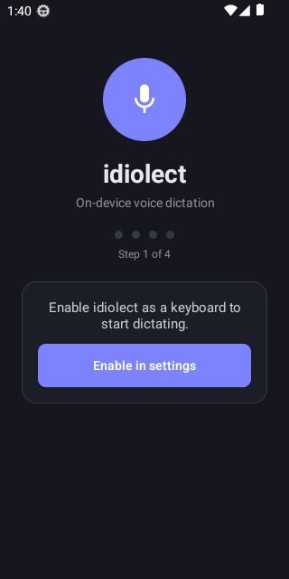
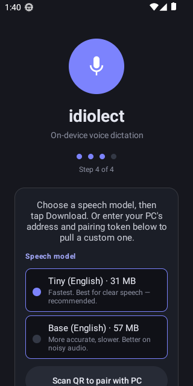
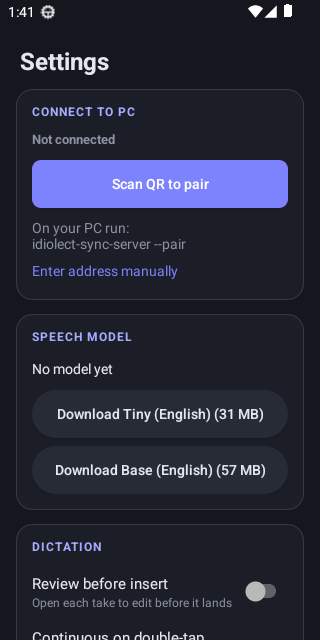
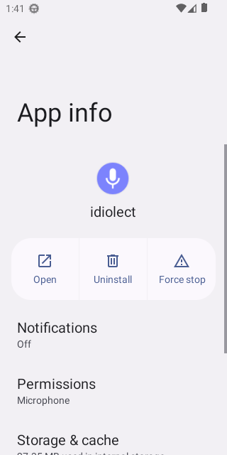

# idiolect for Android — setup & usage

On-device voice dictation as an Android keyboard (IME). Speech-to-text runs **entirely on
your phone** (whisper.cpp / ggml) — no cloud, no Google Play Services, GrapheneOS-friendly.
Optionally pair with your PC so your corrections train a personal model at home.

> New here? The whole first run is four taps: **enable the keyboard → switch to it → grant the
> mic → pick a speech model**. Then dictate into any text field.

---

## 1. Install

**Recommended — Obtainium** (tracks the public GitHub releases, auto-updates):

1. Install [Obtainium](https://github.com/ImranR98/Obtainium).
2. Add app → paste `https://github.com/nick-tgcs/idiolect`.
3. It picks the latest signed `android-v*` release; tap **Install**. Leave *Allow Network
   permission* ticked (used only to pull the speech model and, if you pair, to sync to your PC).

**Or sideload the APK** from the [Releases](https://github.com/nick-tgcs/idiolect/releases) page,
or build it yourself (see [Build from source](#build-from-source)).

---

## 2. First run (4 steps)

Open **idiolect**. The onboarding shows one action at a time and advances as you complete each.

| Step | What to do |
| ---- | ---------- |
| **1 · Enable** | Tap **Enable in settings** → toggle *idiolect dictation* on in the system keyboard list, then come back. |
| **2 · Switch** | Tap **Choose keyboard** → pick *idiolect dictation* as the active keyboard. |
| **3 · Microphone** | Tap **Grant microphone** and allow it — dictation needs to hear you. |
| **4 · Model** | **Choose a speech model and tap Download** (details below). |

<p align="center">
  
  &nbsp;
  
</p>

### Choosing a speech model

Everything runs offline, so the model is downloaded once to your phone.

| Model | Size | Speed | Accuracy |
| ----- | ---- | ----- | -------- |
| **Tiny (English)** — *default* | ~31 MB | Fastest — near real-time on any phone | Great for clear speech |
| **Base (English)** | ~57 MB | ~2× slower | Better on noisy / harder audio |

Start with **Tiny** — it's the default and by far the quickest. You can switch any time in
**Settings → Speech model** (it re-downloads the other one). The download shows live megabytes
and has a **Cancel** button, so it never looks stuck; if it fails, just tap Download again.

> Why Tiny by default? On a phone CPU the full-precision base model was slow and a 140 MB
> download. The shipped models are quantized (`q5_1`) English models — a fraction of the size and
> markedly faster — and decoding is capped to 4 threads (more only drags on a phone's small cores).

---

## 3. Dictate

Tap any text field. idiolect shows a circular **mic** with a control strip (it has no typing
keyboard of its own):

- **Hold the mic** to talk, release to insert — one utterance.
- **Double-tap the mic** for **continuous** hands-free dictation; tap again to stop.
- **⌨** hands the field back to *your* keyboard (system keyboard switch).
- **👁** opens **Review before insert** — edit the take with your own keyboard before it lands.
  Your edit is recorded as a training pair (if you've paired with a PC).
- **⚙** opens **Settings**.

<p align="center">
  
  &nbsp;
  
</p>

---

## 4. Settings

Reached via **⚙** on the mic strip:

- **Connect to PC** — pair to sync corrections / pull a custom model (see below).
- **Speech model** — the active model, with one-tap switch/download of the other.
- **Dictation** — *Review before insert*, *Continuous on double-tap*.
- **Learning** — *Ship corrections to your PC* (only does anything once paired).
- **Audio on device** — captured-audio footprint against the cap (oldest evicted).
- **System** — keyboard enabled/selected and microphone status, each tappable to fix.

---

## 5. Optional — pair with your PC

Pairing lets your edits flow back to your machine to train a personal model, and lets you pull a
custom model. It is **not required** — dictation works fully standalone.

1. On your PC: `idiolect-sync-server --pair` (prints a QR / `idiolect://pair…` link).
2. On the phone: **Settings → Connect to PC → Scan QR to pair** (or *Enter address manually* for
   a `--no-tls` endpoint on your own network).

The default path is **pinned HTTPS**: the server's self-signed certificate's fingerprint is
carried in the QR and pinned on the phone, so the link is verified end-to-end.

**Instant insert (optional):** the 👁 Review flow can type the approved text straight back into
the app you were in. The first time, it offers to enable *idiolect instant insert* in
Accessibility settings. Dictation works without it; it only improves the review hand-off.

---

## Troubleshooting

- **Transcription feels slow** → use **Tiny** (Settings → Speech model). It's the default; if you
  switched to Base, switch back. Tiny is several times faster on a phone.
- **The model download looks stuck** → it shows live MB now; if the network stalls, tap **Cancel
  download** and retry. Tiny (~31 MB) is the quickest to fetch.
- **"No model yet" / dictation produces nothing** → finish step 4 (download a model). Check
  Settings → System that the keyboard is selected and the mic is granted.
- **Mic strip never appears** → make sure idiolect is the *active* keyboard (Settings → System →
  Keyboard, or the system keyboard switcher).
- **Notifications** → a small "idiolect is listening" notification appears while recording; that's
  the foreground microphone service Android requires.

---

## Build from source

Requires the Android SDK + NDK, Rust, and `cargo-ndk`.

```sh
# Cross-compile the native core (arm64 for devices, x86_64 for the emulator) into jniLibs,
# then assemble the APK. -PandroidAbis trims ABIs (x86_64 only = fast local emulator build).
cd android
./gradlew :app:assembleDebug -PandroidAbis=x86_64        # emulator
./gradlew :app:assembleRelease -PandroidAbis=arm64-v8a   # device (needs signing config)
```

Tests:

```sh
./gradlew :app:testDebugUnitTest :ffi:test               # host JVM unit + Robolectric
./gradlew :app:connectedDebugAndroidTest -PandroidAbis=x86_64   # on-emulator e2e
```

See [docs/future/009-android-implementation-plan.md](../docs/future/009-android-implementation-plan.md)
for the architecture, and the repo root [CONTRIBUTING.md](../CONTRIBUTING.md) for the TDD workflow.
