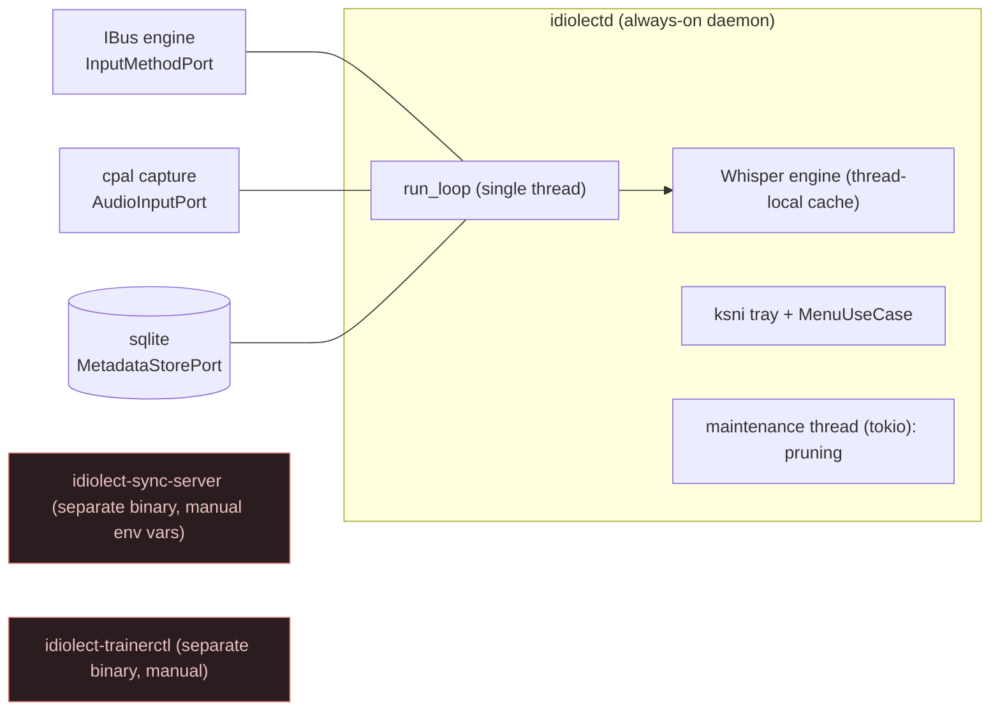
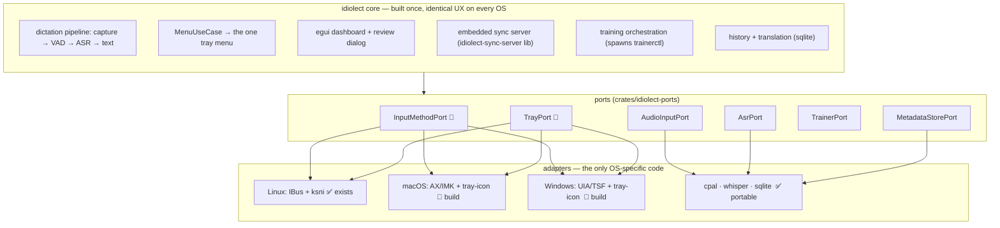
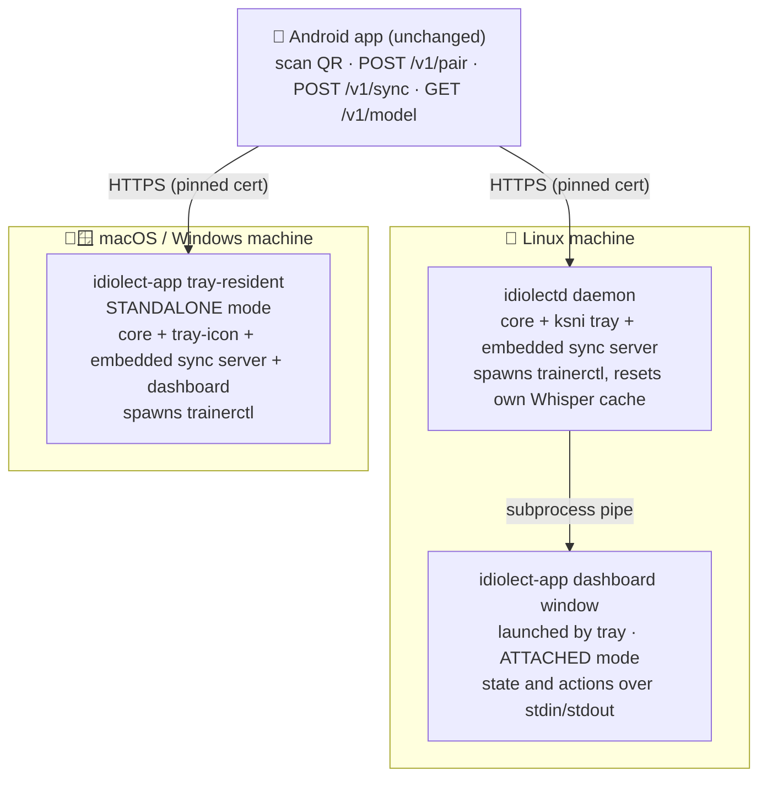
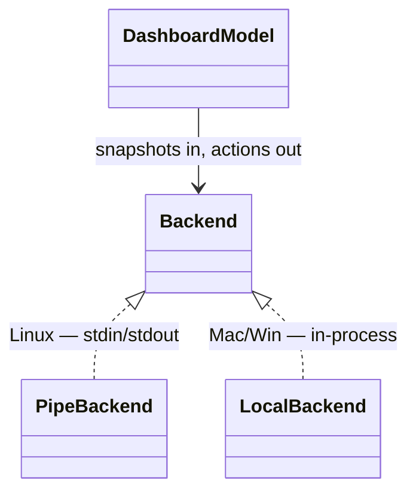
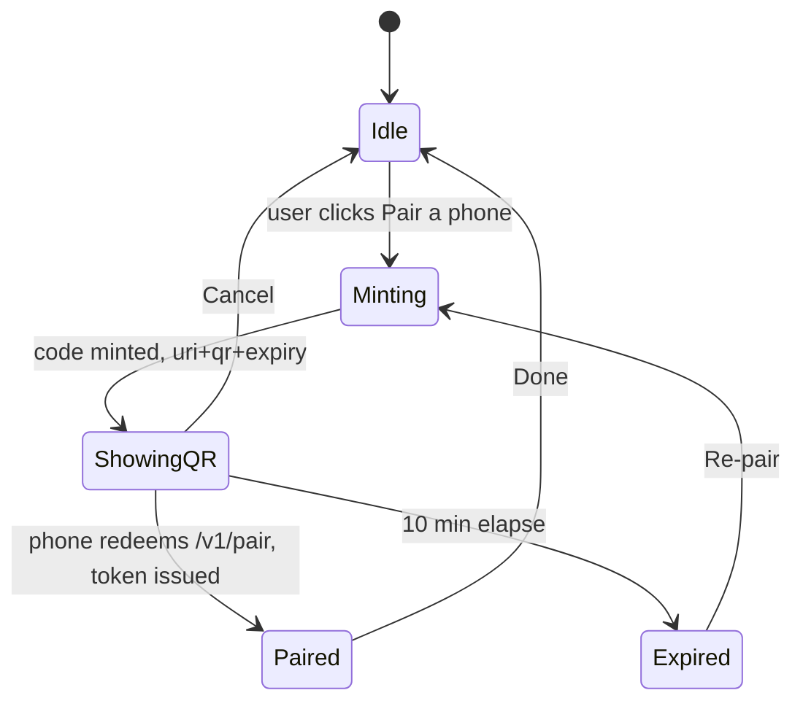
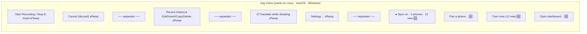
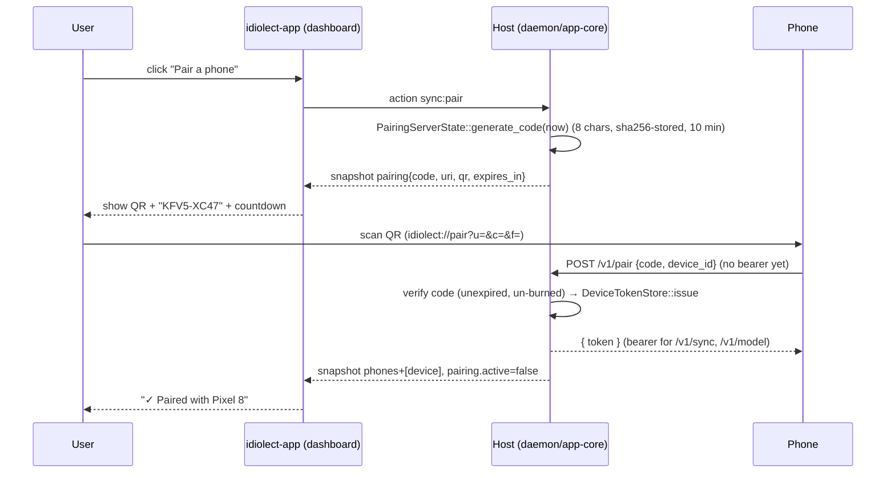
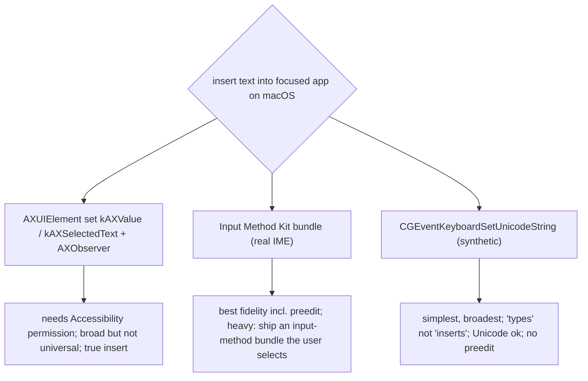
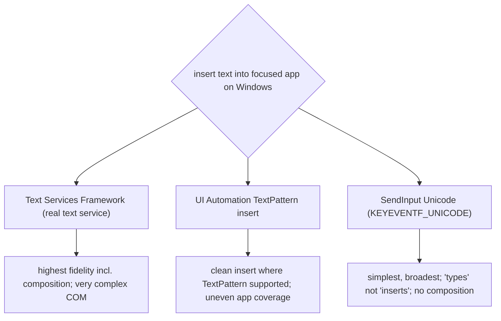

# 010 — idiolect cross-platform desktop app (phone↔PC sync + training, full parity)

**Status:** design, signed-off on architecture & scope; not yet implemented.
**Visual references:** [dashboard mockups](../mockups/desktop-app.html) ([png](../mockups/desktop-app.png), 8 states) · [architecture diagram](../diagrams/desktop-sync-architecture.html) ([png](../diagrams/desktop-sync-architecture.png)).

---

## 1. Goal & non-goals

**Goal.** Replace the three-terminal phone→PC sync/train workflow with **one product that looks and
behaves identically on Linux, macOS and Windows**: the same tray menu, the same dashboard, the same
features. A user pairs a phone by scanning a QR, corrections flow in automatically, and the model
improves with one click (or an opt-in auto-train). After training the PC's own dictation upgrades
immediately. No feature is added or removed per OS — only the adapters underneath differ.

**Non-goals (this effort).** No cloud. No new ML. No change to the phone's sync/pairing protocol
(it already speaks the wire format below). macOS/Windows GPU training stays CPU-only initially
(Metal/CUDA later).

**Scope decision (locked): full parity in one go** — build the portable feature **and** the macOS +
Windows `InputMethodPort`/`TrayPort` adapters so all three OSes reach full dictation+sync+train
parity in this effort.

---

## 2. Why this is feasible — the codebase is already hexagonal

`crates/idiolect-ports` already defines the seams. Verified trait shapes:

```rust
// crates/idiolect-ports/src/input_method.rs
pub trait InputMethodPort {
    type Error;
    fn show_preedit(&mut self, s: ImeSessionId, text: &str) -> Result<(), Self::Error>;
    fn update_preedit(&mut self, s: ImeSessionId, text: &str) -> Result<(), Self::Error>;
    fn commit_text(&mut self, s: ImeSessionId, text: &str) -> Result<(), Self::Error>;
    fn cancel_preedit(&mut self, s: ImeSessionId) -> Result<(), Self::Error>;
}
// crates/idiolect-ports/src/storage.rs
pub trait TrayPort {
    type Error;
    fn set_icon(&mut self, icon: TrayIcon) -> Result<(), Self::Error>;
    fn set_tooltip(&mut self, tooltip: &str) -> Result<(), Self::Error>;
    fn set_menu(&mut self, items: Vec<TrayMenuItem>) -> Result<(), Self::Error>;
    fn set_status(&mut self, status: TrayStatus) -> Result<(), Self::Error>;
}
pub struct TrayMenuItem { pub id: String, pub label: String, pub enabled: bool, pub kind: TrayMenuItemKind }
pub enum TrayMenuItemKind { Standard{submenu:Option<Vec<TrayMenuItem>>}, Checkable{checked:bool}, RadioGroup{..}, Separator }
```

Capture is already cross-platform (`crates/idiolect-adapter-cpal`, cpal). ASR is whisper
(cross-platform). The tray menu is built once (`idiolect-application` `MenuUseCase`). So the **only**
OS-specific code is the implementation behind `InputMethodPort` (put text into the focused app) and
`TrayPort` (draw the tray).

---

## 3. Architecture

### 3.1 Today (Linux only)



The sync server and trainer are **disconnected** manual binaries — that's the UX we're killing.

### 3.2 Target (ports & adapters; identical UX everywhere)



### 3.3 Deployment topology — two hosts, same core, same UX



The **same `idiolect-app` binary** runs in two modes: *attached* (Linux — a thin view over the
daemon pipe) and *standalone* (macOS/Windows — hosts the core itself). The egui view is identical;
only the backend differs (next section).

---

## 4. `idiolect-app` — the new crate

### 4.1 Layout

```
crates/idiolect-app/
  Cargo.toml          # eframe, egui, serde_json, tray-icon, idiolect-sync-server (lib),
                      # idiolect-adapter-sqlite, idiolect-common ; NO ibus/ksni/x11
  src/
    main.rs           # mode detection (attached vs standalone), eframe::run_native
    model.rs          # PURE: DashboardModel — state JSON → view-model; gesture → action-id
    view.rs           # egui rendering of the 8 states (Phones, Learning, Pairing, Prefs)
    backend.rs        # trait Backend { fn poll_state()->Option<Snapshot>; fn send(Action); }
    backend_pipe.rs   # ATTACHED: reads stdin snapshots, writes stdout action-ids (Linux)
    backend_local.rs  # STANDALONE: owns SyncHost + TrainerLauncher in-process (Mac/Win)
    qr.rs             # render a qr_matrix (bool grid) into an egui texture
    theme.rs          # the periwinkle/slate constants (shared with review-dialog/settings)
    icon.rs           # window/tray icon
```

### 4.2 The attached-vs-standalone seam



- `DashboardModel`: `from_snapshot(json)`, `on_gesture(g) -> Option<Action>` (pure).
- `Backend` (trait): `poll_state() -> Option<Snapshot>`, `send(Action)`.
- `PipeBackend`: stdin reader thread + stdout writer. `LocalBackend`: owns `SyncHost` + `TrainerLauncher`.

`DashboardModel` is **pure and unit-tested** (snapshot JSON → view-model, gesture → action-id),
exactly like `idiolect-settings`'s `Model`. The egui `view.rs` is the GUI-boundary sliver, covered
by a thin manual harness — same testing split the repo already uses.

### 4.3 Streaming protocol (generalises the settings one-liner)

`idiolect-settings` reads **one** stdin line. The dashboard needs **live** updates (pairing
redeemed, counts change, training progress), so:

- **stdin → app:** newline-delimited JSON **state snapshots**; the app re-renders on each.
- **app → stdout:** newline-delimited **action-ids** (same colon grammar as the tray).

**State snapshot schema** (the daemon/host serialises this):

```json
{
  "sync": { "enabled": true, "reachable_url": "https://100.64.0.7:8765", "tls": true },
  "phones": [ { "device_id": "pixel-8", "name": "Pixel 8", "paired_at": "2026-06-20T09:11:02Z" } ],
  "pairing": { "active": true, "code": "KFV5-XC47",
               "uri": "idiolect://pair?u=…&c=KFV5XC47&f=eb44…",
               "qr": "<run-length bool grid>", "expires_in_secs": 581 },
  "learning": { "new_corrections": 12, "last_trained_at": "2026-06-21T18:40:00Z" },
  "training": { "running": false, "auto_enabled": false, "auto_threshold": 25,
                "progress": null },
  "model": { "name": "medium-en", "device": "gpu" }
}
```
`training.progress` while running: `{ "epoch": 2, "epochs": 2, "sample": 90, "total": 120, "loss_before": 0.33, "loss_now": 0.19 }`.

### 4.4 Action-id catalog (stdout → `handle_tray_action`)

| Action id | Meaning | Handler effect |
|---|---|---|
| `sync:enable` / `sync:disable` | toggle the embedded server | start/stop the server task; persist `[sync].enabled` |
| `sync:pair` | mint a pairing code | `PairingServerState::generate_code` → push `pairing{…}` snapshot |
| `sync:cancel_pair` | drop pending code | clear pending; snapshot |
| `sync:unpair:<device_id>` | revoke a device | `DeviceTokenStore` evict; snapshot |
| `train:now` | run training once | `TrainerLauncher::start(flags)` |
| `train:auto:on` / `train:auto:off` | toggle auto-train | persist `[training].auto_train` |
| `train:auto_threshold:<n>` | set auto threshold | persist `[training].auto_train_threshold` |
| `prefs:reachable_url:<url>` | set the phone-facing URL | persist `[sync].pair_url`; snapshot |
| `open:dashboard` | (tray only) open the window | launch/raise `idiolect-app` |

These are appended to the **existing** grammar (`settings:*`, `translation:*`, `review_mode`,
`start_recording`, …) and dispatched by the same `handle_tray_action`.

### 4.5 Dashboard pairing state machine



The host detects redemption by watching the `DeviceTokenStore` / pairing state (poll ~500 ms while
a code is outstanding) and pushes the `Paired` snapshot.

---

## 5. The tray menu — IDENTICAL on all three OSes

Built once by `MenuUseCase::get_menu` (`crates/idiolect-application/src/use_cases/menu.rs:330`). We
**append** a sync/train group; **every existing item is unchanged**.



The Linux tray is `ksni`; the macOS/Windows tray is the `tray-icon` crate — both consume the same
`Vec<TrayMenuItem>` from `MenuUseCase`, so the menu cannot drift between platforms.

**Dictation-preedit nuance (honest caveat).** `InputMethodPort` has `show_preedit`/`update_preedit`
(live in-place preview) — IBus supports this; arbitrary macOS/Windows apps generally do **not** let
an external process show inline preedit. So on Mac/Win the *Insert* path commits the final text
(`commit_text`) via the OS injector, and the live preview uses the existing **review dialog /
recording indicator** rather than in-place preedit. The tray items are identical; the in-place
preview is the one behaviour that legitimately degrades where the OS can't support it.

---

## 6. Sequence flows

### 6.1 Pairing (camera-free QR)



### 6.2 Correction sync / ingest (automatic, no UI action)

```mermaid
sequenceDiagram
  participant P as Phone (outbox + WorkManager)
  participant S as Embedded sync server
  participant DB as sqlite + audio store
  participant APP as dashboard
  P->>S: POST /v1/sync  (Bearer; application/vnd.idiolect.sync.v1)
  Note right of P: SyncBatchEnvelope { batch{device_id,batch_id,learnings[]}, audio{digest→bytes} }
  S->>S: decode_batch; reject if missing_audio_digests()
  S->>DB: store audio by digest; upsert training_candidate (status 'captured')
  S-->>P: IngestReport { accepted[], already_have[] }   (idempotent on (device_id,audio_digest))
  S-->>APP: snapshot learning.new_corrections += N
```

### 6.3 Training → serve → hot-reload

```mermaid
sequenceDiagram
  participant U as User (or auto-train)
  participant H as Host
  participant T as trainerctl (subprocess)
  participant SLOT as model slot (.bin)
  participant ASR as local Whisper cache
  participant P as Phone
  U->>H: action train:now   (or auto: trainable ≥ threshold)
  H->>T: spawn: trainerctl train --db --audio-root --base-model --output --serve <slot> [--gpu]
  T-->>H: stderr "epoch e/E sample s/S loss …"  → snapshot training.progress
  T->>SLOT: atomic install (temp + rename)  (install_atomically)
  T-->>H: stdout JSON TrainReport { holdout_loss_before/after, served, … } ; exit 0
  H->>ASR: reset Whisper cache (same-process)  → next dictation reloads
  H-->>H: notify_user("✓ Model improved 0.33→0.16")
  P->>H: GET /v1/model  → pulls the improved model on next sync
```

---

## 7. Embedded sync server wiring (both hosts)

A tiny shared helper builds the server from resolved paths (no env vars, no separate process):

```rust
// proposed crates/idiolect-sync-server/src/host.rs  (or a thin idiolect-sync-host crate)
pub struct SyncHostConfig { pub bind: SocketAddr, pub pair_url: String, pub tls: bool,
    pub db: PathBuf, pub audio_root: PathBuf, pub model_path: PathBuf, pub tokens_path: PathBuf }

pub struct SyncHost { tokens: Arc<Mutex<DeviceTokenStore>>, pairing: Arc<PairingServerState>, /*…*/ }

impl SyncHost {
    pub fn start(cfg: SyncHostConfig, rt: &tokio::runtime::Handle) -> Result<SyncHost, Error> {
        let tokens = Arc::new(Mutex::new(DeviceTokenStore::open(&cfg.tokens_path)?));
        let pairing = Arc::new(PairingServerState::new(tokens.clone()));
        let ingest = Some(Arc::new(IngestServerState::new(
            SqliteMetadataStore::open_path(&cfg.db)?, FileAudioStore::new(cfg.audio_root, decoded_cache), tokens.clone())));
        let app = build_app(model_cfg, pairing.clone(), ingest);     // verified signature §2
        rt.spawn(serve_tls_or_plain(cfg.bind, cfg.tls, app));
        Ok(SyncHost { tokens, pairing, /*…*/ })
    }
    pub fn mint_pairing(&self) -> PairingOffer { /* generate_code + pairing_uri + qr_matrix */ }
    pub fn paired_devices(&self) -> Vec<PairedDevice> { /* DeviceTokenStore listing */ }
    pub fn unpair(&self, device_id: &str) { /* evict */ }
}
```

- **Linux:** `idiolectd` starts `SyncHost` on a dedicated thread with a tokio runtime (mirrors the
  existing maintenance thread, `crates/idiolectd/src/run_loop.rs:255`). Gated on `[sync].enabled`.
- **macOS/Windows:** `idiolect-app`'s `backend_local.rs` owns `SyncHost` directly.

Token store + TLS cert persist **in the data dir** (not `/tmp`), so pairings survive restarts —
fixing the throwaway-server problem we hit manually.

---

## 8. Config additions

```toml
# config.toml  (crates/idiolect-common/src/config.rs)
[sync]
enabled   = false                         # opt-in; flipped on first pair
bind      = "0.0.0.0:8765"
pair_url  = "https://100.64.0.7:8765"     # the address the phone can actually reach
tls       = true

[training]
auto_train           = false              # OFF by default (locked decision)
auto_train_threshold = 25                 # corrections before auto fires
```

```rust
#[derive(Clone, Debug, Deserialize, Serialize)]
pub struct SyncConfig { pub enabled: bool, pub bind: String, pub pair_url: Option<String>, pub tls: bool }
// extend TrainingConfig with: pub auto_train: bool, pub auto_train_threshold: u32
```
Resolved alongside the rest in `resolve_xdg_paths` (`config.rs:644`).

---

## 9. Status counts (new public queries)

```rust
// crates/idiolect-adapter-sqlite/src/repository.rs  (make public / add)
impl SqliteMetadataStore {
    pub fn trainable_count(&self, user: &str) -> Result<u64, _>;        // status NOT IN ('rejected','synced')
    pub fn pending_sync_count(&self, user: &str) -> Result<u64, _>;     // status = 'captured'
    pub fn last_trained_at(&self, user: &str) -> Result<Option<String>, _>; // MAX(finished_at) FROM training_runs
}
// crates/idiolect-sync-server/src/device_tokens.rs
impl DeviceTokenStore { pub fn devices(&self) -> Vec<PairedDevice>; }   // id + issued_at
```

---

## 10. Per-OS `InputMethodPort` adapters (the hard, new native work)

New adapter crates mirroring the existing `crates/idiolect-adapters/desktop/{ibus,ksni}` layout:
`crates/idiolect-adapters/desktop/{macos,windows}` (injection) + a cross-platform
`.../tray-icon` (tray). Each implements the verified `InputMethodPort` / `TrayPort` traits.

### macOS — choose the injection strategy (spike)


Recommendation to validate in the spike: **CGEvent Unicode for commit + Accessibility for
caret/field context**, falling back to clipboard-paste where AX is denied. (IMK only if we later
want true inline preedit on macOS.)

### Windows — choose the injection strategy (spike)


Recommendation to validate: **SendInput Unicode for commit** (broadest), UIA where available;
TSF only if inline composition becomes a requirement.

Both adapters: `commit_text` = inject; `show/update_preedit` = drive the recording-indicator/review
overlay (no in-place preedit); `cancel_preedit` = clear overlay. Native injection is a GUI/OS
boundary → covered by a documented manual harness; the surrounding glue is unit-tested.

---

## 11. Testing strategy (strict TDD — unit / integration / e2e at every phase)

| Layer | What | Where |
|---|---|---|
| **unit** | `DashboardModel` (snapshot→view, gesture→action), `should_auto_train`, `PairingOffer`, count queries, config parse | `idiolect-app` `model.rs` tests; `idiolect-adapter-sqlite`; `idiolect-sync-server` |
| **integration** | `SyncHost` accepts `POST /v1/pair` then `POST /v1/sync`; `TrainerLauncher` parses progress+report; menu has the new items + kept items | `idiolect-integration-tests` (reuse `sync_pairing_round_trip`, `m6_learning_loop`, `tray_settings_contract`) |
| **e2e** | daemon launches dashboard subprocess, applies a streamed action; full pair→sync→train→hot-reload→serve on a host | `idiolect-integration-tests` + a real-phone manual checklist (no emulator) |

Every phase: **red → green → refactor**, and `cargo test --workspace` + `clippy --all-targets` +
`fmt --all --check` green before and after.

---

## 12. Phases (file-level)

Each phase is independently shippable and leaves the suite green. Linux reaches full function at
Phase 4, macOS at Phase 5, Windows at Phase 6.

**Phase 0 — Mockups + architecture.** DONE (this doc + `docs/mockups` + `docs/diagrams`).

**Phase 1 — portable seams + counts.** *New/changed:* `repository.rs` (3 count fns + tests),
`device_tokens.rs` (`devices()`), `pairing_qr.rs`/`pairing.rs` (`PairingOffer` builder),
`should_auto_train` (in `idiolect-application`). Confirm `model_server.rs` re-reads the slot.
*Tests:* unit per query/builder. *Exit:* counts + offer covered, green.

**Phase 2 — `idiolect-app` core.** *New:* the crate (§4) with `DashboardModel`, `view.rs`,
`backend.rs`+`backend_local.rs`, `qr.rs`, `theme.rs`; `SyncHost` (§7). *Tests:* `DashboardModel`
unit tests (mirror `idiolect-settings`); integration: `SyncHost` pair+sync round-trip. *Exit:*
standalone app pairs a phone and ingests on a host, dashboard renders all 8 states.

**Phase 3 — training + auto-train + hot-reload.** *New:* `TrainerLauncher` (mirrors
`settings_launcher.rs`); auto-train check in the maintenance loop. *Changed:* `adapters.rs`
`reset_whisper_engine()`. *Tests:* launcher progress/report parse (fixture model + seeded
candidate, like `train_cli.rs`); `should_auto_train` truth table; hot-reload seam clears cache.
*Exit:* one-click + auto training serve a new model and the local ASR reloads.

**Phase 4 — identical tray + Linux wiring.** *Changed:* `MenuUseCase::get_menu` (append group;
kept items unchanged), `handle_tray_action` (new ids), `run_loop.rs` (start `SyncHost` thread,
`SyncPanelLauncher` streaming). *Tests:* extend `tray_settings_contract`; e2e launch+action.
*Exit:* Linux fully working end-to-end through the existing tray.

**Phase 5 — macOS adapters.** *Spike first* (§10). *New:* `desktop/macos` (`InputMethodPort`),
`desktop/tray-icon` (`TrayPort`), standalone-host wiring, LaunchAgent autostart. *Exit:* macOS
reaches parity (dictate→insert + sync + train).

**Phase 6 — Windows adapters.** *Spike first* (§10). *New:* `desktop/windows` (`InputMethodPort`),
reuse `tray-icon`, Run-key autostart. *Exit:* Windows parity.

**Phase 7 — CI + packaging.** `.github/workflows/pr-validation.yml` → Linux/macOS/Windows matrix
(CPU; never `--all-features`/cuda in CI). Package AppImage/`.deb`, `.app`/`.dmg`, `.msi`; bundle
`idiolect-trainerctl` beside the app.

**Phase 8 — phone sync-status surface (additive).** Phone Settings shows "last synced · N queued ·
model up-to-date" via FFI; Kotlin pure-layer TDD.

---

## 13. Risks & spikes (honest)

- **macOS/Windows injectors are the bulk of the cost and carry the most unknowns** — Accessibility
  permission prompts, app coverage, Unicode/IME edge cases, COM complexity (TSF). Each gets a
  dedicated spike (§10) to pick + prototype the approach **before** committing the phase.
- **No inline preedit on Mac/Win** in arbitrary apps — the live-preview UX uses the review
  dialog/indicator there (tray + features still identical).
- **whisper/GPU per OS:** CPU everywhere; CUDA on Linux/Win w/ NVIDIA; macOS CPU now (Metal later).
- **Two hosting models** (Linux IBus daemon vs standalone tray app) share the core but diverge in
  process lifecycle — the `Backend` seam (attached vs standalone) is the abstraction to get right early.
- **`build_app` adds axum/tokio to `idiolectd`** (tokio already partly present); Burn/CUDA stays in
  the trainer subprocess, so the daemon/app GUI stays lean.

---

## 14. Verification (no emulator)

Per OS: launch → pair a **real phone** over LAN/tailnet → dictate+correct → dashboard count climbs →
**Train** → "✓ improved" + atomic serve → local dictation hot-reloads → **Insert lands text in a
focused app** via the per-OS injector. CI matrix green on all three; existing suites stay green.

## 15. Open questions
- App name (`idiolect-app` placeholder).
- macOS: ship an IMK bundle for true preedit later, or stay commit-only?
- Windows: SendInput-only v1, or invest in UIA/TSF for richer insert?
