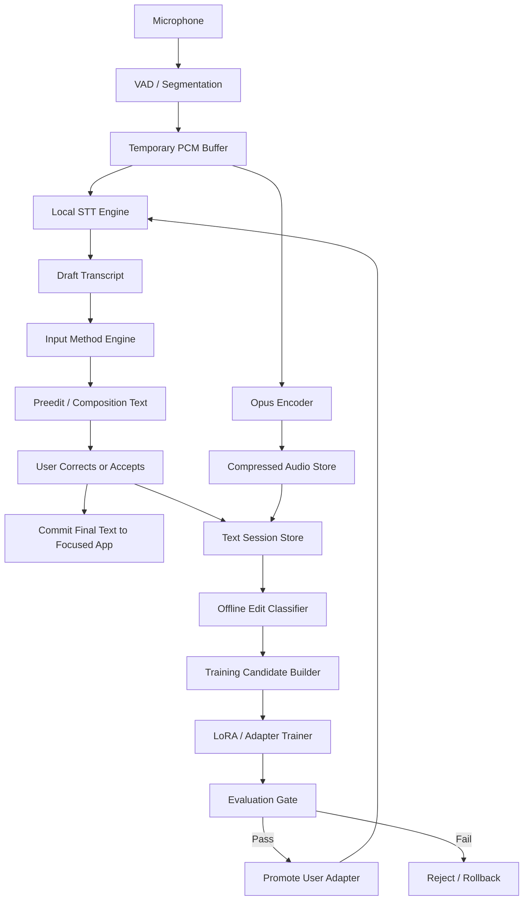
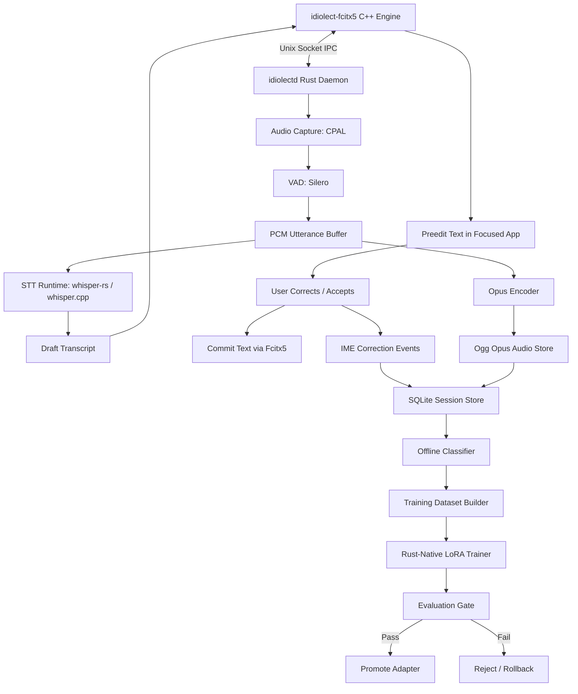
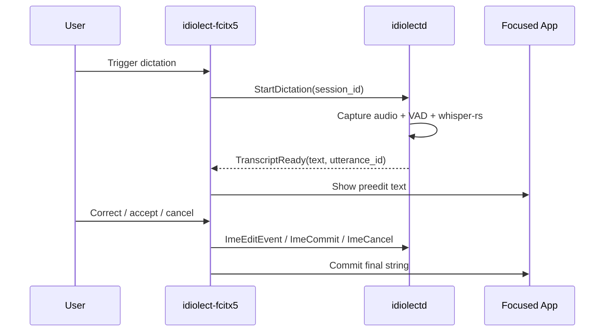
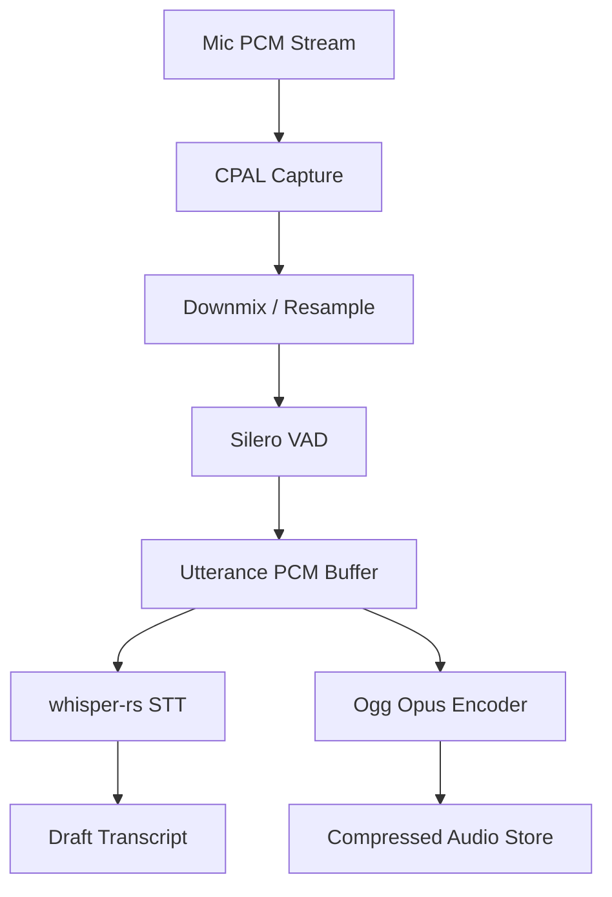
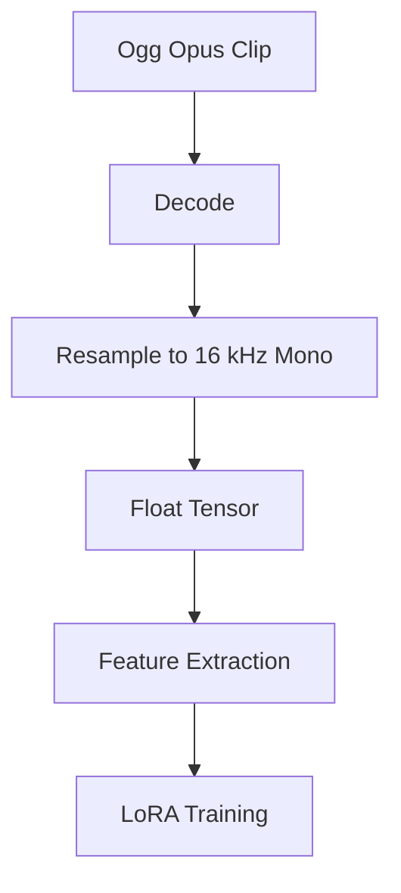
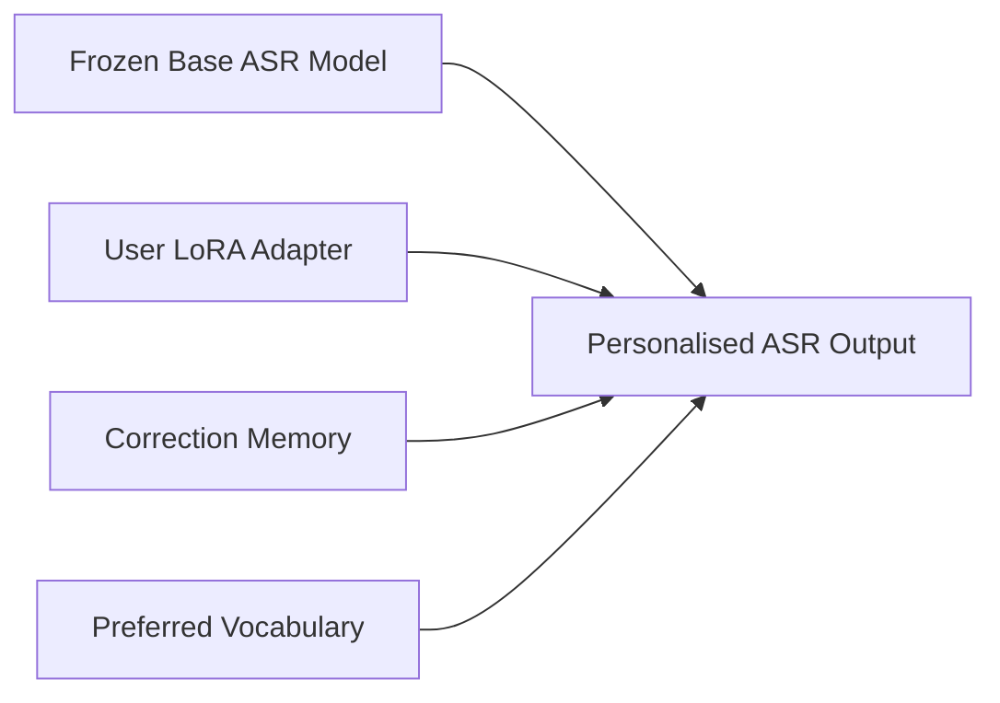
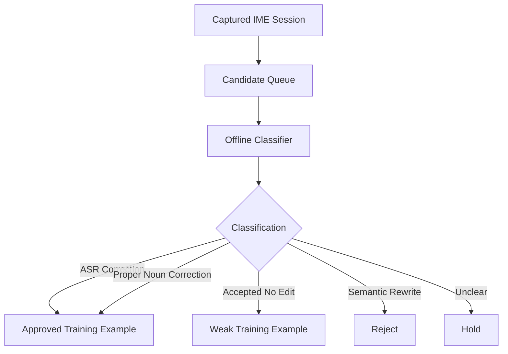
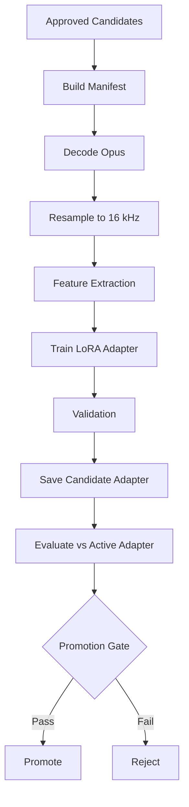
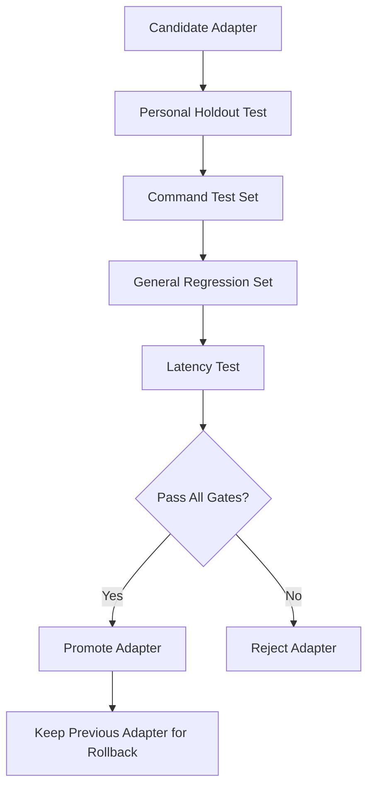

# Idiolect Master Plan

**Product name:** Idiolect  
**Tagline:** Speech-to-text that learns your way of speaking.  
**Short description:** Idiolect is a local-first personalised speech-to-text input method. It runs through the operating system input method layer, captures corrections made before text is committed, and uses those corrections to improve a per-user speech model over time.

---

## Contents

- [1. Product Goal](#1-product-goal)
- [2. Core Architecture](#2-core-architecture)
- [3. Why Idiolect Must Be an Input Method](#3-why-idiolect-must-be-an-input-method)
- [4. Linux Input Method Strategy](#4-linux-input-method-strategy)
  - [4.1 Primary Backend: Fcitx5](#41-primary-backend-fcitx5)
  - [4.2 Secondary Backend: IBus](#42-secondary-backend-ibus)
  - [4.3 Later Platforms](#43-later-platforms)
- [5. Implementation Technology Stack](#5-implementation-technology-stack)
  - [5.1 Languages](#51-languages)
  - [5.2 Runtime Components](#52-runtime-components)
- [6. System Processes](#6-system-processes)
- [7. Interface Architecture and Replaceable Components](#7-interface-architecture-and-replaceable-components)
  - [7.1 Boundary Rule](#71-boundary-rule)
  - [7.2 Proposed Interface Crates](#72-proposed-interface-crates)
  - [7.3 Core Domain Types](#73-core-domain-types)
  - [7.4 Required Ports](#74-required-ports)
  - [7.5 Adapter Selection Through Configuration](#75-adapter-selection-through-configuration)
  - [7.6 Dependency Direction](#76-dependency-direction)
  - [7.7 Contract Tests for Replaceability](#77-contract-tests-for-replaceability)
  - [7.8 Anti-Coupling Checklist](#78-anti-coupling-checklist)
  - [7.9 Architectural Refinements](#79-architectural-refinements)
  - [7.10 Proposed Layering](#710-proposed-layering)
  - [7.11 Composition Root](#711-composition-root)
  - [7.12 Use-Case Services](#712-use-case-services)
  - [7.13 Domain Events](#713-domain-events)
  - [7.14 Event Log plus Materialised Tables](#714-event-log-plus-materialised-tables)
  - [7.15 Command and Query Separation](#715-command-and-query-separation)
  - [7.16 Idempotency and Exactly-Once Session Semantics](#716-idempotency-and-exactly-once-session-semantics)
  - [7.17 Backpressure and Worker Isolation](#717-backpressure-and-worker-isolation)
  - [7.18 Capability Negotiation](#718-capability-negotiation)
  - [7.19 Adapter Manifest Format](#719-adapter-manifest-format)
  - [7.20 Interface Stability Levels](#720-interface-stability-levels)
  - [7.21 Anti-Corruption Layer for Third-Party Types](#721-anti-corruption-layer-for-third-party-types)
  - [7.22 Replaceability Acceptance Test](#722-replaceability-acceptance-test)
- [8. Repository Structure](#8-repository-structure)
- [9. Binary Names](#9-binary-names)
- [10. Rust Crate Responsibilities](#10-rust-crate-responsibilities)
  - [10.1 `idiolect-common`](#101-idiolect-common)
  - [10.2 `idiolect-ipc`](#102-idiolect-ipc)
  - [10.3 `idiolect-audio`](#103-idiolect-audio)
  - [10.4 `idiolect-vad`](#104-idiolect-vad)
  - [10.5 `idiolect-asr`](#105-idiolect-asr)
  - [10.6 `idiolect-codec`](#106-idiolect-codec)
  - [10.7 `idiolect-storage`](#107-idiolect-storage)
  - [10.8 `idiolect-trainerctl`](#108-idiolect-trainerctl)
  - [10.9 `idiolectd`](#109-idiolectd)
- [11. Fcitx5 Engine Design](#11-fcitx5-engine-design)
  - [11.1 C++ Shim Principle](#111-c-shim-principle)
  - [11.2 Fcitx5 Install Layout](#112-fcitx5-install-layout)
  - [11.3 Fcitx5 Interaction Flow](#113-fcitx5-interaction-flow)
- [12. Text Session Model](#12-text-session-model)
  - [12.1 Session States](#121-session-states)
  - [12.2 High-Quality Correction Capture](#122-high-quality-correction-capture)
  - [12.3 Medium-Quality Capture](#123-medium-quality-capture)
  - [12.4 Low-Quality Capture](#124-low-quality-capture)
- [13. Database Schema](#13-database-schema)
  - [13.1 `users`](#131-users)
  - [13.2 `utterances`](#132-utterances)
  - [13.3 `ime_text_sessions`](#133-ime_text_sessions)
  - [13.4 `ime_edit_events`](#134-ime_edit_events)
  - [13.5 `training_candidates`](#135-training_candidates)
  - [13.6 `adapters`](#136-adapters)
  - [13.7 `training_runs`](#137-training_runs)
- [14. File Storage Layout](#14-file-storage-layout)
- [15. Audio Pipeline](#15-audio-pipeline)
  - [15.1 Runtime Audio Pipeline](#151-runtime-audio-pipeline)
  - [15.2 Training Decode Pipeline](#152-training-decode-pipeline)
  - [15.3 Audio Settings](#153-audio-settings)
- [16. Model Plan](#16-model-plan)
  - [16.1 v1 Inference Model](#161-v1-inference-model)
  - [16.2 Model Test Matrix](#162-model-test-matrix)
  - [16.3 Hardware Profiles](#163-hardware-profiles)
- [17. Personalisation Strategy](#17-personalisation-strategy)
  - [17.1 Immediate Adaptation](#171-immediate-adaptation)
  - [17.2 Deferred Model Adaptation](#172-deferred-model-adaptation)
  - [17.3 Deployment Reality](#173-deployment-reality)
- [18. Offline Classification](#18-offline-classification)
- [19. Training Pipeline](#19-training-pipeline)
  - [19.1 Triggering Training](#191-triggering-training)
  - [19.2 Dataset Split](#192-dataset-split)
  - [19.3 Manifest Format](#193-manifest-format)
  - [19.4 Training Flow](#194-training-flow)
  - [19.5 Initial LoRA Settings](#195-initial-lora-settings)
- [20. Evaluation and Promotion](#20-evaluation-and-promotion)
  - [20.1 Metrics](#201-metrics)
  - [20.2 Promotion Criteria](#202-promotion-criteria)
  - [20.3 Rollback Rules](#203-rollback-rules)
- [21. Testing Strategy](#21-testing-strategy)
  - [21.1 Test Suite Layout](#211-test-suite-layout)
  - [21.2 Unit Testing](#212-unit-testing)
  - [21.3 Integration Testing](#213-integration-testing)
  - [21.4 End-to-End Testing](#214-end-to-end-testing)
  - [21.5 Test Fixtures](#215-test-fixtures)
  - [21.6 Model and Evaluation Regression Testing](#216-model-and-evaluation-regression-testing)
  - [21.7 Privacy and Security Testing](#217-privacy-and-security-testing)
  - [21.8 Performance and Reliability Testing](#218-performance-and-reliability-testing)
  - [21.9 Continuous Integration Gates](#219-continuous-integration-gates)
  - [21.10 Manual Exploratory Testing](#2110-manual-exploratory-testing)
  - [21.11 Definition of Done for Testing](#2111-definition-of-done-for-testing)
- [22. Configuration](#22-configuration)
- [23. System Packages](#23-system-packages)
- [24. Rust-Native ML Roadmap](#24-rust-native-ml-roadmap)
- [25. Privacy and Security](#25-privacy-and-security)
  - [25.1 Principles](#251-principles)
  - [25.2 Storage Protection](#252-storage-protection)
  - [25.3 Deletion](#253-deletion)
- [26. Complete v1 Delivery Target](#26-complete-v1-delivery-target)
  - [26.1 v1 Scope](#261-v1-scope)
  - [26.2 v1 Must Be End-to-End Complete](#262-v1-must-be-end-to-end-complete)
  - [26.3 v1 Workstreams](#263-v1-workstreams)
  - [26.4 v1 Acceptance Criteria](#264-v1-acceptance-criteria)
  - [26.5 Definition of All Done](#265-definition-of-all-done)
- [27. Key Technical Risks](#27-key-technical-risks)
  - [27.1 Fcitx5 Preedit Editing May Be Limited](#271-fcitx5-preedit-editing-may-be-limited)
  - [27.2 Surrounding Text Is Not Universal](#272-surrounding-text-is-not-universal)
  - [27.3 LoRA Runtime Deployment Is Not Immediate](#273-lora-runtime-deployment-is-not-immediate)
  - [27.4 Training Data Contamination](#274-training-data-contamination)
  - [27.5 Audio Compression Quality](#275-audio-compression-quality)
  - [27.6 Third-Party Coupling](#276-third-party-coupling)
- [28. Core Truths of the Plan](#28-core-truths-of-the-plan)
- [29. Further Plan Improvements](#29-further-plan-improvements)
  - [29.1 Complete v1 Scope Boundary](#291-complete-v1-scope-boundary)
  - [29.2 User Experience Model](#292-user-experience-model)
  - [29.3 Consent and Onboarding](#293-consent-and-onboarding)
  - [29.4 Correction Memory Schema](#294-correction-memory-schema)
  - [29.5 Packaging and Install Plan](#295-packaging-and-install-plan)
  - [29.6 Configuration Profiles](#296-configuration-profiles)
  - [29.7 Observability Without Leaking Private Text](#297-observability-without-leaking-private-text)
  - [29.8 Threat Model](#298-threat-model)
  - [29.9 Data Lifecycle and Retention](#299-data-lifecycle-and-retention)
  - [29.10 Schema Versioning and Migrations](#2910-schema-versioning-and-migrations)
  - [29.11 API and Protocol Versioning](#2911-api-and-protocol-versioning)
  - [29.12 Error Handling and Recovery](#2912-error-handling-and-recovery)
  - [29.13 Desktop Compatibility Matrix](#2913-desktop-compatibility-matrix)
  - [29.14 Model Governance](#2914-model-governance)
  - [29.15 Product Commands](#2915-product-commands)
  - [29.16 Documentation Set](#2916-documentation-set)
  - [29.17 All-Done Acceptance Gates](#2917-all-done-acceptance-gates)
  - [29.18 Decision Log](#2918-decision-log)
  - [29.19 Open Questions](#2919-open-questions)
  - [29.20 Revised Core Truths](#2920-revised-core-truths)
- [30. One-Line Summary](#30-one-line-summary)

---

## 1. Product Goal

Idiolect is a local-first, personalised speech-to-text input method.

It should:

1. Run locally by default.
2. Work system-wide through the operating system input method layer.
3. Transcribe speech locally.
4. Present the transcript as input-method preedit/composition text before final insertion.
5. Capture user corrections made before the text is committed.
6. Store compressed audio and text-session metadata.
7. Classify correction sessions offline.
8. Train per-user LoRA/adapters from high-quality correction examples.
9. Evaluate adapters before promotion.
10. Roll back bad adapters.

Core loop:

```text
Speech
  -> local STT
  -> input-method preedit text
  -> user correction
  -> committed text
  -> training candidate
  -> personalised adapter
```

Non-goal:

```text
Do not build a plugin for every app.
Do not rely on clipboard hacks as the core design.
Do not globally keylog.
Do not monitor unrelated text outside Idiolect sessions.
```

---

## 2. Core Architecture



Main design rule:

```text
Every dictation creates an IME text session.
Every IME text session links audio, raw STT, preedit changes, committed text, and training status.
```

---

## 3. Why Idiolect Must Be an Input Method

The text layer should be implemented through the operating system input method framework.

For Linux, the first target is:

```text
Fcitx5 input method engine
```

Secondary Linux target:

```text
IBus engine, later, if GNOME/Ubuntu compatibility requires it
```

This replaces the earlier plugin-heavy model.

Old approach:

```text
Browser plugin
VS Code plugin
Terminal plugin
Email plugin
Slack plugin
Notion plugin
...
```

New approach:

```text
One input method that speaks to normal focused text fields through the OS input-method layer.
```

This is the correct abstraction because input methods already exist to mediate text composition, preedit text, candidate selection, and final commit.

---

## 4. Linux Input Method Strategy

### 4.1 Primary Backend: Fcitx5

Use Fcitx5 first.

Reasons:

- It is a modern input method framework.
- It supports add-ons/input-method engines.
- It supports preedit/composition-style text.
- It avoids per-application integrations.
- It has a C++/CMake-oriented development model suitable for a thin engine shim.

Implementation decision:

```text
Do not put the full product inside the Fcitx5 engine.
Use a small C++ Fcitx5 engine that talks to a Rust daemon.
```

### 4.2 Secondary Backend: IBus

IBus remains a compatibility option.

Use it later if:

- Fcitx5 integration is poor on a target distribution.
- GNOME/Ubuntu packaging makes IBus easier.
- Users expect IBus-based input methods.

### 4.3 Later Platforms

Long-term platform abstraction:

| Platform | Input method layer |
|---|---|
| Linux | Fcitx5 / IBus |
| Windows | Text Services Framework |
| macOS | Input Method Kit / input source |
| Android | InputMethodService |
| iOS | Custom keyboard, restricted |

---

## 5. Implementation Technology Stack

### 5.1 Language Policy

Primary implementation language:

```text
Rust
```

Rust is the default for product code, runtime code, orchestration, data processing, training control, evaluation, promotion, rollback, and local tooling.

Allowed non-Rust components:

| Component | Status | Rule |
|---|---|---|
| Fcitx5 engine shim | Allowed C++ boundary adapter | Must remain thin and replaceable behind `InputMethodPort` |
| Third-party C/C++ libraries | Allowed behind Rust adapter crates | Must not leak types into core/application crates |
| Python scripts | Research/reference only | Must not be required for normal v1 operation, packaging, tests, training, promotion, or rollback |

Non-goal:

```text
Do not build the production learning pipeline around Python.
Do not make PyTorch, Transformers, or external Python reference tooling part of the required product architecture.
```

### 5.2 Rust-First ML Strategy

The learning system should be Rust-first. The product should treat model training and evaluation as Idiolect-owned application services, not Python notebooks glued onto the side.

Preferred direction:

```text
Rust orchestration
Rust dataset builder
Rust manifest validator
Rust metric engine
Rust adapter registry
Rust promotion gate
Rust-native trainer where feasible
```

Candidate Rust ML backends:

| Backend | Intended role | Coupling rule |
|---|---|---|
| Burn | primary Rust-native training research path | behind `TrainerPort` / `ModelTrainingBackendPort` |
| Candle | alternative Rust ML backend to evaluate | behind the same training/inference ports |
| whisper-rs / whisper.cpp | practical v1 local inference backend | behind `AsrPort` only |
| ONNX Runtime | possible inference/VAD backend | behind ASR/VAD ports only |

Burn is a Rust deep-learning framework intended for model inference and training, and Candle is a Rust machine-learning framework with Transformer model support; both are better aligned with the Rust-first direction than a production Python training stack. citeturn253100search1turn253100search2turn253100search4

Python may still be useful as a temporary scientific reference implementation, but only under `research/` or `tools/reference/`. It must be possible to delete the Python reference path without breaking the product.

### 5.3 Runtime Components

| Component | First implementation choice | Replaceability rule |
|---|---|---|
| Input method | Fcitx5 C++ engine | behind `InputMethodPort` |
| Local daemon | Rust | composition root only |
| IPC | Unix domain socket + JSON Lines first | behind `IpcTransportPort` |
| Audio capture | CPAL | behind `AudioInputPort` |
| Resampling | rubato | behind `AudioResamplerPort` |
| VAD | Silero VAD Rust crate / ONNX Runtime path | behind `VadPort` |
| STT inference | whisper-rs over whisper.cpp | behind `AsrPort` |
| First model | Whisper `medium.en` GGML/GGUF-compatible model | model artifact, not domain dependency |
| Audio storage | Ogg Opus, mono, 24 kbps VBR | behind `AudioCodecPort` |
| Metadata storage | SQLite via rusqlite | behind `MetadataStorePort` |
| Training orchestration | Rust | application service |
| Training backend | Rust-native backend first; Burn/Candle evaluated | behind `TrainerPort` |
| Evaluation | Rust metric engine first | behind `EvaluationPort` |
| Python reference tools | optional research only | never required by v1 product |

---

## 6. System Processes



---


## 7. Interface Architecture and Replaceable Components

Idiolect must not be tightly coupled to any third-party component. Fcitx5, IBus, Whisper, Silero VAD, Opus, SQLite, external Python reference tooling, ONNX Runtime, Burn, and any future model runtime must be treated as replaceable adapters behind stable Idiolect-owned interfaces.

Architectural rule:

```text
Idiolect core owns the domain model, session lifecycle, correction semantics, storage invariants, training manifests, evaluation gates, and privacy rules.
Third-party libraries are implementation details behind ports.
No domain crate should expose third-party types in public APIs.
```

Use a ports-and-adapters architecture:

```mermaid
flowchart TD
    A[Idiolect Core Domain] --> B[InputMethodPort]
    A --> C[AudioInputPort]
    A --> D[VadPort]
    A --> E[AsrPort]
    A --> F[AudioCodecPort]
    A --> G[MetadataStorePort]
    A --> H[TrainerPort]
    A --> I[EvaluationPort]
    A --> J[AdapterRegistryPort]

    B --> B1[Fcitx5 Adapter]
    B --> B2[IBus Adapter]
    B --> B3[Windows TSF Adapter Later]
    B --> B4[macOS Input Method Kit Adapter Later]

    C --> C1[CPAL Adapter]
    C --> C2[PipeWire Adapter Later]

    D --> D1[Silero Adapter]
    D --> D2[WebRTC VAD Adapter]
    D --> D3[ONNX VAD Adapter]

    E --> E1[whisper-rs Adapter]
    E --> E2[whisper.cpp CLI Adapter]
    E --> E3[ONNX ASR Adapter]
    E --> E4[Burn ASR Adapter]

    F --> F1[Ogg Opus Adapter]
    F --> F2[FLAC Adapter Later]

    G --> G1[SQLite Adapter]
    G --> G2[Encrypted SQLite Adapter Later]

    H --> H1[Rust Trainer Adapter]
    H --> H2[Burn Trainer Backend]

    I --> I1[jiwer Evaluation Adapter]
    I --> I2[Custom Metrics Adapter]

    J --> J1[Filesystem Adapter Registry]
```



### 7.1 Boundary Rule

Each external system must be isolated by an Idiolect-owned trait or interface.

Examples:

```text
Fcitx5 does not own the input-method domain model.
whisper-rs does not own the ASR result model.
Silero does not own the segmentation model.
Opus does not own the utterance storage model.
SQLite does not own the repository API.
No third-party framework owns the training-run model. Rust application services own manifests, evaluation gates, adapter metadata, promotion, and rollback. Training backends are replaceable implementations behind `TrainerPort`.
```

Every adapter must convert between:

```text
third-party types <-> Idiolect domain types
```

Never allow this:

```text
idiolect-storage depends on whisper-rs types
idiolect-core depends on Fcitx5 types
idiolect-trainerctl depends directly on SQLite row structs
idiolect-asr public API exposes whisper-rs internals
```

### 7.2 Proposed Interface Crates

Repository structure additions:

```text
crates/
  idiolect-core/
    src/
      domain/
        utterance.rs
        ime_session.rs
        correction.rs
        candidate.rs
        adapter.rs
        training_run.rs
      services/
        dictation_service.rs
        correction_service.rs
        learning_service.rs
        promotion_service.rs
      ports/
        input_method.rs
        audio_input.rs
        vad.rs
        asr.rs
        audio_codec.rs
        metadata_store.rs
        object_store.rs
        trainer.rs
        evaluator.rs
        adapter_registry.rs
        clock.rs
        id_generator.rs

  idiolect-adapters/
    fcitx5-input-method/
    ibus-input-method/
    cpal-audio-input/
    silero-vad/
    whisper-rs-asr/
    ogg-opus-codec/
    sqlite-store/
    rust-native-lora-trainer/
    jiwer-evaluator/
```

The existing feature crates may remain, but their public APIs should align to these ports.

### 7.3 Core Domain Types

Core domain types should be plain Rust structs/enums with no dependency on external runtime libraries.

Example:

```rust
pub struct AudioSegment {
    pub id: UtteranceId,
    pub sample_rate_hz: u32,
    pub channels: u16,
    pub samples_f32_mono: Vec<f32>,
    pub duration_ms: u32,
}

pub struct TranscriptDraft {
    pub utterance_id: UtteranceId,
    pub text: String,
    pub language: Option<String>,
    pub segments: Vec<TranscriptSegment>,
    pub engine_metadata: AsrMetadata,
}

pub struct CorrectionEvent {
    pub session_id: ImeSessionId,
    pub event_index: u32,
    pub event_type: CorrectionEventType,
    pub from_text: Option<String>,
    pub to_text: Option<String>,
    pub cursor_position: Option<u32>,
}
```

Third-party-specific values go into opaque metadata maps only when necessary:

```rust
pub struct AsrMetadata {
    pub engine_name: String,
    pub engine_version: Option<String>,
    pub model_id: String,
    pub model_digest: Option<String>,
    pub real_time_factor: Option<f32>,
}
```

### 7.4 Required Ports

Core ports:

```rust
pub trait InputMethodPort {
    fn show_preedit(&mut self, session_id: ImeSessionId, text: &str) -> Result<()>;
    fn update_preedit(&mut self, session_id: ImeSessionId, text: &str) -> Result<()>;
    fn commit_text(&mut self, session_id: ImeSessionId, text: &str) -> Result<()>;
    fn cancel_preedit(&mut self, session_id: ImeSessionId) -> Result<()>;
}

pub trait AudioInputPort {
    fn start_capture(&mut self, session_id: ImeSessionId) -> Result<()>;
    fn stop_capture(&mut self, session_id: ImeSessionId) -> Result<AudioSegment>;
}

pub trait VadPort {
    fn segment(&mut self, audio: AudioStreamFrame) -> Result<Vec<AudioSegment>>;
}

pub trait AsrPort {
    fn transcribe(&self, audio: &AudioSegment, profile: AsrProfile) -> Result<TranscriptDraft>;
}

pub trait AudioCodecPort {
    fn encode(&self, audio: &AudioSegment, target: AudioEncoding) -> Result<EncodedAudio>;
    fn decode(&self, encoded: &EncodedAudio) -> Result<AudioSegment>;
}

pub trait MetadataStorePort {
    fn create_session(&self, session: NewImeSession) -> Result<ImeSessionId>;
    fn append_edit_event(&self, event: CorrectionEvent) -> Result<()>;
    fn commit_session(&self, commit: SessionCommit) -> Result<()>;
    fn create_training_candidate(&self, candidate: NewTrainingCandidate) -> Result<TrainingCandidateId>;
}

pub trait TrainerPort {
    fn train(&self, manifest: TrainingManifest, config: TrainingConfig) -> Result<TrainingArtifact>;
}

pub trait EvaluationPort {
    fn evaluate(&self, artifact: TrainingArtifact, suites: EvaluationSuites) -> Result<EvaluationReport>;
}

pub trait AdapterRegistryPort {
    fn register_candidate(&self, artifact: TrainingArtifact, report: EvaluationReport) -> Result<AdapterId>;
    fn promote(&self, adapter_id: AdapterId) -> Result<()>;
    fn rollback(&self, user_id: UserId) -> Result<()>;
}
```

The exact Rust signatures can change, but the boundary principle must not.

### 7.5 Adapter Selection Through Configuration

Runtime configuration should select adapters by logical capability, not by hard-coded library names.

Example:

```toml
[input_method]
backend = "fcitx5"

[audio]
backend = "cpal"

[vad]
backend = "silero"

[asr]
backend = "whisper-rs"
model = "whisper-medium-en"

[codec]
backend = "ogg-opus"

[metadata_store]
backend = "sqlite"

[trainer]
backend = "rust-native-lora"
auto_train = false

[evaluator]
backend = "jiwer"
```

Adapter loading does not need to be dynamic plugin loading at first. Compile-time feature selection is acceptable for v1, provided the core talks only to interfaces.

Acceptable for v1:

```text
Rust traits
feature-gated adapters
dependency injection at daemon startup
mock adapters in tests
```

Deferred:

```text
stable binary plugin ABI
runtime-loaded shared libraries
third-party adapter marketplace
```

### 7.6 Dependency Direction

Dependency direction must be enforced:

```text
idiolect-core      -> no third-party backend dependencies
adapters           -> depend on idiolect-core + third-party libraries
idiolectd          -> wires core services to selected adapters
fcitx5 shim        -> speaks protocol only; no learning/storage/model logic
Rust trainer     -> external process behind TrainerPort contract
```

Allowed:

```text
idiolect-adapters/whisper-rs-asr depends on whisper-rs
idiolect-adapters/sqlite-store depends on rusqlite
idiolect-adapters/fcitx5-input-method depends on Fcitx5 C++ APIs
```

Not allowed:

```text
idiolect-core depends on whisper-rs
idiolect-core depends on rusqlite
idiolect-core depends on Fcitx5
idiolect-core depends on PyTorch
```

### 7.7 Contract Tests for Replaceability

Every port must have a shared contract test suite. Any adapter implementing that port must pass the same tests.

Examples:

```text
All AsrPort adapters must return TranscriptDraft with valid utterance_id and model metadata.
All AudioCodecPort adapters must round-trip a fixture clip within accepted tolerance.
All MetadataStorePort adapters must enforce the same session/candidate invariants.
All TrainerPort adapters must produce a TrainingArtifact with manifest digest and metrics.
All InputMethodPort adapters must preserve preedit -> edit -> commit event ordering.
```

Test layout:

```text
tests/contracts/
  input_method_contract.rs
  audio_input_contract.rs
  vad_contract.rs
  asr_contract.rs
  audio_codec_contract.rs
  metadata_store_contract.rs
  trainer_contract.rs
  evaluator_contract.rs
```

Replaceability is considered real only when a second implementation can pass the same contract tests without changing core code.

### 7.8 Anti-Coupling Checklist

Before accepting a new dependency, answer:

```text
Can this component be replaced without changing idiolect-core?
Are its types hidden behind an Idiolect-owned interface?
Can it be mocked in tests?
Can its version be upgraded without changing the database schema?
Can its output be represented in stable Idiolect domain types?
Can failures be mapped into Idiolect error types?
Does it require private data to leave the machine?
```

If the answer is no, the dependency must be wrapped or rejected.

---


### 7.9 Architectural Refinements

The interface architecture should be strengthened further so Idiolect is not only loosely coupled to third-party libraries, but also loosely coupled internally.

Recommended architectural style:

```text
hexagonal architecture / ports-and-adapters
clean dependency direction
event-driven session lifecycle
replaceable infrastructure adapters
contract-tested component boundaries
```

This means Idiolect should have a small core that knows the product rules, and many outer adapters that know specific technologies.

Core should answer questions like:

```text
When does a correction become a training candidate?
When is a candidate safe to train on?
When should an adapter be promoted?
When must a session be rejected, cancelled, or marked failed?
```

Adapters should answer questions like:

```text
How does Fcitx5 show preedit text?
How does whisper-rs transcribe audio?
How does SQLite persist a session?
How does Opus encode audio?
How does PEFT train a LoRA adapter?
```

The product rules must live in the core. Third-party integration details must live outside the core.

### 7.10 Proposed Layering

Use explicit layers:

```text
idiolect-core
  pure domain logic
  no Fcitx5
  no whisper-rs
  no CPAL
  no SQLite
  no ONNX Runtime
  no Python
  no filesystem assumptions

idiolect-application
  use cases and orchestration
  session lifecycle
  dictation workflow
  candidate workflow
  training workflow
  promotion workflow
  depends on core + port traits

idiolect-ports
  traits/interfaces only
  InputMethodPort
  AudioCapturePort
  VoiceActivityPort
  SpeechToTextPort
  AudioCodecPort
  SessionRepositoryPort
  CandidateRepositoryPort
  TrainerPort
  EvaluatorPort
  AdapterRegistryPort
  ClockPort
  EventSinkPort

idiolect-adapters
  concrete implementations
  Fcitx5 adapter
  CPAL adapter
  Silero adapter
  whisper-rs adapter
  Opus adapter
  SQLite adapter
  Rust trainer adapter
  filesystem adapter

idiolectd
  composition root
  wires config to concrete adapters
  starts services
  owns process lifecycle
```

Dependency rule:

```text
adapters depend inward
core never depends outward
application depends on ports, not concrete adapters
idiolectd wires concrete adapters together
```

### 7.11 Composition Root

`idiolectd` should be the composition root.

It should:

```text
read config
choose adapter implementations
construct ports
wire use cases
start background workers
own shutdown order
expose health/doctor state
```

It should not contain product rules.

Bad pattern:

```text
idiolectd directly decides whether a correction should train the model.
```

Good pattern:

```text
idiolectd calls CorrectionUseCase, which uses domain rules from idiolect-core.
```

This keeps the daemon replaceable and testable.

### 7.12 Use-Case Services

Create application-level use cases. These are the main orchestration units.

Suggested use cases:

| Use case | Responsibility |
|---|---|
| `StartDictationUseCase` | create session, start audio, notify input method |
| `StopDictationUseCase` | close audio segment, trigger transcription |
| `TranscriptReadyUseCase` | attach transcript to session, request preedit display |
| `PreeditChangedUseCase` | record user correction event |
| `CommitSessionUseCase` | commit final text, create candidate if valid |
| `CancelSessionUseCase` | cancel safely without training |
| `ClassifyCandidateUseCase` | label and score candidate |
| `BuildManifestUseCase` | create train/validation/holdout manifests |
| `TrainAdapterUseCase` | launch training through `TrainerPort` |
| `EvaluateAdapterUseCase` | run evaluation through `EvaluatorPort` |
| `PromoteAdapterUseCase` | atomically promote or reject adapter |
| `DeleteUtteranceUseCase` | remove sample and mark derived adapters |

Use cases should be deterministic where possible and should accept ports as dependencies.

### 7.13 Domain Events

Use typed domain events inside Idiolect.

Examples:

```rust
pub enum DomainEvent {
    DictationStarted(DictationStarted),
    AudioSegmentCaptured(AudioSegmentCaptured),
    TranscriptProduced(TranscriptProduced),
    PreeditChanged(PreeditChanged),
    TextCommitted(TextCommitted),
    SessionCancelled(SessionCancelled),
    TrainingCandidateCreated(TrainingCandidateCreated),
    CandidateClassified(CandidateClassified),
    AdapterEvaluated(AdapterEvaluated),
    AdapterPromoted(AdapterPromoted),
    AdapterRejected(AdapterRejected),
}
```

Benefits:

```text
clear audit trail
simpler testing
idempotent recovery after crashes
easier future UI/telemetry/debug views
cleaner integration between daemon, storage, trainer, and input method
```

Domain events should not contain third-party types.

### 7.14 Event Log plus Materialised Tables

The current relational schema is useful, but the session lifecycle is naturally event-based. Use an append-only event log as the source of truth for correction/session history, then maintain relational tables for query speed.

Recommended addition:

```sql
CREATE TABLE event_log (
  id TEXT PRIMARY KEY,
  aggregate_type TEXT NOT NULL,
  aggregate_id TEXT NOT NULL,
  event_type TEXT NOT NULL,
  event_version INTEGER NOT NULL,
  event_json TEXT NOT NULL,
  idempotency_key TEXT,
  created_at TEXT NOT NULL
);
```

Use materialised tables for:

```text
utterances
ime_text_sessions
ime_edit_events
training_candidates
adapters
training_runs
```

Rules:

```text
append event first
update materialised tables in the same transaction
replay event log during migration tests
make duplicate commit/cancel events idempotent
```

This is more robust for a product that must prove exactly how a training example was created.

### 7.15 Command and Query Separation

Separate writes from reads.

Commands change state:

```text
StartDictation
StopDictation
RecordPreeditChange
CommitSession
CancelSession
ClassifyCandidate
PromoteAdapter
RollbackAdapter
DeleteUtterance
```

Queries read state:

```text
GetCurrentSession
ListCandidates
ListAdapters
GetTrainingRun
GetPrivacyReport
GetDoctorReport
```

This improves testability and avoids leaking database implementation details into business logic.

### 7.16 Idempotency and Exactly-Once Session Semantics

Input method systems can resend events, lose IPC connections, or deliver late messages. The architecture must assume duplicate and out-of-order messages.

Every mutating command should have:

```text
command_id
session_id
monotonic event_index where applicable
idempotency_key
created_at
```

Rules:

```text
duplicate commit must not create duplicate candidates
cancel after commit must be ignored or recorded as late invalid event
preedit edit events must preserve order
transcript for unknown session must be rejected
training promotion must be atomic
rollback must be repeatable
```

### 7.17 Backpressure and Worker Isolation

Do not let expensive work block text input.

Separate execution lanes:

```text
input-method lane: fast, non-blocking
audio lane: real-time-ish
speech-to-text lane: bounded worker queue
storage lane: short transactions
training lane: background, cancellable
evaluation lane: background, resource-limited
```

Use bounded queues between lanes:

```text
audio frames queue
utterance queue
transcription queue
storage event queue
training job queue
```

Backpressure rules:

```text
if ASR queue is full, reject or defer new dictation cleanly
if storage is unavailable, do not silently train from memory
if training is running, interactive transcription gets priority
if GPU memory is constrained, training must yield to live dictation
```

### 7.18 Capability Negotiation

Each adapter should report capabilities at startup.

Examples:

```rust
pub struct AdapterCapabilities {
    pub name: String,
    pub version: String,
    pub supports_streaming: bool,
    pub supports_word_timestamps: bool,
    pub supports_confidence: bool,
    pub supports_gpu: bool,
    pub supports_incremental_updates: bool,
}
```

Use this for:

```text
ASR engines that do or do not support timestamps
input method backends that do or do not support editable preedit
codecs that support different bitrates
trainers that support LoRA merge/export or only evaluation
storage adapters that support encryption or not
```

Do not branch directly on third-party library names in core logic. Branch on capabilities.

### 7.19 Adapter Manifest Format

Each concrete adapter should have a manifest.

Example:

```toml
[adapter]
kind = "speech_to_text"
name = "whisper-rs"
version = "0.16"
implementation_crate = "idiolect-adapter-whisper-rs"

[capabilities]
streaming = false
word_timestamps = true
confidence = false
gpu = true

[compatibility]
core_api = "1"
protocol_api = "1"
```

Manifests allow:

```text
runtime validation
doctor command output
clear replacement requirements
packaging checks
future plugin-style loading if wanted
```

### 7.20 Interface Stability Levels

Not every interface needs the same stability guarantee.

Use stability levels:

| Level | Meaning | Examples |
|---|---|---|
| internal | can change freely before v1 | low-level helper traits |
| product-stable | should be stable across v1.x | session lifecycle, training candidate rules |
| adapter-stable | third-party adapter implementations depend on it | port traits, adapter manifests |
| storage-stable | migration required for change | database schema, event log |
| protocol-stable | compatibility negotiation required | IPC messages |

Document the stability level for each public trait, message, and schema.

### 7.21 Anti-Corruption Layer for Third-Party Types

Each third-party adapter should translate external types into Idiolect domain types at the edge.

Examples:

| Third-party type | Convert to |
|---|---|
| Fcitx5 key/input context types | `InputContextSnapshot` |
| CPAL sample formats | `AudioFrame` / `PcmBuffer` |
| Silero/ONNX outputs | `SpeechSegment` |
| whisper-rs transcript result | `TranscriptDraft` |
| rusqlite rows/errors | repository return types |
| Framework-specific trainer output | `TrainingRunResult` |
| filesystem paths | `AudioObjectRef` / `ModelArtifactRef` |

No third-party error type should escape an adapter. Convert to Idiolect errors at the boundary.

### 7.22 Replaceability Acceptance Test

A component is not replaceable until there are at least two implementations of its port:

```text
real adapter
fake/mock adapter used in tests
```

For critical ports, add a second real or semi-real implementation:

| Port | Primary adapter | Replacement/test adapter |
|---|---|---|
| `InputMethodPort` | Fcitx5 | headless fake input method |
| `SpeechToTextPort` | whisper-rs | deterministic fixture recogniser |
| `VoiceActivityPort` | Silero | fixture segmenter |
| `AudioCodecPort` | Opus | no-op PCM fixture codec |
| `SessionRepositoryPort` | SQLite | in-memory repository |
| `TrainerPort` | Rust-native trainer adapter | fake trainer returning fixed metrics |
| `EvaluatorPort` | jiwer evaluator | fixture evaluator |
| `AdapterRegistryPort` | filesystem registry | temp-dir registry |

Rule:

```text
No port is considered architecturally proven until both the real adapter and replacement adapter pass the same contract test suite.
```


## 8. Repository Structure

```text
idiolect/
  Cargo.toml
  README.md
  LICENSE

  crates/
    idiolect-core/
      src/
        domain/
        services/
        ports/

    idiolect-adapters/
      fcitx5-input-method/
      ibus-input-method/
      cpal-audio-input/
      silero-vad/
      whisper-rs-asr/
      ogg-opus-codec/
      sqlite-store/
      rust-native-lora-trainer/
      jiwer-evaluator/

    idiolect-common/
      src/
        ids.rs
        protocol.rs
        config.rs
        error.rs
        time.rs

    idiolect-ipc/
      src/
        server.rs
        client.rs
        messages.rs
        framing.rs

    idiolect-audio/
      src/
        capture.rs
        devices.rs
        buffer.rs
        resample.rs

    idiolect-vad/
      src/
        silero.rs
        segmenter.rs
        config.rs

    idiolect-asr/
      src/
        whisper_rs.rs
        runtime.rs
        models.rs
        transcript.rs

    idiolect-codec/
      src/
        opus.rs
        decode.rs
        encode.rs
        wav_debug.rs

    idiolect-storage/
      src/
        db.rs
        migrations.rs
        utterances.rs
        sessions.rs
        candidates.rs
        adapters.rs
        audio_store.rs

    idiolect-trainerctl/
      src/
        manifest.rs
        classify.rs
        train.rs
        evaluate.rs
        promote.rs

    idiolectd/
      src/
        main.rs
        daemon.rs
        services.rs
        commands.rs

  fcitx5/
    idiolect-fcitx5/
      CMakeLists.txt
      src/
        engine.cpp
        engine.h
        ipc_client.cpp
        ipc_client.h
        preedit_session.cpp
        preedit_session.h
      data/
        idiolect-addon.conf
        idiolect.conf

  research/
    python-trainer-reference/
      README.md
      pyproject.toml
      train_lora.py
      evaluate_adapter.py
      build_manifest.py
      classify_edits.py
      merge_adapter.py
      export_model.py

  models/
    README.md
    whisper/
      .gitkeep

  docs/
    00-master-plan.md
    01-interface-architecture.md
    02-input-method-architecture.md
    03-fcitx5-engine.md
    04-rust-daemon.md
    05-audio-pipeline.md
    06-storage-schema.md
    07-correction-sessions.md
    08-training-pipeline.md
    09-models.md
    10-burn-roadmap.md
    11-security-privacy.md
    12-testing-strategy.md
    13-v1-delivery-target.md
```

---

## 9. Binary Names

```text
idiolectd          # local daemon
idiolect           # CLI
idiolect-fcitx5    # Fcitx5 input method engine/addon
idiolect-train     # trainer orchestration CLI, optional
```

Example commands:

```bash
idiolectd run
idiolect status
idiolect models list
idiolect models install whisper-medium-en
idiolect db migrate
idiolect export-training-manifest
idiolect train classify
idiolect train run
idiolect adapters list
idiolect adapters promote <adapter-id>
idiolect adapters rollback
```

---

## 10. Rust Crate Responsibilities

### 10.1 `idiolect-common`

Shared types and protocol objects.

Responsibilities:

- `UtteranceId`
- `ImeSessionId`
- `UserId`
- `AdapterId`
- timestamps
- config structs
- shared error types
- IPC message structs

Suggested dependencies:

```toml
serde = { version = "1.0.203", features = ["derive"] }
uuid = { version = "1.8.0", features = ["v4", "serde"] }
thiserror = "1.0.61"
time = { version = "0.3.36", features = ["serde", "formatting", "parsing"] }
```

Example types:

```rust
pub struct UtteranceId(pub uuid::Uuid);
pub struct ImeSessionId(pub uuid::Uuid);

pub enum ImeSessionState {
    Created,
    Recording,
    Transcribing,
    PreeditActive,
    UserCorrecting,
    Committed,
    Cancelled,
    Abandoned,
}
```

### 10.2 `idiolect-ipc`

Unix socket protocol between `idiolect-fcitx5` and `idiolectd`.

Responsibilities:

- socket server
- socket client helpers
- JSON Lines framing
- request/response messages
- streaming status events

Suggested dependencies:

```toml
tokio = { version = "1.38.0", features = ["rt-multi-thread", "macros", "net", "io-util", "sync", "time"] }
serde = { version = "1.0.203", features = ["derive"] }
serde_json = "1.0.117"
# Pin an exact tracing crate version only after IPC-task verification.
```

Initial protocol examples:

```json
{"type":"StartDictation","session_id":"...","user_id":"default"}
{"type":"StopDictation","session_id":"..."}
{"type":"TranscriptReady","session_id":"...","utterance_id":"...","text":"restart traffic"}
{"type":"ImePreeditChanged","session_id":"...","from":"restart traffic","to":"restart Traefik"}
{"type":"ImeCommit","session_id":"...","committed_text":"restart Traefik"}
{"type":"ImeCancel","session_id":"..."}
```

### 10.3 `idiolect-audio`

Audio capture and buffering.

Responsibilities:

- enumerate audio devices
- open default microphone
- capture PCM stream
- downmix to mono
- resample to processing sample rate
- maintain rolling buffer
- emit utterance buffers

Suggested dependencies:

```toml
cpal = "0.17"
rubato = "0.16"
dasp_sample = "0.11"
```

Target processing format:

```text
16 kHz
mono
float32 PCM
```

Capture format:

```text
Device native format, often 48 kHz, converted internally.
```

### 10.4 `idiolect-vad`

Voice activity detection.

Responsibilities:

- run Silero VAD
- detect speech boundaries
- apply hysteresis
- add pre-roll and post-roll
- emit stable utterance segments

Candidate dependencies:

```toml
# Pin an exact VAD crate version only after adapter-task verification.
```

Initial segmentation config:

```text
frame: 32 ms
speech threshold: 0.5
min speech: 250 ms
pre-roll: 300 ms
post-roll: 700 ms
max utterance: 30 s
```

### 10.5 `idiolect-asr`

Whisper runtime wrapper.

Responsibilities:

- load Whisper model
- hold model context
- transcribe utterance buffer
- return draft text
- return timing/confidence-like metadata where available
- support correction-memory post-processing before preedit display

Suggested dependency:

```toml
whisper-rs = { version = "0.16", features = ["cuda"] }
```

Build variants:

```toml
# CPU / OpenBLAS
whisper-rs = { version = "0.16", features = ["openblas"] }

# NVIDIA
whisper-rs = { version = "0.16", features = ["cuda"] }

# AMD/Linux experimental path
whisper-rs = { version = "0.16", features = ["vulkan"] }

# Apple Silicon later
whisper-rs = { version = "0.16", features = ["metal"] }
```

Runtime config:

```toml
[asr]
engine = "whisper-rs"
model = "whisper-medium-en"
language = "en"
translate = false
threads = 8
use_gpu = true
```

### 10.6 `idiolect-codec`

Audio encoding/decoding.

Responsibilities:

- encode utterances to Ogg Opus
- decode Opus for training/export
- optional debug WAV writing
- hash encoded audio

Suggested dependencies:

```toml
# Pin exact Opus/Ogg crate versions only after codec-task verification.
```

Early fallback:

```text
Use ffmpeg for Opus encoding until native Rust/Ogg/Opus path is stable.
```

### 10.7 `idiolect-storage`

SQLite metadata and file storage.

Responsibilities:

- schema migrations
- users
- utterances
- IME text sessions
- edit events
- training candidates
- adapters
- training runs
- audio path management

Suggested dependency:

```toml
rusqlite = { version = "0.32", features = ["bundled"] }
blake3 = "1"
```

Rules:

```text
Only idiolectd writes to SQLite.
The Fcitx5 engine never writes to SQLite directly.
The trainer reads through exported manifests or through idiolectd APIs.
```

### 10.8 `idiolect-trainerctl`

Trainer orchestration.

Responsibilities:

- export approved training candidates
- call offline classifier
- generate train/validation/holdout manifests
- launch Rust trainer backend through `TrainerPort`
- import metrics
- register candidate adapter
- promote/reject/rollback

This must not require Python for v1. A temporary Python reference path may exist under research tooling only, but the product path must use Rust orchestration and Rust-owned interfaces.

### 10.9 `idiolectd`

Main daemon.

Responsibilities:

- load config
- run IPC socket
- manage user profile
- manage audio capture
- run VAD
- run ASR
- encode/store audio
- create/update IME sessions
- store correction events
- schedule trainer jobs

Suggested dependencies:

```toml
tokio = { version = "1.38.0", features = ["rt-multi-thread", "macros", "net", "io-util", "sync", "time"] }
# Pin exact tracing, tracing-subscriber, clap, and directories versions only after daemon/CLI-task verification.
```

---

## 11. Fcitx5 Engine Design

### 11.1 C++ Shim Principle

The Fcitx5 engine should be deliberately thin.

It should:

- register Idiolect as an input method
- handle activation/hotkey
- send `StartDictation` and `StopDictation` to `idiolectd`
- receive transcript results
- display transcript as preedit text
- capture edits made before commit
- commit final text to the focused application
- send session events back to `idiolectd`

It should not:

- run Whisper
- capture microphone audio directly
- encode audio
- write SQLite rows
- train models
- own learning logic

### 11.2 Fcitx5 Install Layout

System install:

```text
/usr/lib/fcitx5/idiolect.so
/usr/share/fcitx5/addon/idiolect.conf
/usr/share/fcitx5/inputmethod/idiolect.conf
/usr/share/icons/hicolor/scalable/apps/idiolect.svg
```

User-local development install:

```text
~/.local/lib/fcitx5/idiolect.so
~/.local/share/fcitx5/addon/idiolect.conf
~/.local/share/fcitx5/inputmethod/idiolect.conf
```

### 11.3 Fcitx5 Interaction Flow



---

## 12. Text Session Model

### 12.1 Session States

```text
created
recording
transcribing
preedit_active
user_correcting
committed
cancelled
abandoned
post_commit_observed
post_commit_unknown
```

### 12.2 High-Quality Correction Capture

The strongest training examples come from corrections inside the IME preedit session.

Example:

```text
Spoken:      restart Traefik
Raw STT:     restart traffic
Preedit fix: restart Traefik
Committed:   restart Traefik
```

Training candidate:

```json
{
  "source": "ime_preedit_correction",
  "capture_quality": "high",
  "raw_stt_text": "restart traffic",
  "candidate_transcript": "restart Traefik"
}
```

### 12.3 Medium-Quality Capture

If surrounding text is available after commit, Idiolect may observe later corrections.

Example:

```text
Committed: restart traffic
Later observed surrounding text: restart Traefik
```

This is medium quality only. It must be classified before training.

### 12.4 Low-Quality Capture

If the application accepts committed text but does not expose surrounding text or later edits:

```text
Store audio + raw STT + committed text.
Do not infer later edits.
Do not treat it as a correction unless explicitly captured.
```

---

## 13. Database Schema

### 13.1 `users`

```sql
CREATE TABLE users (
  id TEXT PRIMARY KEY,
  display_name TEXT,
  active_adapter_id TEXT,
  created_at TEXT NOT NULL
);
```

### 13.2 `utterances`

```sql
CREATE TABLE utterances (
  id TEXT PRIMARY KEY,
  user_id TEXT NOT NULL,

  audio_path TEXT NOT NULL,
  audio_codec TEXT NOT NULL,
  audio_container TEXT NOT NULL,
  sample_rate_hz INTEGER NOT NULL,
  training_sample_rate_hz INTEGER,
  channels INTEGER NOT NULL,
  bitrate_bps INTEGER,
  duration_ms INTEGER NOT NULL,
  audio_sha256 TEXT,

  raw_stt_text TEXT,
  stt_model TEXT NOT NULL,
  adapter_id TEXT,
  confidence REAL,
  language TEXT,

  created_at TEXT NOT NULL,
  FOREIGN KEY (user_id) REFERENCES users(id)
);
```

### 13.3 `ime_text_sessions`

```sql
CREATE TABLE ime_text_sessions (
  id TEXT PRIMARY KEY,
  utterance_id TEXT NOT NULL,
  user_id TEXT NOT NULL,

  platform TEXT NOT NULL,
  input_backend TEXT NOT NULL,

  target_app_name TEXT,
  target_app_class TEXT,
  target_window_title TEXT,

  session_state TEXT NOT NULL,

  raw_stt_text TEXT,
  initial_preedit_text TEXT,
  final_preedit_text TEXT,
  committed_text TEXT,

  surrounding_text_before TEXT,
  surrounding_text_after TEXT,

  edit_capture_quality TEXT NOT NULL,

  started_at TEXT NOT NULL,
  committed_at TEXT,
  cancelled_at TEXT,
  last_observed_at TEXT,

  FOREIGN KEY (utterance_id) REFERENCES utterances(id),
  FOREIGN KEY (user_id) REFERENCES users(id)
);
```

### 13.4 `ime_edit_events`

```sql
CREATE TABLE ime_edit_events (
  id TEXT PRIMARY KEY,
  text_session_id TEXT NOT NULL,

  event_index INTEGER NOT NULL,
  event_type TEXT NOT NULL,

  from_text TEXT,
  to_text TEXT,

  cursor_position INTEGER,
  surrounding_text TEXT,

  timestamp_ms INTEGER NOT NULL,

  FOREIGN KEY (text_session_id) REFERENCES ime_text_sessions(id)
);
```

Event types:

```text
stt_draft
preedit_update
candidate_selected
user_replace
user_insert
user_delete
commit
cancel
abandon
```

### 13.5 `training_candidates`

```sql
CREATE TABLE training_candidates (
  id TEXT PRIMARY KEY,
  utterance_id TEXT NOT NULL,
  text_session_id TEXT,

  candidate_transcript TEXT NOT NULL,
  source TEXT NOT NULL,

  status TEXT NOT NULL DEFAULT 'captured',

  classifier_label TEXT,
  trust_score REAL,
  classifier_model TEXT,
  classifier_reason TEXT,

  created_at TEXT NOT NULL,
  classified_at TEXT,

  FOREIGN KEY (utterance_id) REFERENCES utterances(id),
  FOREIGN KEY (text_session_id) REFERENCES ime_text_sessions(id)
);
```

Candidate sources:

```text
ime_preedit_correction
candidate_selection
accepted_without_edit
post_commit_observation
manual_review
```

Candidate statuses:

```text
captured
needs_classification
approved
rejected
holdout
used
```

### 13.6 `adapters`

```sql
CREATE TABLE adapters (
  id TEXT PRIMARY KEY,
  user_id TEXT NOT NULL,

  base_model TEXT NOT NULL,
  adapter_type TEXT NOT NULL,
  adapter_path TEXT NOT NULL,

  training_run_id TEXT,
  status TEXT NOT NULL,

  wer_personal REAL,
  wer_command REAL,
  wer_general REAL,

  created_at TEXT NOT NULL,
  promoted_at TEXT,

  FOREIGN KEY (user_id) REFERENCES users(id)
);
```

### 13.7 `training_runs`

```sql
CREATE TABLE training_runs (
  id TEXT PRIMARY KEY,
  user_id TEXT NOT NULL,
  base_model TEXT NOT NULL,
  previous_adapter_id TEXT,
  new_adapter_id TEXT,
  num_training_examples INTEGER,
  num_validation_examples INTEGER,
  num_holdout_examples INTEGER,
  status TEXT NOT NULL,
  started_at TEXT NOT NULL,
  finished_at TEXT,
  notes TEXT,
  FOREIGN KEY (user_id) REFERENCES users(id)
);
```

---

## 14. File Storage Layout

Use XDG paths on Linux.

```text
~/.local/share/idiolect/
  models/
    whisper/
      ggml-small.en.bin
      ggml-medium.en.bin
      ggml-large-v3-turbo.bin

  audio/
    2026/
      06/
        03/
          u_000001.ogg
          u_000002.ogg

  adapters/
    user_default/
      adapter_v001/
      adapter_v002/

  manifests/
    train_2026-06-03.jsonl
    validate_2026-06-03.jsonl
    holdout_2026-06-03.jsonl

  db/
    idiolect.sqlite

~/.config/idiolect/
  config.toml

~/.cache/idiolect/
  decoded/
  trainer/
```

---

## 15. Audio Pipeline

### 15.1 Runtime Audio Pipeline



### 15.2 Training Decode Pipeline



### 15.3 Audio Settings

Default:

```text
container: Ogg
codec: Opus
channels: mono
bitrate: 24 kbps VBR
stored sample rate: 48 kHz acceptable
training sample rate: 16 kHz
```

High-value examples:

```text
32 kbps Opus
```

Avoid:

```text
long-term WAV storage
very low bitrate Opus below 16 kbps for training examples
full-day recordings
```

---

## 16. Model Plan

### 16.1 v1 Inference Model

Use:

```text
Whisper medium.en via whisper-rs / whisper.cpp
```

Model file:

```text
~/.local/share/idiolect/models/whisper/ggml-medium.en.bin
```

Reason:

```text
good English accuracy
reasonable local performance
compatible with whisper.cpp ecosystem
usable before custom adaptation exists
```

### 16.2 Model Test Matrix

| Model | Purpose |
|---|---|
| `small.en` | low-resource baseline |
| `medium.en` | default v1 model |
| `medium.en` quantised | performance/storage comparison |
| `large-v3-turbo` | accuracy candidate |
| `large-v3-turbo` quantised | accuracy/performance compromise |

Do not start with full `large-v3` as the development default.

### 16.3 Hardware Profiles

| Hardware | Suggested model/runtime |
|---|---|
| CPU-only | `small.en` or quantised `medium.en` |
| NVIDIA GPU | `medium.en`, then `large-v3-turbo` |
| AMD GPU Linux | Vulkan first; ROCm only after build testing |
| Apple Silicon | Metal later |

---

## 17. Personalisation Strategy

### 17.1 Immediate Adaptation

Immediate learning should not update model weights.

Use:

```text
personal correction memory
preferred vocabulary
context-aware substitution
candidate reranking
proper noun preference
```

Example:

```json
{
  "heard": "traffic",
  "preferred": "Traefik",
  "contexts": ["docker", "server", "container", "restart"],
  "count": 6
}
```

This gives fast UX improvement without risking model degradation.

### 17.2 Deferred Model Adaptation

After enough classified examples, train a per-user adapter.

Use:

```text
LoRA first
DoRA later
bottleneck adapters optional
speaker-conditioned adapters later
mixture-of-LoRA experts later
```

Core principle:

```text
Freeze the base ASR model.
Train only small per-user adapter weights.
Evaluate before promotion.
```



### 17.3 Deployment Reality

Important constraint:

```text
whisper-rs / whisper.cpp is primarily an inference path and must not dictate the whole training architecture. Adapter training, merge/export, evaluation, and promotion must be owned by Rust application services behind replaceable ports.
```

Therefore use three paths:

#### Path A: v1 Runtime Learning

Deploy:

```text
correction memory
preferred terms
candidate reranking
context-aware correction
```

#### Path B: Research/Mid-Term

Train or fine-tune adapters through a Rust-owned trainer interface. Evaluate Burn and Candle as Rust-native training backends. If a backend cannot directly serve whisper-rs, produce a versioned export/merge artifact and validate it through `AsrPort` contract tests.

#### Path C: Long-Term

Build adapter-aware inference/training in Rust, with Burn or Candle as candidate backends, so personalised adapters can be loaded without a Python runtime.

---

## 18. Offline Classification

Realtime capture does not decide whether an edit is valid ASR training data.

Capture first:

```text
audio
raw STT
preedit changes
committed text
IME context
```

Classify later:



Classifier labels:

```text
asr_correction
proper_noun_correction
candidate_selection
accepted_without_edit
capitalisation_only
punctuation_formatting
semantic_rewrite
user_changed_intent
expansion
deletion
unclear
```

Trust scoring:

| Signal | Trust |
|---|---:|
| Explicit preedit correction | 1.00 |
| Candidate alternative selected | 0.95 |
| Proper noun correction | 0.90 |
| Accepted without edit | 0.60 |
| Post-commit surrounding-text observation | 0.50 |
| Punctuation/capitalisation only | 0.20 |
| Semantic rewrite / changed intent | 0.00 |

Key classifier question:

```text
Does the final committed text still represent what was actually spoken in the audio?
```

If yes, it may train ASR.

If no, it must not train ASR.

---

## 19. Training Pipeline

### 19.1 Triggering Training

Train only after enough high-quality examples.

Initial triggers:

```text
>= 50 approved correction examples
or >= 20 high-trust repeated proper-noun corrections
or manual "train now"
or scheduled idle/nightly training
```

### 19.2 Dataset Split

```text
80% train
10% validation
10% holdout
```

Rules:

```text
Never train on the holdout set.
Keep a stable command test set.
Keep a small general speech regression set.
```

### 19.3 Manifest Format

```json
{
  "utterance_id": "u_000123",
  "audio_path": "audio/2026/06/03/u_000123.ogg",
  "transcript": "restart Traefik",
  "source": "ime_preedit_correction",
  "trust_score": 1.0,
  "split": "train"
}
```

### 19.4 Training Flow



### 19.5 Initial LoRA Settings

```text
rank: 8 or 16
alpha: 16 or 32
dropout: 0.05
target layers: attention q/v first
learning rate: conservative
epochs: few
early stopping: yes
```

---

## 20. Evaluation and Promotion

### 20.1 Metrics

```text
WER
CER
proper noun accuracy
command accuracy
hallucination rate
deletion rate
latency
real-time factor
```

### 20.2 Promotion Criteria

Promote a new adapter only if:

```text
personal holdout WER improves
proper noun accuracy improves or does not regress
command accuracy does not regress
general mini-set does not materially regress
hallucination/deletion rates do not increase
latency remains acceptable
```



### 20.3 Rollback Rules

Always retain:

```text
current active adapter
previous active adapter
best historical adapter
base model fallback
```

Adapter states:

```text
candidate
active
rejected
archived
rolled_back
```

---


## 21. Testing Strategy

Testing is a core product requirement, not an afterthought. Idiolect sits between microphone input, speech recognition, operating-system text composition, local storage, and model adaptation. Bugs can silently corrupt training data, commit wrong text into user applications, or promote a worse personalised model. The test strategy must therefore cover correctness, privacy, data integrity, latency, and regression safety.

Testing layers:

```text
unit tests
  -> integration tests
  -> component contract tests
  -> end-to-end tests
  -> model/evaluation regression tests
  -> manual exploratory tests
```

Testing principle:

```text
No captured correction should be used for training unless the audio, raw transcript, edit events, committed text, classifier decision, and manifest entry are all internally consistent.
```

### 21.1 Test Suite Layout

Repository layout additions:

```text
idiolect/
  crates/
    idiolect-core/
      src/
        domain/
        events/
        rules/
        value_objects/

    idiolect-application/
      src/
        use_cases/
        workflows/
        services/

    idiolect-ports/
      src/
        input_method.rs
        audio_capture.rs
        voice_activity.rs
        speech_to_text.rs
        audio_codec.rs
        repositories.rs
        trainer.rs
        evaluator.rs
        adapter_registry.rs
        clock.rs
        events.rs

    idiolect-adapters/
      fcitx5/
      cpal/
      silero/
      whisper_rs/
      opus/
      sqlite/
      rust_native_lora/
      filesystem/

    idiolect-common/
      tests/
    idiolect-ipc/
      tests/
    idiolect-audio/
      tests/
    idiolect-vad/
      tests/
    idiolect-asr/
      tests/
    idiolect-codec/
      tests/
    idiolect-storage/
      tests/
    idiolect-trainerctl/
      tests/
    idiolectd/
      tests/

  fcitx5/
    idiolect-fcitx5/
      tests/
        unit/
        contract/
        headless/

  research/
    python-trainer-reference/
      tests/
        unit/
        integration/
        fixtures/

  tests/
    fixtures/
      audio/
      transcripts/
      ipc/
      sqlite/
      manifests/
      adapters/
    integration/
    e2e/
    performance/
    privacy/
    regression/

  ci/
    scripts/
      test-rust.sh
      test-cpp.sh
      test-integration.sh
      test-e2e-linux.sh
      test-model-regression.sh
```

Rust convention:

```text
crate-local unit tests live beside the code under #[cfg(test)].
crate-level integration tests live in each crate's tests/ directory.
cross-component tests live under top-level tests/.
```

Rust-first trainer convention:

```text
trainer, classifier, manifest, and evaluation tests must run in Rust by default. Optional reference Python tools may have pytest tests, but those tests are not part of the required product path.
```

C++ convention:

```text
use Catch2 or GoogleTest for pure Fcitx5 shim logic.
use headless Fcitx5/X11/Wayland smoke tests only where practical.
```

### 21.2 Unit Testing

Unit tests should isolate a single function, struct, state machine, or algorithm. They should not require a microphone, GPU, real Fcitx5 session, real Whisper model, or user desktop.

Core unit test targets:

| Area | What to test |
|---|---|
| `idiolect-common` | ID parsing, timestamp handling, config defaults, enum serialisation, error mapping |
| `idiolect-ipc` | JSON Lines framing, malformed messages, request/response correlation, streaming events, reconnect behaviour |
| `idiolect-audio` | sample conversion, channel downmixing, buffer boundaries, resampling metadata, clipping handling |
| `idiolect-vad` | speech boundary state machine, pre-roll/post-roll logic, max utterance cut-off, silence handling |
| `idiolect-asr` | runtime wrapper behaviour with mocked recogniser, transcript normalisation, error propagation |
| `idiolect-codec` | Opus path generation, hash calculation, decode metadata, debug WAV guardrails |
| `idiolect-storage` | migrations, insert/update invariants, foreign-key behaviour, deletion cascades, transaction rollback |
| `idiolect-trainerctl` | candidate filtering, split generation, manifest writing, metric import, promotion decision logic |
| `idiolectd` | daemon state transitions, command handling, service wiring with mocks |
| Fcitx5 shim | preedit state, edit event ordering, commit/cancel logic, IPC client failure handling |
| Rust trainer | classifier rules, dataset split, metric calculation, adapter metadata, early-stopping decisions |

Minimum unit test rules:

```text
All state machines must test every valid transition and every invalid transition.
All database writes must test success and rollback failure paths.
All IPC message types must round-trip through serialisation and deserialisation.
All text edit classification labels must have positive and negative examples.
```

Example Rust unit tests:

```rust
#[test]
fn vad_adds_pre_roll_without_negative_start() {
    // Given a speech boundary near the start of the rolling buffer,
    // pre-roll should clamp to zero rather than underflow.
}

#[test]
fn ime_commit_creates_high_quality_candidate_after_preedit_correction() {
    // Raw: "restart traffic"
    // Edited: "restart Traefik"
    // Commit should create an ime_preedit_correction candidate with trust 1.0.
}
```

Example classifier unit tests:

```rust
#[test]
fn semantic_rewrite_is_rejected() {
    let raw = "restart traffic";
    let final_text = "actually open the deployment notes";
    let label = classify_edit(raw, final_text);
    assert_eq!(label, EditClassification::SemanticRewrite);
}
```

### 21.3 Integration Testing

Integration tests should verify that two or more real components work together while still avoiding a full desktop session where possible.

Required integration suites:

| Suite | Components under test | Purpose |
|---|---|---|
| IPC contract | Fcitx5 IPC client + Rust IPC server | Ensure both sides agree on message schemas and streaming behaviour |
| daemon-storage | `idiolectd` + SQLite + audio store pathing | Ensure session lifecycle writes consistent rows and files |
| audio-vad | CPAL abstraction or fixture PCM + VAD | Ensure utterance segmentation is stable on known clips |
| asr-fixture | ASR wrapper + small fixed model or mocked recogniser | Ensure transcript output is passed into IME session correctly |
| codec-storage | Opus encode/decode + utterance rows | Ensure stored clips can be recovered for training |
| classifier-storage | captured sessions + classifier + candidate table | Ensure trust scores and labels persist correctly |
| manifest-builder | approved candidates + audio files + manifests | Ensure train/validation/holdout manifests are valid |
| trainer-evaluator | small fixture dataset + Rust trainer/evaluator | Ensure metrics are produced and imported |
| adapter-promotion | evaluation metrics + adapter registry | Ensure pass/fail/rollback rules are enforced |

Important integration invariants:

```text
An utterance row must not exist without an audio file unless the transaction is explicitly marked failed.
An IME committed session must link to exactly one utterance.
A high-quality correction candidate must link to both utterance_id and text_session_id.
A rejected classifier label must never appear in a training manifest.
A holdout item must never appear in a training split.
Adapter promotion must be atomic.
Rollback must restore the previous active adapter.
```

SQLite integration tests should run against temporary databases with migrations applied from scratch:

```text
create temp dir
run migrations
execute lifecycle
verify rows
verify files
drop temp dir
```

IPC integration tests should use temporary Unix domain sockets:

```text
start idiolectd test server
connect test client
send StartDictation
receive accepted status
send mocked TranscriptReady or inject recogniser result
send ImePreeditChanged
send ImeCommit
assert persisted session and candidate
```

### 21.4 End-to-End Testing

End-to-end tests should validate the complete user-visible workflow:

```text
trigger dictation
capture or inject audio
transcribe
show preedit text
simulate correction
commit text into focused app
persist session
classify candidate
export manifest
run evaluation/promotion gate where applicable
```

E2E tiers:

| Tier | Environment | Purpose |
|---|---|---|
| E2E-lite | no desktop, mocked Fcitx5, mocked ASR | Fast lifecycle test in continuous integration |
| E2E-headless | nested X11/Wayland session + Fcitx5 + test app | Verify input-method behaviour without a real user desktop |
| E2E-real-desktop | manual or nightly Linux desktop VM | Verify browser, terminal, GTK, Qt, and Electron apps |
| E2E-model | real Whisper model + fixture audio | Verify transcription and latency regressions |
| E2E-training | fixture corrections + trainer + evaluation gate | Verify learning loop without user data |

Minimum E2E scenarios:

```text
1. Accept transcript unchanged.
2. Correct one word in preedit and commit.
3. Cancel dictation before commit.
4. Abandon session after transcript appears.
5. Dictate two utterances in the same target app.
6. Dictate into browser text field.
7. Dictate into terminal.
8. Dictate into GTK editor.
9. Dictate into Qt editor.
10. Dictate into Electron app.
11. Daemon crashes after audio capture but before commit.
12. Fcitx5 engine loses IPC connection during preedit.
13. Storage disk becomes unavailable.
14. ASR returns empty transcript.
15. ASR returns low-confidence transcript.
16. Classifier rejects semantic rewrite.
17. Approved correction appears in manifest.
18. Holdout example is excluded from training.
19. Bad adapter is rejected.
20. Previous adapter is restored after rollback.
```

Target applications for Linux E2E:

| App class | Example target |
|---|---|
| Browser | Firefox, Chromium |
| Terminal | GNOME Terminal, Konsole, Alacritty |
| GTK text editor | gedit or GNOME Text Editor |
| Qt text editor | Kate or simple Qt test app |
| Electron | VS Code or simple Electron fixture app |
| Web text area | local test page with input and textarea fields |

The E2E test harness should include a tiny local test application that records exactly what text was committed:

```text
focused field receives committed string
committed string equals expected final text
preedit lifecycle events match expected order
no unrelated keystrokes are captured
```

### 21.5 Test Fixtures

Fixtures should be synthetic, redistributable, and small enough for continuous integration.

Fixture types:

| Fixture | Contents |
|---|---|
| audio clips | short spoken phrases, silence, noise, clipped speech, long utterance |
| transcripts | raw STT, corrected text, semantic rewrite examples |
| IPC logs | valid sessions, malformed messages, reconnect sequences |
| SQLite snapshots | migrated empty DB, sample populated DB, corrupted DB copy |
| manifests | valid train/validation/holdout files, invalid duplicate split files |
| adapter metrics | passing, failing, latency-regressing, hallucination-regressing examples |

Required phrase fixtures:

```text
restart Traefik
open Vaultwarden
deploy the container
roll back the adapter
use the Fcitx5 input method
```

Correction fixtures:

| Raw STT | Final text | Expected label | Trust |
|---|---|---|---:|
| restart traffic | restart Traefik | proper_noun_correction | 0.90 |
| open vault warden | open Vaultwarden | proper_noun_correction | 0.90 |
| deploy the container | deploy the container | accepted_without_edit | 0.60 |
| roll back adapter | roll back the adapter | asr_correction | 1.00 |
| restart traffic | actually open the notes | semantic_rewrite | 0.00 |

Audio fixture rules:

```text
Do not use private user recordings in the repository.
Use synthetic or explicitly consented sample audio only.
Keep large model files out of git.
Download models through explicit developer command or CI cache.
```

### 21.6 Model and Evaluation Regression Testing

Model tests are not the same as ordinary unit tests. They should detect accuracy, latency, hallucination, deletion, and promotion regressions.

Regression sets:

| Set | Purpose |
|---|---|
| personal fixture set | proper nouns and repeated user-style corrections |
| command set | short operational commands |
| general speech mini-set | ordinary dictation to prevent overfitting |
| silence/noise set | hallucination detection |
| long utterance set | segmentation and timeout behaviour |

Metrics to track in CI or nightly jobs:

```text
word error rate
character error rate
proper noun accuracy
command exact-match accuracy
hallucination rate on silence/noise
deletion rate
median latency
p95 latency
real-time factor
memory usage
model load time
```

Promotion-gate tests should use fixed metric inputs and real evaluation outputs.

Promotion must fail if:

```text
personal holdout WER does not improve enough
general regression set materially worsens
proper noun accuracy regresses
command accuracy regresses
hallucination rate increases
p95 latency exceeds target
adapter artifact is missing or corrupt
adapter metadata does not match the base model
```

Example promotion test matrix:

| Case | Personal WER | General WER | Proper nouns | Latency | Expected |
|---|---:|---:|---:|---:|---|
| clear improvement | better | same | better | same | promote |
| overfit | better | worse | better | same | reject |
| hallucination regression | better | same | same | same | reject |
| latency regression | better | same | same | worse | reject |
| corrupt artifact | better | same | better | same | reject |

### 21.7 Privacy and Security Testing

Privacy tests should prove that Idiolect captures only Idiolect sessions and does not act as a general keylogger.

Required tests:

```text
Non-Idiolect typed text is not stored.
Clipboard contents are not read during normal dictation.
Unrelated app text is not captured unless supplied through the active input-method session.
Cancelled sessions store only allowed metadata according to config.
Delete operation removes audio, text session rows, edit events, candidates, decoded cache, and manifest references.
Strict privacy mode blocks future training from deleted samples.
Logs do not contain raw audio paths plus transcript text unless debug mode is explicitly enabled.
Crash reports do not include private transcripts by default.
```

Security test areas:

| Area | Test |
|---|---|
| IPC socket | permissions, wrong-user access, malformed message flood, oversized message rejection |
| SQLite | migration rollback, corrupted DB handling, transaction boundaries |
| file storage | path traversal rejection, symlink handling, missing-file recovery |
| model artifacts | checksum verification, base-model/adapter compatibility |
| config | unsafe config values rejected, secret values not logged |

### 21.8 Performance and Reliability Testing

Performance tests should run separately from fast unit tests.

Targets for v1:

```text
preedit appears within acceptable latency after speech ends
no unbounded memory growth during long idle sessions
VAD does not emit repeated false utterances during silence
Opus encoding does not block the input method thread
SQLite writes do not block preedit updates
Fcitx5 shim remains responsive if idiolectd is slow
```

Suggested benchmark areas:

| Benchmark | Measurement |
|---|---|
| audio buffer | CPU use and allocations per minute |
| VAD | processing time per frame |
| ASR | real-time factor by model and hardware profile |
| Opus encode | milliseconds per utterance |
| DB write | transaction latency |
| IPC | round-trip latency and streaming throughput |
| preedit | time from transcript ready to visible preedit |
| trainer | examples per minute and peak memory |

Reliability tests:

```text
daemon restart preserves pending sessions safely
partial audio write is detected and marked failed
database lock contention is handled
IPC reconnect does not duplicate commit events
duplicate commit event is idempotent
training job interruption leaves no active half-written adapter
```

### 21.9 Continuous Integration Gates

Every pull request should run:

```text
cargo fmt --check
cargo clippy --all-targets --all-features -- -D warnings
cargo test --workspace
C++ format/lint/build tests for Fcitx5 shim
Rust trainer contract tests
SQLite migration tests
IPC contract tests
manifest validation tests
```

Nightly or scheduled jobs should run:

```text
headless Fcitx5 E2E tests
real Whisper fixture tests
model regression tests
performance benchmarks
privacy deletion tests
adapter promotion/rollback tests
packaging smoke tests
```

Release-blocking gates:

```text
all unit tests pass
all integration tests pass
E2E-lite passes
headless Fcitx5 smoke test passes on target Ubuntu version
migration from previous release succeeds
privacy deletion test passes
no known promotion-gate regression
package install/uninstall test passes
```

### 21.10 Manual Exploratory Testing

Some input-method behaviours need manual verification because desktop environments, toolkits, and applications differ.

Manual test matrix:

| Environment | Apps |
|---|---|
| Ubuntu GNOME + Wayland | Firefox, terminal, GTK editor, VS Code |
| Ubuntu GNOME + X11 | Firefox, terminal, GTK editor, VS Code |
| KDE Plasma + Wayland | Chromium, Konsole, Kate |
| KDE Plasma + X11 | Chromium, Konsole, Kate |

Manual checklist:

```text
enable Idiolect input method
trigger dictation
see preedit text
correct text before commit
commit final text
cancel without committing
switch input methods
restart daemon
restart desktop session
verify no unrelated text capture
verify stored session matches visible behaviour
```

### 21.11 Definition of Done for Testing

A feature is not complete until:

```text
unit tests cover normal and failure paths
integration tests cover real component boundaries
storage invariants are tested
privacy impact is tested
logging is checked for sensitive data leakage
E2E-lite scenario exists for user-visible flow
manual test notes are added for input-method behaviour where automation is weak
```

For learning-related features, also require:

```text
classifier tests
manifest tests
holdout contamination tests
evaluation metric tests
promotion/rejection tests
rollback tests
```

## 22. Configuration

`~/.config/idiolect/config.toml`

```toml
[user]
default_user_id = "default"

[daemon]
socket_path = "/run/user/1000/idiolect.sock"
log_level = "info"

[audio]
input_device = "default"
capture_sample_rate = 48000
processing_sample_rate = 16000
channels = 1

[vad]
engine = "silero"
threshold = 0.5
min_speech_ms = 250
pre_roll_ms = 300
post_roll_ms = 700
max_utterance_ms = 30000

[asr]
engine = "whisper-rs"
model = "whisper-medium-en"
language = "en"
use_gpu = true
threads = 8

[storage]
audio_codec = "opus"
audio_container = "ogg"
opus_bitrate_bps = 24000
high_value_opus_bitrate_bps = 32000

[training]
min_approved_examples = 50
trainer = "rust-native-lora"
auto_train = false
```

---

## 23. System Packages

Ubuntu/Debian-style development packages:

```bash
sudo apt install \
  build-essential cmake pkg-config clang \
  fcitx5 fcitx5-dev fcitx5-frontend-gtk3 fcitx5-frontend-qt5 \
  libopus-dev libasound2-dev
```

Optional research Python reference environment, not a v1 runtime, trainer, promotion, packaging, or required-test path:

```bash
cd research/python-trainer-reference
python -m venv .venv
source .venv/bin/activate
pip install torch transformers peft datasets accelerate jiwer soundfile librosa
```

NVIDIA GPU path:

```text
Install NVIDIA driver and CUDA toolkit separately.
Build whisper-rs with CUDA feature.
```

---

## 24. Rust-Native ML Roadmap

The product goal is Rust-first. Python is not the production learning architecture.

Rust-owned responsibilities:

```text
training manifest generation
manifest validation
audio decode/resample orchestration
feature extraction interface
trainer backend selection
metric calculation
evaluation gate
adapter registry
promotion
rollback
model/artifact checksums
```

### 24.1 Backend Strategy

Use stable Idiolect ports first, then plug in ML backends.

```text
TrainerPort
EvaluationPort
ModelArtifactPort
AdapterRegistryPort
AsrPort
```

Candidate backends:

| Backend | Role | v1 stance |
|---|---|---|
| Burn | Rust-native training and inference research | preferred Rust training candidate |
| Candle | Rust-native Transformer/model experimentation | evaluate as alternate backend |
| whisper-rs / whisper.cpp | practical local inference | keep behind `AsrPort` |
| ONNX Runtime | optional inference/VAD backend | keep behind adapter boundary |
| Python/PyTorch/PEFT | optional reference implementation only | not required for product operation |

### 24.2 Rust LoRA Implementation Direction

LoRA, or Low-Rank Adaptation, freezes base model weights and trains small low-rank matrices instead of full model weights; that approach is suitable for per-user personalisation because the trainable artifact can stay small. citeturn253100academia33

Idiolect should implement LoRA concepts behind its own adapter model rather than exposing a framework-specific PEFT object.

Conceptual layer:

```text
y = xW + scale * xAB
```

Where:

```text
W = frozen base weight
A/B = small trainable low-rank matrices
scale = alpha / rank
```

### 24.3 Research Escape Hatch

Python may be kept only as a reference path for comparing metrics or reproducing external papers.

Rules:

```text
Python reference code lives under research/ or tools/reference/.
Python is not called by idiolectd.
Python is not required by installer packages.
Python is not required by v1 tests, promotion, rollback, or normal training.
Python outputs must be imported only through versioned artifact formats.
Rust contract tests decide whether imported artifacts are acceptable.
```

Possible layout:

```text
crates/
  idiolect-ml-core/
    src/
      lora.rs
      tensors.rs
      features.rs
      metrics.rs
      artifacts.rs

  idiolect-trainer-burn/
    src/
      trainer.rs
      lora.rs
      dataset.rs
      evaluate.rs

  idiolect-trainer-candle/
    src/
      trainer.rs
      lora.rs
      dataset.rs
      evaluate.rs

research/
  python-reference/
    README.md
    train_lora_reference.py
    evaluate_reference.py
```

---

## 25. Privacy and Security

### 25.1 Principles

```text
local-first
no cloud transcription by default
no telemetry by default
no global keylogging
no per-app spying
capture only Idiolect IME sessions
explicit delete/export controls
```

### 25.2 Storage Protection

Initial:

```text
local SQLite
local Opus files
local adapter artifacts
```

Later:

```text
encrypted SQLite or app-level encryption
encrypted audio store
per-user encryption key
optional passphrase unlock
```

### 25.3 Deletion

Deletion must remove:

```text
Opus audio clip
IME text session
edit events
training candidate
decoded cache
training manifest entries
```

If a deleted utterance has already been used in an adapter, mark that adapter as derived from deleted data. Strict privacy mode should require future adapters to be trained without that sample.

---

## 26. Complete v1 Delivery Target

Idiolect should not be planned as a phased prototype or staged demo. The delivery target is a complete local-first Linux v1 that proves the whole product loop end to end.

Planning rule:

```text
Do not ship a staged demo as the product target.
Build toward one complete v1 where dictation, correction capture, storage, learning, evaluation, rollback, privacy controls, packaging, and tests all work together.
```

### 26.1 v1 Scope

v1 target:

```text
Linux desktop
Fcitx5 input method backend
English dictation
single local user profile
local-only transcription
explicitly installed local model
preedit/composition text display
preedit correction capture
Ogg Opus audio storage
SQLite metadata storage
rules-based offline classifier
immediate correction memory
training manifest export
Rust-native LoRA/adaptation training path
adapter evaluation and promotion gate
adapter rollback
privacy controls
install/uninstall packaging
complete unit, integration, contract, and end-to-end test coverage
```

Explicitly outside v1:

```text
Windows production support
macOS production support
mobile keyboard support
cloud sync
team accounts
cloud transcription by default
multi-user enterprise management
runtime-loaded third-party plugin marketplace
unsupported per-application plugins
background global text observation
clipboard-based insertion as the core mechanism
```

### 26.2 v1 Must Be End-to-End Complete

v1 is done only when this complete flow works:

```text
user installs Idiolect
user selects Idiolect input method
user starts dictation
Idiolect captures only the requested dictation audio
VAD segments speech
ASR generates a draft transcript
draft appears as preedit/composition text
user accepts, cancels, retries, or corrects the draft
final text commits to the focused application
session stores linked audio, raw transcript, edit events, and committed text
classifier decides whether the correction is valid training data
approved candidates enter correction memory and/or training manifests
trainer can produce a candidate adapter from approved examples
candidate adapter is evaluated against holdout, command, general, latency, and hallucination tests
passing adapter can be promoted atomically
bad adapter is rejected or rolled back
user can inspect, export, and delete captured data
```

### 26.3 v1 Workstreams

Workstreams are allowed for engineering organisation, but they are not product phases. They should progress together toward the same complete v1 target.

| Workstream | Required v1 outcome |
|---|---|
| Input method | Fcitx5 backend can show preedit, receive correction, commit, cancel, and recover from daemon disconnects |
| Core daemon | Owns session lifecycle, orchestration, privacy rules, and adapter wiring |
| Interface architecture | All external components are behind Idiolect-owned ports and contract tests |
| Audio | Capture, buffering, resampling, VAD segmentation, and fixture injection work reliably |
| ASR | Local whisper-rs adapter produces stable `TranscriptDraft` domain objects |
| Storage | SQLite and audio store maintain atomic, queryable, deletable session records |
| Correction capture | Edit events generate correct candidate records and trust scores |
| Correction memory | Repeated proper-noun and preferred-term corrections improve future drafts without model retraining |
| Classification | Rules-based classifier rejects semantic rewrites and approves high-trust ASR corrections |
| Training | Rust trainer can consume manifests and emit candidate adapter artifacts |
| Evaluation | Metrics and promotion gates protect against worse adapters |
| Rollback | Previous adapter can be restored atomically |
| Privacy | User controls audio storage, learning, debug logs, export, and deletion |
| Packaging | Install, enable, disable, upgrade, and uninstall are tested |
| Testing | Unit, integration, contract, end-to-end, privacy, model regression, and packaging tests pass |

### 26.4 v1 Acceptance Criteria

Functional acceptance:

```text
Dictation works in Firefox, Chromium, a terminal, a GTK editor, a Qt editor, and VS Code.
The transcript appears as preedit text before commit.
User correction before commit is captured as edit events.
Committed text exactly matches the user's accepted/corrected text.
Cancel does not commit text.
Retry does not create duplicate committed sessions.
Daemon restart does not corrupt the session store.
Disk-full and model-load failures produce safe user-visible errors.
```

Learning acceptance:

```text
Accepted unchanged transcript becomes a weak candidate only.
Explicit preedit correction becomes a high-trust candidate.
Semantic rewrite is rejected.
Holdout examples never enter training.
Correction memory improves repeated proper-noun mistakes without retraining.
A candidate adapter cannot be promoted unless all evaluation gates pass.
Rollback restores the previous active adapter.
```

Architecture acceptance:

```text
No idiolect-core public API exposes Fcitx5, whisper-rs, Silero, Opus, rusqlite, PyTorch, PEFT, Burn, Candle, ONNX Runtime, or jiwer types.
At least one mock adapter exists for every core port.
Every adapter passes its shared contract test suite.
Replacing whisper-rs with a mock ASR adapter requires no core-code change.
Replacing SQLite with an in-memory MetadataStorePort test implementation requires no core-code change.
Replacing Fcitx5 with a mocked InputMethodPort requires no core-code change.
```

Privacy acceptance:

```text
Normal typing outside Idiolect sessions is not stored.
Clipboard is not read during normal operation.
No cloud upload occurs by default.
Raw transcript logging is disabled by default.
Delete removes audio, text sessions, edit events, candidates, decoded cache, and manifest references.
Strict privacy mode prevents future adapters from using deleted samples.
```

Packaging acceptance:

```text
Package installs the daemon, CLI, Fcitx5 engine, desktop metadata, config templates, and systemd user service.
Package uninstall removes binaries but does not delete user data without explicit user request.
Upgrade migrates schema safely.
Install/uninstall tests pass in a clean VM.
```

### 26.5 Definition of All Done

Idiolect v1 is all done when:

```text
the complete dictation-to-learning loop works locally
third-party dependencies are replaceable behind interfaces
privacy controls are implemented and tested
adapter promotion and rollback are safe
all release-blocking tests pass
packaging works on the target Linux distributions
the user can delete/export their data
known failure modes fail safely
```

Anything less is an internal prototype, not the v1 delivery target.

---

## 27. Key Technical Risks

### 27.1 Fcitx5 Preedit Editing May Be Limited

Risk:

```text
IME preedit may not feel like a full editor.
```

Mitigation:

```text
support accept/cancel
support candidate alternatives
support quick word replacement
consider small IME-owned correction popup if preedit editing is too awkward
```

### 27.2 Surrounding Text Is Not Universal

Risk:

```text
Some apps will not expose reliable surrounding text.
```

Mitigation:

```text
Do not rely on post-commit edit tracking.
Use preedit correction as the main high-quality signal.
Treat post-commit observations as medium/low quality.
```

### 27.3 LoRA Runtime Deployment Is Not Immediate

Risk:

```text
The first practical inference runtime may not directly load the same adapter format produced by the Rust training backend.
```

Mitigation:

```text
keep training, adapter artifacts, and inference behind separate ports
validate every exported adapter/model through ASR contract tests
use correction memory as the immediate learning path
only promote adapters that pass runtime compatibility and evaluation gates
```

### 27.4 Training Data Contamination

Risk:

```text
Semantic rewrites may be mistaken for ASR corrections.
```

Mitigation:

```text
capture everything
classify offline
train only high-trust examples
keep holdout set
use promotion gate
rollback bad adapters
```

### 27.5 Audio Compression Quality

Risk:

```text
Over-compression may damage useful acoustic detail.
```

Mitigation:

```text
use 24 kbps Opus by default
use 32 kbps for high-value examples
do not go below 16 kbps for training examples
```


### 27.6 Third-Party Coupling

Risk:

```text
Core product logic becomes coupled to Fcitx5, whisper-rs, Silero, Opus, SQLite, Burn, Candle, PyTorch, PEFT, Python, or another specific dependency.
```

Mitigation:

```text
use Idiolect-owned ports for every external component
keep third-party types out of core public APIs
require contract tests for every adapter
use mock adapters in unit and end-to-end-lite tests
make adapter selection explicit in configuration
```

---

## 28. Core Truths of the Plan

```text
1. Idiolect is an input method, not an app plugin ecosystem.
2. Fcitx5 is the first Linux backend.
3. The C++ Fcitx5 engine is a thin shim.
4. The Rust daemon owns audio, STT, storage, and learning orchestration.
5. whisper-rs is the first practical local inference runtime.
6. Whisper medium.en is the first default model.
7. Ogg Opus is the long-term audio storage format.
8. SQLite is the local metadata store.
9. Preedit correction is the main high-quality training signal.
10. Capture now, classify later.
11. Immediate learning is correction memory, not weight updates.
12. LoRA training is deferred, batched, evaluated, and gated.
13. Rust is the first trainer/orchestrator path; Python is optional research/reference tooling only.
14. Burn and Candle are Rust-native ML backend candidates behind stable trainer/inference ports.
15. Testing must cover unit, integration, end-to-end, privacy, model regression, contract tests, and adapter promotion gates.
16. Third-party components must be replaceable behind Idiolect-owned interfaces.
17. v1 is a complete all-done delivery target, not a staged partial product.
18. Bad adapters must be rejected or rolled back.
```

---


## 29. Further Plan Improvements

The current plan is technically coherent, but it should be hardened into an implementation plan that can survive real users, desktop edge cases, packaging, upgrades, and bad training data. This section adds the missing product, operational, and engineering detail.

### 29.1 Complete v1 Scope Boundary

v1 should be complete, not phased, but still deliberately bounded to the first supported product surface.

v1 target:

```text
Linux desktop
Fcitx5 only
English dictation only
single local user profile
manual model download/install
local-only transcription
preedit correction capture
SQLite + Ogg Opus storage
rules-based classifier
correction memory before model-weight adaptation
```

Explicitly not v1:

```text
Windows/macOS support
mobile keyboards
cloud sync
team accounts
multi-language training
automatic cloud model download without explicit user action
production LoRA deployment into whisper-rs
background global text observation
per-app plugins
```

v1 success criteria:

```text
A user can dictate into Firefox, a terminal, a GTK editor, a Qt editor, and VS Code.
The transcript appears as preedit text.
The user can correct text before commit.
The committed text matches the user's final correction.
The session is stored with linked audio, raw transcript, edits, and committed text.
A high-trust training candidate is created only when the correction is valid.
Immediate correction memory improves repeated proper-noun mistakes without retraining the model.
```

### 29.2 User Experience Model

Idiolect needs a clear interaction model before deep model work.

Default flow:

```text
press hotkey
speak
pause
draft appears as preedit text
edit with normal text controls where supported
press Enter or trigger accept
final text commits to focused app
```

Required user actions:

| Action | Behaviour |
|---|---|
| Start dictation | Begins a new IME session and audio segment |
| Stop dictation | Ends recording and starts transcription |
| Accept | Commits the current preedit text |
| Cancel | Clears preedit and stores no training candidate by default |
| Correct | Records preedit edit events |
| Retry | Discards draft and records a new utterance |
| Disable learning for session | Commits text but does not create a training candidate |

Useful hotkeys:

```text
Start/stop dictation
Accept draft
Cancel draft
Retry utterance
Toggle learning for this session
Open correction popup
```

Correction popup fallback:

```text
If native preedit editing is too limited, show a small Idiolect-owned correction window.
The popup should still commit via the input method layer, not clipboard paste.
The popup must write the same edit-event model as native preedit correction.
```

### 29.3 Consent and Onboarding

On first run, Idiolect should explain exactly what is captured.

Required onboarding choices:

```text
enable local audio storage: yes/no
enable correction learning: yes/no
enable debug logs with transcripts: no by default
enable automatic training jobs: no by default
choose default microphone
choose model profile: fast / balanced / accurate
```

User-facing promise:

```text
Idiolect only records dictation sessions that the user explicitly starts.
It does not record normal typing.
It does not read the clipboard for normal operation.
It does not upload audio or transcripts by default.
```

### 29.4 Correction Memory Schema

Immediate learning needs a first-class storage model, not just an implementation note.

Suggested table:

```sql
CREATE TABLE correction_memory_entries (
  id TEXT PRIMARY KEY,
  user_id TEXT NOT NULL,

  heard_text TEXT NOT NULL,
  preferred_text TEXT NOT NULL,
  normalised_heard_text TEXT NOT NULL,
  normalised_preferred_text TEXT NOT NULL,

  context_terms_json TEXT,
  target_app_class TEXT,
  language TEXT,

  count INTEGER NOT NULL DEFAULT 1,
  positive_hits INTEGER NOT NULL DEFAULT 0,
  negative_hits INTEGER NOT NULL DEFAULT 0,
  confidence REAL NOT NULL DEFAULT 0.5,

  source TEXT NOT NULL,
  created_at TEXT NOT NULL,
  updated_at TEXT NOT NULL,
  last_used_at TEXT,

  FOREIGN KEY (user_id) REFERENCES users(id)
);
```

Correction-memory rules:

```text
Do not blindly replace every future occurrence.
Apply only when context and confidence are strong enough.
Prefer candidate reranking over destructive substitution.
Decay entries that the user repeatedly rejects.
Allow the user to delete individual learned terms.
Keep correction memory separate from model-training candidates.
```

### 29.5 Packaging and Install Plan

The plan needs packaging early because input methods are sensitive to install paths and desktop session configuration.

Linux packaging targets:

```text
.deb package for Ubuntu/Debian first
AUR/PKGBUILD later for Arch users
Fedora/RPM later if demand exists
AppImage is not ideal for input-method engine installation
Flatpak is not ideal for the Fcitx5 engine itself
```

Installed components:

```text
idiolectd user service
idiolect CLI
Fcitx5 addon shared library
Fcitx5 input-method metadata
icons and desktop files
sample config
system package dependencies
```

User service:

```ini
[Unit]
Description=Idiolect local speech-to-text daemon
After=graphical-session.target

[Service]
ExecStart=%h/.local/bin/idiolectd run
Restart=on-failure
RestartSec=2

[Install]
WantedBy=default.target
```

Package tests:

```text
install package
register Fcitx5 addon
start user service
verify socket path
verify input method appears in Fcitx5 config
dictate into test app
uninstall package
verify user data is preserved unless purge is requested
```

### 29.6 Configuration Profiles

The configuration should expose profiles rather than forcing users to understand every model parameter.

Suggested profiles:

| Profile | Model | Goal |
|---|---|---|
| `fast` | `small.en` or quantised `medium.en` | lowest latency |
| `balanced` | `medium.en` | default v1 behaviour |
| `accurate` | `large-v3-turbo` if hardware allows | better accuracy |
| `cpu-safe` | `small.en` | avoids GPU dependencies |
| `private-strict` | user-selected model, stricter retention | less stored data |

Config layering:

```text
built-in defaults
system config
user config
profile selection
command-line override
runtime temporary override
```

### 29.7 Observability Without Leaking Private Text

Idiolect needs useful diagnostics without turning logs into a transcript database.

Default logs should include:

```text
session state transitions
component timing
model loaded/unloaded
VAD segment durations
IPC connection status
storage success/failure
trainer job status
adapter promotion/rejection outcome
```

Default logs should not include:

```text
raw transcript
corrected transcript
audio file contents
surrounding application text
clipboard contents
full window title if it may contain private data
```

Diagnostic command examples:

```bash
idiolect doctor
idiolect doctor --audio
idiolect doctor --fcitx5
idiolect doctor --models
idiolect doctor --storage
idiolect logs redact --since today
```

Health checks:

```text
microphone is available
Fcitx5 addon is installed
idiolectd service is running
Unix socket is reachable
model file exists and checksum passes
SQLite migrations are current
audio store is writable
GPU backend is available if selected
```

### 29.8 Threat Model

Threat modelling should be explicit because the product handles microphone audio, transcripts, and learned personal vocabulary.

Assets:

```text
stored audio
raw transcripts
corrected transcripts
edit history
learned vocabulary
adapter artifacts
configuration
model files
logs
```

Threats:

| Threat | Mitigation |
|---|---|
| Another local user reads the IPC socket | socket under `/run/user/<uid>` with user-only permissions |
| Malicious process sends fake correction events | session IDs, protocol validation, optional client identity checks |
| Logs leak private text | redaction by default, explicit debug opt-in |
| Training data is poisoned | classifier, trust scores, holdout, promotion gates |
| Corrupt adapter is promoted | checksum, metadata validation, atomic promotion |
| Symlink/path traversal attacks on audio store | canonical paths, no following untrusted symlinks |
| Deleted samples remain in future datasets | deletion tombstones and manifest regeneration |
| Model file tampering | checksums and signed manifest later |

### 29.9 Data Lifecycle and Retention

The plan should specify how long data lives and what states it moves through.

Utterance lifecycle:

```text
recorded
encoded
linked_to_session
candidate_created
classified
approved/rejected/holdout
exported_to_manifest
used_in_training
eligible_for_deletion
```

Retention modes:

| Mode | Behaviour |
|---|---|
| minimal | keep correction memory, delete audio after classification |
| balanced | keep approved/holdout audio, delete rejected audio after retention window |
| research | keep all explicit dictation sessions until user deletes |
| strict-private | no long-term audio unless user manually marks session for learning |

Deletion policy:

```text
soft-delete first with tombstone
remove from future manifests
delete decoded cache immediately
delete audio according to selected mode
mark adapters derived from deleted samples
retrain required for strict removal guarantee
```

### 29.10 Schema Versioning and Migrations

SQLite migrations should be treated as product compatibility work.

Rules:

```text
every schema change gets a forward migration
destructive migrations require backup/export first
migrations are tested from every supported previous release
schema version is stored in the database
failed migration leaves the previous database usable
```

Suggested table:

```sql
CREATE TABLE schema_migrations (
  version INTEGER PRIMARY KEY,
  name TEXT NOT NULL,
  applied_at TEXT NOT NULL,
  checksum TEXT NOT NULL
);
```

Backup before migration:

```text
copy SQLite database
verify copy checksum
apply migration in transaction where possible
run integrity check
only then mark migration applied
```

### 29.11 API and Protocol Versioning

The Fcitx5 engine and daemon should negotiate protocol versions.

Handshake example:

```json
{"type":"Hello","client":"idiolect-fcitx5","protocol_version":1,"features":["preedit","commit","cancel"]}
```

Daemon response:

```json
{"type":"HelloAck","protocol_version":1,"accepted_features":["preedit","commit","cancel"]}
```

Rules:

```text
unknown message types are rejected with structured errors
new optional fields must not break old clients
protocol version mismatch produces a visible diagnostic
integration tests pin example protocol transcripts
```

### 29.12 Error Handling and Recovery

The plan should define what happens when components fail.

Failure behaviour:

| Failure | Required behaviour |
|---|---|
| microphone unavailable | show local error, do not create training candidate |
| VAD never detects speech | timeout and cancel cleanly |
| ASR fails | keep audio only if configured, mark session failed |
| daemon crashes during preedit | Fcitx5 clears or preserves draft according to safe default |
| Fcitx5 disconnects | daemon closes active session as abandoned |
| disk full | stop storing audio, warn user, do not corrupt DB |
| model missing | prompt install command, do not start dictation |
| trainer interrupted | no active adapter change |
| migration fails | restore previous DB and block startup with clear error |

Idempotency rules:

```text
commit event can be received twice without duplicate candidates
cancel after commit is ignored
transcript after cancel is ignored
adapter promotion can be retried safely
```

### 29.13 Desktop Compatibility Matrix

Desktop behaviour should be tracked as a compatibility matrix, not left vague.

Minimum matrix:

| Desktop/session | Browser | Terminal | GTK | Qt | Electron | Status |
|---|---|---|---|---|---|---|
| Ubuntu GNOME Wayland | Firefox | GNOME Terminal | Text Editor | test app | VS Code | required |
| Ubuntu GNOME X11 | Firefox | GNOME Terminal | Text Editor | test app | VS Code | required |
| KDE Plasma Wayland | Chromium | Konsole | test app | Kate | VS Code | recommended |
| KDE Plasma X11 | Chromium | Konsole | test app | Kate | VS Code | recommended |

Each target should record:

```text
preedit display works
preedit correction works
commit works
cancel works
surrounding text availability
known quirks
last tested version/date
```

### 29.14 Model Governance

Model files and adapters need provenance.

Model registry entry:

```json
{
  "model_id": "whisper-medium-en",
  "runtime": "whisper-rs",
  "format": "ggml-or-gguf",
  "path": "models/whisper/ggml-medium.en.bin",
  "sha256": "...",
  "source": "user-installed",
  "installed_at": "..."
}
```

Adapter registry entry:

```json
{
  "adapter_id": "adapter_v003",
  "user_id": "default",
  "base_model": "whisper-medium-en",
  "training_run_id": "...",
  "training_manifest_sha256": "...",
  "metrics": {
    "wer_personal": 0.12,
    "wer_general": 0.08,
    "proper_noun_accuracy": 0.94
  },
  "status": "candidate"
}
```

Rules:

```text
adapter must declare the exact base model it was trained against
adapter cannot be promoted against a different base model
training manifest checksum is stored with the adapter
metrics are immutable after evaluation
promotion writes a new adapter state row, not an in-place silent mutation
```

### 29.15 Product Commands

The CLI should expose product operations from the beginning.

Recommended commands:

```bash
idiolect doctor
idiolect service status
idiolect service restart
idiolect models list
idiolect models install <model-id>
idiolect sessions list
idiolect sessions show <session-id>
idiolect sessions delete <session-id>
idiolect memory list
idiolect memory delete <entry-id>
idiolect candidates list --status approved
idiolect train export-manifest
idiolect train classify
idiolect train run
idiolect adapters list
idiolect adapters promote <adapter-id>
idiolect adapters rollback
idiolect privacy export
idiolect privacy delete-all
```

Commands that may expose private text should require an explicit flag:

```bash
idiolect sessions show <session-id> --show-text
idiolect logs show --include-private
```

### 29.16 Documentation Set

The docs list should expand beyond architecture.

Recommended documentation:

```text
docs/00-master-plan.md
docs/01-product-scope.md
docs/02-input-method-architecture.md
docs/03-fcitx5-engine.md
docs/04-rust-daemon.md
docs/05-ipc-protocol.md
docs/06-audio-pipeline.md
docs/07-storage-schema.md
docs/08-correction-sessions.md
docs/09-correction-memory.md
docs/10-training-pipeline.md
docs/11-models-and-adapters.md
docs/12-testing-strategy.md
docs/13-privacy-security-threat-model.md
docs/14-packaging-installation.md
docs/15-observability-diagnostics.md
docs/16-desktop-compatibility.md
docs/17-roadmap.md
docs/18-decision-log.md
```

### 29.17 All-Done Acceptance Gates

The plan should use all-done acceptance gates rather than phase gates. Work can be organised internally however the team likes, but the product target is one complete v1.

All-done gates:

| Gate | Required evidence |
|---|---|
| Input method complete | preedit, edit, commit, cancel, retry, daemon-disconnect recovery, and app matrix tests pass |
| Interface architecture complete | every third-party component is behind an Idiolect-owned port; no core public API leaks backend types |
| Adapter replaceability complete | mock adapters exist for every port; contract tests pass for each real adapter |
| Dictation loop complete | audio capture, VAD, ASR, preedit display, correction, commit, and persistence work end to end |
| Storage complete | session/audio/candidate invariants survive crash, duplicate event, disk-full, and deletion tests |
| Learning loop complete | correction memory, classifier, manifest export, trainer, evaluation, promotion, and rollback all work |
| Privacy complete | normal typing is not stored, clipboard is not read, logs are redacted, delete/export works |
| Packaging complete | install, enable, disable, upgrade, and uninstall tests pass on target Linux environments |
| Test suite complete | unit, integration, contract, end-to-end, privacy, regression, model, and packaging tests pass |
| Documentation complete | architecture, interfaces, privacy model, install, troubleshooting, and decision log are current |

Anything missing from these gates means the v1 target is not all done.


### 29.18 Decision Log

Add a decision log so the plan does not repeatedly reopen settled choices.

Format:

```text
Decision: Use Fcitx5 as first Linux input method backend.
Status: accepted
Reason: best first abstraction for Linux-wide preedit/commit support.
Alternatives: per-app plugins, clipboard paste, IBus first.
Consequences: requires C++ shim and desktop packaging work.
Review date: after first complete v1 desktop compatibility run.
```

Initial decisions to log:

```text
input method rather than app plugins
Fcitx5 before IBus
Rust daemon plus C++ shim
Unix socket plus JSON Lines first
SQLite local metadata store
Ogg Opus long-term audio storage
whisper-rs first inference runtime
correction memory before model-weight updates
ports-and-adapters interface architecture
no third-party types in core public APIs
optional Python reference experiments only; Rust remains the product training path
Rust-native ML backend evaluated behind ports
```

### 29.19 Open Questions

Open questions should be tracked explicitly.

Current open questions:

```text
Can Fcitx5 preedit support the desired correction UX across target apps?
Is a correction popup required for reliable editing?
Which Whisper model is acceptable on CPU-only machines?
Which Opus bitrate gives the best storage/training trade-off for short dictation clips?
How reliable is merged LoRA export into a whisper.cpp-compatible runtime?
What is the minimum safe dataset size before adapter training is worth attempting?
How should deleted training samples affect already-promoted adapters in non-strict mode?
What is the right default retention policy for audio?
How should proper-noun correction memory avoid false positives?
```

### 29.20 Revised Core Truths

Additional truths from this hardening pass:

```text
17. v1 scope must stay Linux/Fcitx5/local/English until the core loop works.
18. The user experience is as important as model quality; preedit correction must feel reliable.
19. Correction memory needs its own schema, lifecycle, and delete controls.
20. Packaging is part of the product, not a final polish task.
21. Logs and diagnostics must be useful without leaking transcripts.
22. Protocol, schema, model, and adapter versions must be explicit.
23. Failure recovery and idempotency must be designed before real users rely on it.
24. Desktop compatibility must be tracked as a test matrix.
25. Every adapter must have provenance, metrics, and a safe rollback path.
26. A decision log should preserve architectural choices and their reasoning.
```

---

## 30. One-Line Summary

```text
Idiolect is a local-first adaptive STT input method that learns each user’s idiolect by capturing corrections before text is committed and turning high-quality correction sessions into personalised speech-model updates.
```
