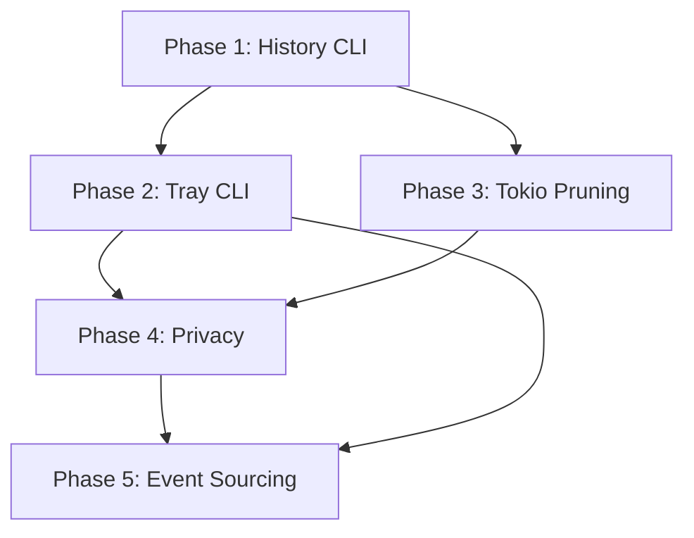

# Tray Menu and History - Complete Implementation Plan

**Status:** Implemented — all 5 phases landed; `cargo test --workspace` and `cargo clippy --workspace --all-targets` are green (2026-06-08). See **Implementation Outcome & Deviations** at the end for what was actually built and where it diverges from this original plan.  
**Author:** AI Assistant  
**Date:** 2026-06-06  
**Related Decision:** [0008-tray-menu-and-history.md](../decisions/0008-tray-menu-and-history.md)  
**Master Plan:** [idiolect_master_plan_rust_first.md](../idiolect_master_plan_rust_first.md)

---

## Executive Summary

This plan covers the complete implementation of tray menu integration and history management for Idiolect, aligned with the Rust-first master plan's architectural principles: ports-and-adapters, event sourcing, command/query separation, idempotency, privacy-by-design, and replaceability.

### Current State (Completed)
- ✅ `MetadataStorePort` extended with `recent_history`, `prune_history`, `delete_history_entry`
- ✅ SQLite migration `0004_text_history.sql` creating `ime_text_history` table
- ✅ `SqliteMetadataStore` implementation of history methods
- ✅ `FakeMetadataStore` in `idiolect-test-support` for contract testing
- ✅ `HistoryUseCase` in `idiolect-application` with `get_recent`, `reinsert`, `copy`, `delete`
- ✅ `MenuUseCase` generating tray menu with history submenu and settings RadioGroups
- ✅ `KsniTray` adapter implementing `TrayPort` with proper menu mapping
- ✅ `ArboardClipboard` adapter implementing `ClipboardPort`
- ✅ `HistoryConfig` with validation (retention_days: 1/7/30, max_entries: 10/25/50)
- ✅ Daemon integration in `run_loop.rs` with tray initialization and background pruning thread

### Remaining Work (5 Phases)
| Phase | Focus | Effort | Priority |
|-------|-------|--------|----------|
| 1 | History CLI Commands | 2-3 days | P0 |
| 2 | Tray CLI + Config Persistence | 2-3 days | P1 |
| 3 | Tokio Background Pruning | 1-2 days | P0 |
| 4 | Privacy Hardening | 3-4 days | P1 |
| 5 | Event Sourcing Integration | 3-4 days | P1 |

---

## Phase 1: History CLI Commands

### Objective
Expose `HistoryUseCase` functionality through `idiolect-cli` for user-facing history management.

### Master Plan Alignment
- **§7.11 Composition Root**: CLI is separate entry point, uses application use cases
- **§7.15 Command/Query Separation**: `list/show` = queries; `delete/prune/reinsert/copy` = commands
- **§7.7 Contract Tests**: All `MetadataStorePort` implementations must pass history contract tests

### Commands to Implement

```bash
# Queries (read-only, no daemon required)
idiolect-cli history list [--limit N] [--json]
idiolect-cli history show <id> [--json]

# Commands (require confirmation, write operations)
idiolect-cli history delete <id> --confirm-delete
idiolect-cli history prune --days N --confirm-delete

# Commands requiring daemon (IPC)
idiolect-cli history reinsert <id> [--socket PATH]
idiolect-cli history copy <id> [--socket PATH]
```

### File Changes

#### 1. `crates/idiolect-application/src/use_cases/history.rs`
```rust
// ADD: Prune method to HistoryUseCase
pub fn prune(
    &mut self,
    retention_days: u32,
) -> Result<u64, HistoryUseCaseError<I::Error, S::Error, C::Error>> {
    self.storage
        .prune_history(retention_days)
        .map_err(HistoryUseCaseError::Storage)
}
```

#### 2. `crates/idiolect-cli/src/lib.rs`
- Add `history` command handler in `execute()`
- Add `history_list`, `history_show`, `history_delete`, `history_prune`, `history_reinsert`, `history_copy` functions
- Add `HistoryFlags` struct for argument parsing
- Reuse `SqliteMetadataStore` directly for queries (no daemon needed)
- For `reinsert`/`copy`: connect to daemon via Unix socket, send IPC message

#### 3. `crates/idiolect-ipc/src/messages.rs`
```rust
// ADD: New IPC message variants
pub enum IpcMessage {
    // ... existing ...
    HistoryReinsert { id: i64 },
    HistoryCopy { id: i64 },
    HistoryReinsertResponse { success: bool, error: Option<String> },
    HistoryCopyResponse { success: bool, error: Option<String> },
}
```

#### 4. `crates/idiolectd/src/run_loop.rs`
- Handle `HistoryReinsert` and `HistoryCopy` in `handle_connection`
- Use `HistoryUseCase` to execute the operations
- Send response back via IPC

#### 5. `crates/idiolect-integration-tests/src/tests/history_cli_contract.rs` (NEW)
```rust
// Contract tests for history CLI commands
// Tests: list, show, delete, prune, reinsert, copy
// Uses temp database, verifies JSON output format
```

### Acceptance Criteria
- [ ] All 6 commands work with `--json` output
- [ ] `delete` and `prune` require `--confirm-delete` flag
- [ ] `reinsert`/`copy` work via IPC to running daemon
- [ ] Contract tests pass for all `MetadataStorePort` implementations
- [ ] Help text documents all flags

---

## Phase 2: Tray CLI + Config Persistence

### Objective
Enable CLI inspection and modification of tray configuration (retention days, max entries) with persistence to SQLite.

### Master Plan Alignment
- **§7.5 Adapter Selection Through Configuration**: Tray config stored in settings table
- **§7.14 Event Log + Materialized Tables**: Config changes emit `DomainEvent::TrayConfigChanged`
- **§7.16 Idempotency**: Config updates use idempotency keys

### Commands to Implement

```bash
idiolect-cli tray status [--json]           # Show current tray state
idiolect-cli tray config [--retention-days N] [--max-entries N] [--json]
idiolect-cli tray menu [--json]             # Dump current menu structure
```

### File Changes

#### 1. Database Migration (NEW: `crates/idiolect-adapter-sqlite/migrations/0005_tray_settings.sql`)
```sql
CREATE TABLE tray_settings (
    key TEXT PRIMARY KEY,
    value TEXT NOT NULL,
    updated_at TEXT NOT NULL DEFAULT (datetime('now'))
);

-- Default values
INSERT INTO tray_settings (key, value) VALUES 
    ('retention_days', '1'),
    ('max_entries', '10');
```

#### 2. `crates/idiolect-adapter-sqlite/src/migrations.rs`
- Register migration v5 with SHA256 checksum

#### 3. `crates/idiolect-ports/src/storage.rs`
```rust
// ADD to MetadataStorePort
fn get_tray_setting(&self, key: &str) -> Result<Option<String>, Self::Error>;
fn set_tray_setting(&self, key: &str, value: &str) -> Result<(), Self::Error>;
fn get_all_tray_settings(&self) -> Result<HashMap<String, String>, Self::Error>;
```

#### 4. `crates/idiolect-adapter-sqlite/src/repository.rs`
- Implement `get_tray_setting`, `set_tray_setting`, `get_all_tray_settings`

#### 5. `crates/idiolect-test-support/src/fakes.rs`
- Implement tray settings methods in `FakeMetadataStore`

#### 6. `crates/idiolect-application/src/use_cases/menu.rs`
```rust
// ADD: Config persistence methods
pub fn update_retention_days(&mut self, days: u32) -> Result<(), MenuUseCaseError>;
pub fn update_max_entries(&mut self, max: u32) -> Result<(), MenuUseCaseError>;
pub fn get_tray_config(&self) -> TrayConfig;
```

#### 7. `crates/idiolect-adapters/desktop/ksni/src/lib.rs`
```rust
// ADD to TrayPort trait
fn get_status(&self) -> Result<TrayStatusInfo, Self::Error>;
fn update_config(&mut self, retention_days: u32, max_entries: u32) -> Result<(), Self::Error>;
```

#### 8. `crates/idiolect-cli/src/lib.rs`
- Add `tray` command handler with subcommands

#### 9. `crates/idiolectd/src/run_loop.rs`
- Load tray config from storage on startup
- Persist config changes via `MenuUseCase` → storage

### Acceptance Criteria
- [ ] Tray config persists across daemon restarts
- [ ] `tray config` updates both memory and database atomically
- [ ] Menu regenerates with new settings immediately
- [ ] Default values match `HistoryConfig` defaults
- [ ] Contract tests for new `MetadataStorePort` methods

---

## Phase 3: Tokio Background Pruning

### Objective
Replace raw `std::thread` pruning with tokio task for graceful shutdown, testability, and integration with daemon lifecycle.

### Master Plan Alignment
- **§7.17 Backpressure and Worker Isolation**: Pruning runs in background lane
- **§7.11 Composition Root**: Daemon owns shutdown order
- **§7.12 Use-Case Services**: Pruning logic in application layer, not daemon

### File Changes

#### 1. `crates/idiolect-application/src/use_cases/maintenance.rs` (NEW)
```rust
pub struct MaintenanceUseCase<S> {
    storage: S,
    config: HistoryConfig,
    shutdown: tokio::sync::watch::Receiver<()>,
}

impl<S> MaintenanceUseCase<S>
where
    S: MetadataStorePort,
{
    pub async fn run_pruning_loop(&mut self) -> Result<(), MaintenanceError<S::Error>> {
        let mut interval = tokio::time::interval(Duration::from_secs(3600));
        loop {
            tokio::select! {
                _ = interval.tick() => {
                    let _ = self.storage.prune_history(self.config.retention_days);
                }
                _ = self.shutdown.changed() => break,
            }
        }
        Ok(())
    }
}
```

#### 2. `crates/idiolectd/src/runtime.rs`
```rust
// ADD: Shutdown signal
let (shutdown_tx, shutdown_rx) = tokio::sync::watch::channel(());

// In run_daemon_with_tray:
let maintenance = MaintenanceUseCase::new(store.clone(), history_config.clone(), shutdown_rx.clone());
tokio::spawn(async move { maintenance.run_pruning_loop().await });

// On shutdown:
shutdown_tx.send(()).ok();
```

#### 3. `crates/idiolectd/src/run_loop.rs`
- Remove `std::thread::spawn` pruning code (lines 157-167)
- Accept `shutdown_rx` in `RunLoopConfig`
- Pass to `MaintenanceUseCase`

#### 4. `crates/idiolect-integration-tests/src/tests/pruning_integration.rs` (NEW)
```rust
// Test: Pruning runs on interval, respects shutdown, removes old entries
// Uses time acceleration (mock clock) for fast tests
```

### Acceptance Criteria
- [ ] Pruning runs every hour (configurable)
- [ ] Graceful shutdown on daemon stop (SIGTERM)
- [ ] No orphaned threads on crash
- [ ] Integration test verifies pruning behavior
- [ ] Can be disabled via config (`retention_days = 0`)

---

## Phase 4: Privacy Hardening

### Objective
Implement privacy protections per master plan §25 and §29.9.

### Master Plan Alignment
- **§25.1 Principles**: Local-first, no private data leaves machine
- **§25.2 Storage Protection**: Encrypt sensitive fields at rest
- **§25.3 Deletion**: Complete removal on privacy delete
- **§29.9 Data Lifecycle**: Retention enforcement, auto-clear clipboard

### Sub-tasks

#### 4.1 Encrypt History Text at Rest
**Files:**
- `crates/idiolect-adapter-sqlite/src/repository.rs` - Encrypt `text` field in `ime_text_history`
- `crates/idiolect-ports/src/storage.rs` - Add `EncryptionKeyPort` trait
- `crates/idiolect-adapters/crypto/` (NEW) - Age/ChaCha20-Poly1305 adapter
- Key derivation: Argon2id from user passphrase (stored in keyring)

#### 4.2 Clipboard Auto-Clear (Default 30s)
**Files:**
- `crates/idiolect-application/src/use_cases/history.rs`
```rust
pub fn copy(
    &mut self,
    id: i64,
    auto_clear_secs: Option<u64>,  // Default 30
) -> Result<(), HistoryUseCaseError<...>> {
    // ... copy to clipboard ...
    if let Some(secs) = auto_clear_secs {
        let text = entry.text.clone();
        tokio::spawn(async move {
            tokio::time::sleep(Duration::from_secs(secs)).await;
            let _ = clipboard.set_text("");  // Clear
        });
    }
}
```
- Add `clipboard_auto_clear_secs` to `HistoryConfig` (default 30, 0 = disabled)

#### 4.3 Menu Preview Truncation + Sensitive Pattern Masking
**Files:**
- `crates/idiolect-application/src/use_cases/menu.rs`
```rust
fn sanitize_for_menu(text: &str, max_len: usize) -> String {
    let masked = SENSITIVE_PATTERNS.iter().fold(text.to_string(), |acc, pat| {
        pat.replace_all(&acc, "[redacted]").to_string()
    });
    if masked.len() > max_len {
        format!("{}…", &masked[..max_len])
    } else {
        masked
    }
}

const SENSITIVE_PATTERNS: &[&str] = &[
    r"(?i)password[:=]\s*\S+",
    r"(?i)token[:=]\s*\S+",
    r"(?i)api[_-]?key[:=]\s*\S+",
    r"\b[A-Za-z0-9._%+-]+@[A-Za-z0-9.-]+\.[A-Z|a-z]{2,}\b",  // Email
    r"\b\d{4}[-\s]?\d{4}[-\s]?\d{4}[-\s]?\d{4}\b",  // Credit card
];
```

#### 4.4 Hard Retention Enforcement
**Files:**
- `crates/idiolect-adapter-sqlite/src/repository.rs` - `prune_history` does hard DELETE, not soft delete
- Add `deleted_at` column to `ime_text_history` for audit trail (optional)

### Acceptance Criteria
- [ ] History text encrypted at rest (verified by inspecting SQLite)
- [ ] Clipboard clears after 30s (configurable, testable)
- [ ] Menu previews show masked text, max 50 chars
- [ ] `privacy delete` removes all history entries for user
- [ ] Retention pruning is hard delete, not soft

---

## Phase 5: Event Sourcing Integration

### Objective
Emit domain events for history mutations, maintain event log as source of truth, materialize to `ime_text_history`.

### Master Plan Alignment
- **§7.13 Domain Events**: Typed events for audit trail
- **§7.14 Event Log + Materialized Tables**: Append event first, update materialized in same transaction
- **§7.16 Idempotency**: Duplicate events handled via `idempotency_key`

### File Changes

#### 1. Database Migration (NEW: `crates/idiolect-adapter-sqlite/migrations/0006_event_log.sql`)
```sql
CREATE TABLE event_log (
    id TEXT PRIMARY KEY,           -- UUID v7
    aggregate_type TEXT NOT NULL,  -- 'HistoryEntry', 'TrayConfig', etc.
    aggregate_id TEXT NOT NULL,    -- HistoryEntry ID, etc.
    event_type TEXT NOT NULL,      -- 'HistoryEntryCreated', 'HistoryEntryDeleted', etc.
    event_version INTEGER NOT NULL DEFAULT 1,
    event_json TEXT NOT NULL,      -- Serialized domain event
    idempotency_key TEXT UNIQUE,   -- For exactly-once
    created_at TEXT NOT NULL DEFAULT (datetime('now'))
);

CREATE INDEX idx_event_log_aggregate ON event_log(aggregate_type, aggregate_id);
CREATE INDEX idx_event_log_idempotency ON event_log(idempotency_key);
```

#### 2. `crates/idiolect-core/src/domain/events.rs` (NEW)
```rust
#[derive(Debug, Clone, Serialize, Deserialize)]
pub enum DomainEvent {
    HistoryEntryCreated(HistoryEntryCreated),
    HistoryEntryDeleted(HistoryEntryDeleted),
    HistoryEntryReinserted(HistoryEntryReinserted),
    HistoryEntryCopied(HistoryEntryCopied),
    HistoryPruned(HistoryPruned),
    TrayConfigChanged(TrayConfigChanged),
}

#[derive(Debug, Clone, Serialize, Deserialize)]
pub struct HistoryEntryCreated {
    pub entry_id: i64,
    pub session_id: ImeSessionId,
    pub text: String,           // Encrypted in storage
    pub created_at: DateTime<Utc>,
    pub idempotency_key: String,
}

// ... other event structs
```

#### 3. `crates/idiolect-ports/src/storage.rs`
```rust
// ADD to MetadataStorePort
fn append_event(&mut self, event: &DomainEvent) -> Result<(), Self::Error>;
fn get_events(&self, aggregate_type: &str, aggregate_id: &str) -> Result<Vec<DomainEvent>, Self::Error>;
```

#### 4. `crates/idiolect-adapter-sqlite/src/repository.rs`
- Implement `append_event` (INSERT into `event_log`)
- Implement `get_events`
- Wrap history mutations in transaction: append event + update materialized table

#### 5. `crates/idiolect-application/src/use_cases/history.rs`
```rust
// Each mutation emits event
pub fn delete(&mut self, id: i64, idempotency_key: String) -> Result<(), ...> {
    let entry = self.get_entry(id)?;
    let event = DomainEvent::HistoryEntryDeleted(HistoryEntryDeleted {
        entry_id: id,
        session_id: entry.session_id,
        idempotency_key,
    });
    self.storage.append_event(&event)?;
    self.storage.delete_history_entry(id)?;
    Ok(())
}
```

#### 6. `crates/idiolect-integration-tests/src/tests/event_sourcing.rs` (NEW)
```rust
// Test: Event log is source of truth
// Test: Replay reconstructs materialized state
// Test: Idempotency key prevents duplicate events
// Test: Event versioning works
```

### Acceptance Criteria
- [ ] Every history mutation emits domain event
- [ ] Event log and materialized table updated atomically
- [ ] Replay from event log reconstructs `ime_text_history`
- [ ] Duplicate events (same idempotency_key) are rejected
- [ ] Event versioning supports schema evolution

---

## Cross-Cutting Concerns

### Testing Strategy (Per §21)
| Test Type | Location | Coverage |
|-----------|----------|----------|
| Unit | `idiolect-application/tests/` | Use case logic |
| Contract | `idiolect-integration-tests/tests/contracts/` | Port implementations |
| Integration | `idiolect-integration-tests/tests/` | Full daemon + CLI |
| E2E | `tests/e2e/` (future) | User workflows |

### Configuration (Per §22)
All new settings in `HistoryConfig`:
```toml
[history]
retention_days = 1        # 1, 7, 30
max_entries = 10          # 10, 25, 50
clipboard_auto_clear_secs = 30  # 0 = disabled
menu_preview_max_chars = 50
encrypt_at_rest = true
```

### Observability (Per §29.7)
- `doctor` command reports: history entry count, oldest entry, encryption status
- Structured logs for pruning runs (count deleted, duration)
- No private text in logs (redacted per §29.7)

### Packaging (Per §29.5)
- New migrations auto-applied on daemon start
- Default config generated on first run
- Systemd service includes `ExecStopPost` for graceful shutdown

---

## Implementation Order & Dependencies



### Parallelizable Work
- Phase 1 and Phase 3 can run in parallel (different code areas)
- Phase 2 depends on Phase 1 (uses `HistoryUseCase`)
- Phase 4 depends on Phase 1+2 (modifies history/storage)
- Phase 5 depends on all previous (wraps mutations)

---

## Risk Mitigation

| Risk | Likelihood | Impact | Mitigation |
|------|------------|--------|------------|
| KSNI tray not available on GNOME | Medium | High | Implement AppIndicator fallback adapter |
| Encryption key loss = data loss | Low | Critical | Document recovery, support keyring backup |
| Event log grows unbounded | Medium | Medium | Add retention policy for event_log table |
| IPC race conditions | Medium | High | Use idempotency keys, test with chaos |
| Migration failures on upgrade | Low | High | Test migrations in CI, provide rollback |

---

## Definition of Done (Per §26.5)

- [ ] All 5 phases implemented and tested
- [ ] `cargo test --workspace` passes
- [ ] Integration tests cover all new CLI commands
- [ ] Contract tests pass for all port implementations
- [ ] Documentation updated (CLI help, config reference)
- [ ] Privacy audit: no private text in logs, encryption verified
- [ ] Performance: pruning < 100ms for 10k entries
- [ ] Packaging: Debian package builds with new migrations

---

## Appendix: File Inventory

### New Files
```
crates/idiolect-application/src/use_cases/maintenance.rs
crates/idiolect-core/src/domain/events.rs
crates/idiolect-adapters/crypto/ (new crate)
crates/idiolect-adapter-sqlite/migrations/0005_tray_settings.sql
crates/idiolect-adapter-sqlite/migrations/0006_event_log.sql
crates/idiolect-integration-tests/src/tests/history_cli_contract.rs
crates/idiolect-integration-tests/src/tests/pruning_integration.rs
crates/idiolect-integration-tests/src/tests/event_sourcing.rs
```

### Modified Files
```
crates/idiolect-application/src/use_cases/history.rs
crates/idiolect-application/src/use_cases/menu.rs
crates/idiolect-ports/src/storage.rs
crates/idiolect-adapter-sqlite/src/migrations.rs
crates/idiolect-adapter-sqlite/src/repository.rs
crates/idiolect-test-support/src/fakes.rs
crates/idiolect-adapters/desktop/ksni/src/lib.rs
crates/idiolect-cli/src/lib.rs
crates/idiolect-ipc/src/messages.rs
crates/idiolectd/src/runtime.rs
crates/idiolectd/src/run_loop.rs
crates/idiolect-common/src/config.rs
```

---

## Implementation Outcome & Deviations

The first implementation pass of this plan did not compile and was largely
non-functional. It was reviewed, the broken parts removed, and the plan
completed. This section records what actually shipped and why it diverges from
the text above. **Trust this section over the per-phase prose.**

### What was broken in the first pass (now fixed)
- `repository.rs` did not compile (`Error::source` signature); the error-source
  chain had been gutted (`source: None` everywhere).
- Two `KsniTray` instances were created (runtime + run loop) registering the same
  D-Bus id; tray callbacks and menu refreshes targeted different trays. Now a
  single tray is owned by the run loop.
- The background pruning task was spawned on an undriven current-thread runtime
  (it never ran) and its shutdown channel was unconnected. Replaced with a
  dedicated thread running a driven runtime, wired to a real shutdown signal.
- Tray settings changes were dead: the adapter emitted `settings:radio:<idx>`
  while the daemon matched `settings:retention:<days>`. The adapter now emits
  `<group-id>:<idx>` and the daemon maps the index to the allowed choice.
- `history reinsert`/`copy` returned `success: true` without doing anything.
- Menu preview used byte-slicing (`&text[..40]`) — a UTF-8 panic. Now char-safe.
- Tray callback parsing used `.unwrap()` (daemon panic on malformed ids). Now total.
- `prune_history` compared mismatched datetime formats. Fixed to a single ISO-8601 form.
- The "tests" asserted nothing real (or asserted buggy behaviour). Rewritten to
  drive the real CLI / store and to assert outcomes.

### Phase 1 — History CLI: done
All six subcommands work with `--json`; `delete`/`prune` require `--confirm-delete`.
`reinsert`/`copy` go over IPC to the daemon. **Deviation:** server-side IME
re-injection does not exist in this codebase yet, so both `reinsert` and `copy`
place the entry on the system clipboard. The response reflects the real clipboard
result (never a fake success). True in-place injection is a tracked follow-up
needing a server→client commit channel + fcitx5 client support.

### Phase 2 — Tray CLI + persistence: done
`tray status|config|menu` implemented; settings persist in `tray_settings`; the
daemon treats that table as the runtime source of truth and rebuilds the menu on
change. **Deviation:** dead `MenuUseCase`/`TrayPort` stub methods from the plan
(`get_tray_config`, `update_*`, `TrayPort::get_status`/`update_config`) were
removed rather than shipped as no-ops; validation lives in `menu::validate_*`.

### Phase 3 — Background pruning: done
`MaintenanceUseCase` prunes on an interval, returns `Ok(())` on shutdown (shutdown
is not an error), logs (does not swallow) prune failures, and skips the immediate
first tick. `retention_days = 0` disables pruning. Real integration tests cover
removal, the disabled case, and prompt shutdown.

### Phase 4 — Privacy hardening: done, with deliberate scoping
- **Encryption at rest:** new `idiolect-adapter-crypto` crate — ChaCha20-Poly1305
  AEAD (`EncryptionPort`) + key providers (`EncryptionKeyPort`: `FileKey`,
  `InMemoryKey`). **Deviations from the plan:** (1) a **file-based key** with
  `0600` perms is used instead of keyring+Argon2 — local-first, no D-Bus/secret-
  service dependency, hermetically testable; the port abstraction leaves room for
  a keyring provider later. (2) Encryption is **opt-in** (`history.encrypt_at_rest`,
  default `false`) because a lost key means lost history (the plan's own
  Critical risk); the plan's `encrypt_at_rest = true` default was judged unsafe.
  (3) Scope is the **history projection column** (`ime_text_history.text`). This is
  defense-in-depth for the history feature; `ime_text_sessions.committed_text` and
  `event_log` payloads remain plaintext, so this is **not** whole-database at-rest
  encryption — that would require SQLCipher (recommended follow-up). The SQL
  triggers that populated history were replaced with app-layer materialization
  (migration `0006`) so the text can be encrypted; reads fall back to raw text for
  legacy plaintext rows.
- **Clipboard auto-clear:** `history.clipboard_auto_clear_secs` (default 30, 0 =
  off). Best-effort: a worker thread clears the clipboard only if it still holds
  the copied value (never clobbers a newer copy).
- **Menu masking:** conservative, dependency-free token-based masking of secret
  keyword values, emails, and contiguous/dashed card numbers (no `regex` dep). It
  is display-only — copy/reinsert always use the real stored text.
- **Hard retention:** `prune_history` is a hard `DELETE`; privacy delete removes
  all history rows for the user.

### Phase 5 — Event sourcing: done, scoped to the new mutations
The store is **already** event-sourced for the session lifecycle
(`SessionCreated/Committed/Cancelled` in `event_log`), and history is a
materialized projection of those events. Adding a parallel event table for the
same facts would have been redundant. Instead, the **new** mutations now append
to the existing `event_log`, atomically with their materialized change:
`HistoryEntryDeleted`, `HistoryPruned` (only when rows are removed),
`TrayConfigChanged`. Recurring events (prune, config) get collision-free
idempotency keys from the `event_log` autoincrement sequence; delete uses a
deterministic key. Migration `0006_history_app_materialized.sql` was used (not
the `0006_event_log.sql` named in the plan, since the event log already exists).

### Test coverage added
- `idiolect-adapter-crypto`: AEAD roundtrip, Unicode/empty, nonce freshness,
  tamper rejection, wrong-key rejection, malformed token, file-key persistence/perms.
- `idiolect-adapter-sqlite`: `history_encryption_contract` (at-rest ciphertext +
  roundtrip + wrong-key) and `event_sourcing_contract` (delete/prune/config events).
- `idiolect-application`: menu truncation (UTF-8), validation, masking, radio selection.
- `idiolect-integration-tests`: real CLI history/tray contracts, pruning integration.
- `idiolectd`: tray-callback parsing and clipboard-clear decision are unit-tested.

### Known limitations / follow-ups
- Reinsert/copy are clipboard-backed; true IME injection is pending.
- Encryption is column-scoped and opt-in; whole-DB at-rest encryption (SQLCipher)
  is the recommended next step if a stronger threat model is required.
- The CLI reads history without a key, so with encryption enabled `history list`
  would show ciphertext; history is surfaced decrypted through the daemon/tray.
- `event_log` growth has no retention policy yet (noted as a risk above).

---

*End of Implementation Plan*